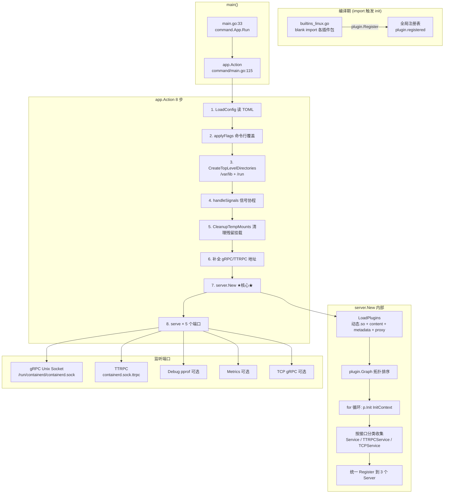
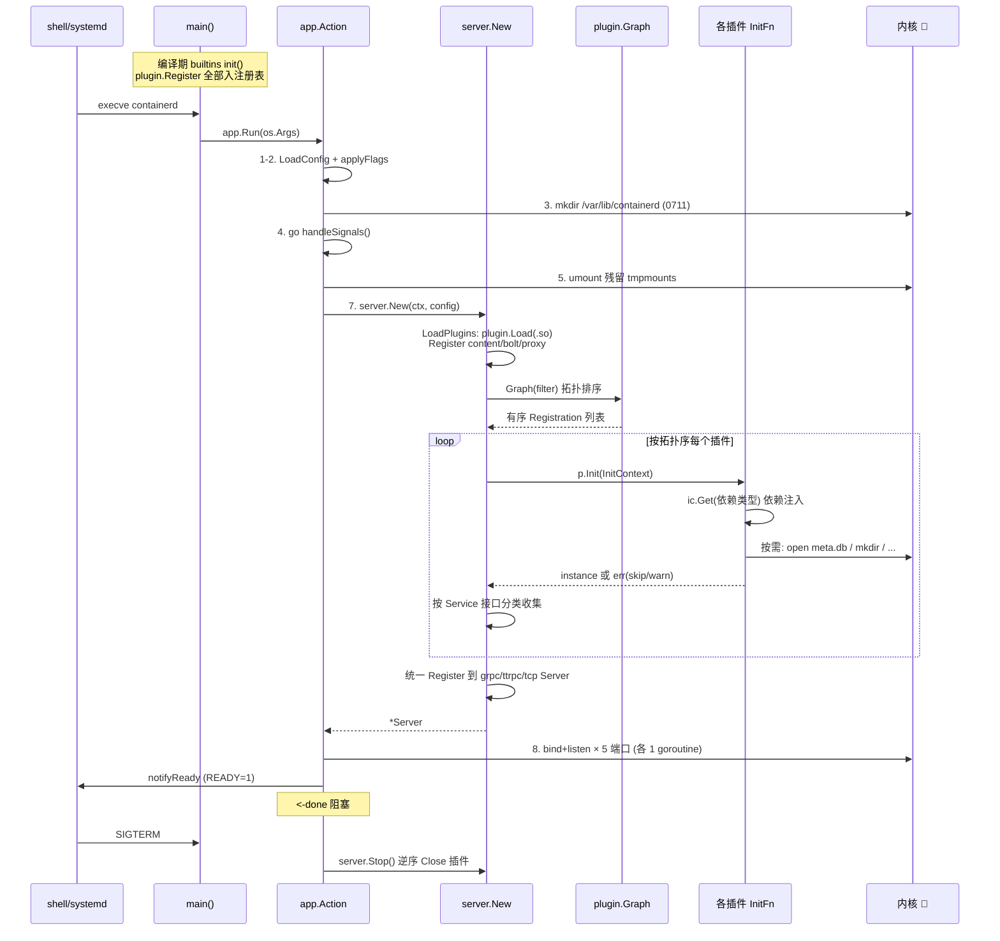

# 第一篇：Daemon 启动与 Plugin 初始化

> containerd v1.5.x (commit 5280530a0) 源码剖析系列 1/N
> 核心文件：`cmd/containerd/main.go`、`cmd/containerd/command/main.go`、`cmd/containerd/builtins_linux.go`、`services/server/server.go`

---

## 1. 概述

一句话：**containerd daemon 的启动 = 加载配置 → 拓扑排序所有插件 → 按序执行每个插件的 InitFn → 把实现了服务接口的插件注册到 gRPC/TTRPC Server → 监听端口**。

在 5 层架构中的位置：本篇覆盖第 1、2 层的"地基"——没有它，后面的容器创建、镜像拉取都无从谈起。

```
┌─ Client 层 ─────────────┐   ← ctr/docker/kubelet
│        gRPC              │
├─ Daemon Services 层 ─────┤   ← 本篇：server.New() 把所有 ServicePlugin 注册到 grpcServer
│        内部调用           │
├─ Runtime V2 层 ──────────┤   ← 本篇：RuntimePluginV2 作为插件被初始化
│        TTRPC             │
├─ Shim 层 ────────────────┤
│        fork/exec         │
└─ runc ───────────────────┘
```

---

## 2. 架构图



---

## 3. 核心数据结构

| 结构体 | 所在文件 | 关键字段 | 作用 |
|---|---|---|---|
| `Server` | `services/server/server.go:303` | `grpcServer`、`ttrpcServer`、`tcpServer`、`events`、`plugins` | daemon 主对象，持有三种 Server 和全局事件总线 |
| `srvconfig.Config` | `services/server/config/config.go` | `Root`、`State`、`GRPC`、`TTRPC`、`Plugins`、`DisabledPlugins` | TOML 配置映射 |
| `plugin.Registration` | `plugin/plugin.go` | `Type`、`ID`、`Requires`、`Config`、`InitFn` | 插件注册信息（第二篇详述） |
| `plugin.InitContext` | `plugin/plugin.go` | `Root`、`State`、`plugins`(已初始化集合)、`Events`、`Address` | 传给 InitFn 的依赖注入上下文 |
| `plugin.Plugin` | `plugin/plugin.go` | `Registration`、`instance`、`err` | 初始化结果包装（实例或错误） |
| `exchange.Exchange` | `events/exchange/` | 订阅者 map | 全局事件总线，发布/订阅模式 |

---

## 4. 源码逐步剖析

### Step 0：程序入口与编译期插件注册

`cmd/containerd/main.go:33`：

```go
func main() {
	app := command.App()
	if err := app.Run(os.Args); err != nil { // wy: urfave/cli 框架，默认 Action 启动 daemon
		fmt.Fprintf(os.Stderr, "containerd: %s\n", err)
		os.Exit(1)
	}
}
```

`cmd/containerd/builtins_linux.go:25`（编译期，先于 main 执行）：

```go
package main

import (
	// wy: 🚀 blank import 触发各插件包的 init() → plugin.Register()
	_ "github.com/containerd/containerd/metrics/cgroups"     // cgroups v1 指标
	_ "github.com/containerd/containerd/metrics/cgroups/v2"  // cgroups v2 指标
	_ "github.com/containerd/containerd/runtime/v1/linux"    // v1 shim（兼容）
	_ "github.com/containerd/containerd/runtime/v2"          // 🚀 v2 TaskManager
	_ "github.com/containerd/containerd/snapshots/native/plugin"  // native 快照器
	_ "github.com/containerd/containerd/snapshots/overlay/plugin" // 🚀 overlayfs 快照器
)
```

**要点**：插件是否编译进 containerd，完全由这个文件的 import 列表决定。想裁剪功能或替换实现，改这里重新编译即可。注意 `services/...` 下的大量 ServicePlugin 在另一个 builtins 文件（`builtins.go`）中注册，本文件只管 Linux 平台特有的 runtime/metrics/snapshot。

### Step 1-6：app.Action 前置准备（command/main.go:115-189）

```go
app.Action = func(context *cli.Context) error {
	var (
		start   = time.Now()
		signals = make(chan os.Signal, 2048)   // wy: 🚀 2048 大缓冲，防止 boot 期间信号丢失
		serverC = make(chan *server.Server, 1)
		config  = defaultConfig()
	)

	// Step 1: 加载 TOML（默认 /etc/containerd/config.toml，不存在则用内置默认值）
	configPath := context.GlobalString("config")
	_, err := os.Stat(configPath)
	if !os.IsNotExist(err) || context.GlobalIsSet("config") {
		if err := srvconfig.LoadConfig(configPath, config); err != nil {
			return err
		}
	}

	// Step 2: 命令行 flag 覆盖配置文件（flag 优先级更高）
	if err := applyFlags(context, config); err != nil { return err }

	// Step 3: 🚀 创建两个顶层目录（见 server.go:72）
	if err := server.CreateTopLevelDirectories(config); err != nil { return err }

	// Step 4: 启动信号处理协程（见下文 Step 4 剖析）
	done := handleSignals(ctx, signals, serverC)
	signal.Notify(signals, handledSignals...)

	// Step 5: 🚀 清理上次崩溃残留的临时挂载点（umount 系统调用）
	if err := mount.SetTempMountLocation(filepath.Join(config.Root, "tmpmounts")); err != nil { ... }
	warnings, err := mount.CleanupTempMounts(0)

	// Step 6: 补全地址——TTRPC 默认 = gRPC 地址 + ".ttrpc" 后缀
	if config.TTRPC.Address == "" {
		config.TTRPC.Address = fmt.Sprintf("%s.ttrpc", config.GRPC.Address)
	}
	...
}
```

两个顶层目录的分工（`server.go:72`）：

| 目录 | 默认路径 | 文件系统 | 存放内容 |
|---|---|---|---|
| `Root` | `/var/lib/containerd` | 磁盘 | content blobs、meta.db、snapshot committed 层（**必须持久化**） |
| `State` | `/run/containerd` | tmpfs | shim socket、OCI bundle、FIFO（重启即清） |

`CreateTopLevelDirectories` 强制 `Root != State`，并用 `0711` 权限创建（其他用户可进入、不可列出）。

### Step 4 细节：信号处理协程（command/main_unix.go:38）

```go
var handledSignals = []os.Signal{
	unix.SIGTERM, unix.SIGINT, unix.SIGUSR1, unix.SIGPIPE,
}

func handleSignals(ctx, signals, serverC) chan struct{} {
	done := make(chan struct{}, 1)
	go func() {
		var server *server.Server
		for {
			select {
			case s := <-serverC:          // wy: 缓存 server 实例，信号到达时才能 Stop
				server = s
			case s := <-signals:
				switch s {
				case unix.SIGUSR1:
					dumpStacks(true)      // wy: 打印全部 goroutine 栈到日志+文件，不退出
				default:                  // wy: SIGTERM/SIGINT → 优雅退出
					notifyStopping(ctx)   // wy: 🚀 通知 systemd: STOPPING=1
					if server == nil { close(done); return }
					server.Stop()         // wy: 逆序关闭所有插件（见下文）
					close(done)
					return
				}
			}
		}
	}()
	return done
}
```

**要点**：`serverC` 是容量 1 的 channel——信号处理协程和主协程之间唯一的同步点。daemon 启动完成前收到 SIGTERM，`server == nil`，直接退出。

### Step 7（核心）：server.New —— 插件加载与初始化（server.go:100）

#### 7a. LoadPlugins：三个插件来源（server.go:386）

```go
func LoadPlugins(ctx context.Context, config *srvconfig.Config) ([]*plugin.Registration, error) {
	// 来源 1: 动态 .so 插件（🚀 底层用 Go plugin 包 dlopen）
	path := config.PluginDir
	if path == "" {
		path = filepath.Join(config.Root, "plugins")  // /var/lib/containerd/plugins/
	}
	if err := plugin.Load(path); err != nil { return nil, err }

	// 来源 2: Server 层直接注册 Content Plugin（本地 CAS）
	plugin.Register(&plugin.Registration{
		Type: plugin.ContentPlugin,
		ID:   "content",
		InitFn: func(ic *plugin.InitContext) (interface{}, error) {
			ic.Meta.Exports["root"] = ic.Root
			return local.NewStore(ic.Root)  // wy: 文件系统 CAS Store
		},
	})

	// 来源 3: Server 层直接注册 Metadata Plugin（BoltDB 中枢）
	plugin.Register(&plugin.Registration{
		Type: plugin.MetadataPlugin,
		ID:   "bolt",
		Requires: []plugin.Type{
			plugin.ContentPlugin,   // wy: 拓扑排序依据：必须先于 content 之后
			plugin.SnapshotPlugin,  // wy: 必须先于所有 snapshotter 之后
		},
		InitFn: func(ic *plugin.InitContext) (interface{}, error) {
			cs, _ := ic.Get(plugin.ContentPlugin)                    // wy: 依赖注入
			snapshottersRaw, _ := ic.GetByType(plugin.SnapshotPlugin) // wy: 拿全部 snapshotter
			// ... 过滤加载失败的 snapshotter ...
			path := filepath.Join(ic.Root, "meta.db")
			db, err := bolt.Open(path, 0644, nil)   // wy: 🚀 打开 BoltDB（flock 独占）
			mdb := metadata.NewDB(db, cs.(content.Store), snapshotters, dbopts...)
			if err := mdb.Init(ic.Context); err != nil { return nil, err }
			return mdb, nil
		},
	})

	// 来源 4: 配置中的 proxy_plugins（远程 snapshotter/content 代理）
	for name, pp := range config.ProxyPlugins { ... plugin.Register(...) }

	// 🚀 拓扑排序，被禁用的插件由 filter 标记后跳过
	return plugin.Graph(filter(config.DisabledPlugins)), nil
}
```

| 插件来源 | 注册时机 | 例子 |
|---|---|---|
| blank import 包的 `init()` | 编译期决定、进程启动时执行 | overlayfs、native、runtime v2、metrics |
| `LoadPlugins` 内直接 `Register` | daemon 每次启动 | content(local)、metadata(bolt) |
| `plugin.Load(path)` 动态 `.so` | daemon 启动时 dlopen | 第三方自定义插件 |
| 配置文件 `proxy_plugins` | daemon 启动时 | 远程 snapshotter（如 stargz） |

#### 7b. 拓扑序初始化循环（server.go:195-270）

```go
plugins, err := LoadPlugins(ctx, config)   // wy: 已排序

for _, p := range plugins {
	id := p.URI()   // wy: "io.containerd.snapshotter.v1.overlayfs" 格式

	// wy: 每个插件拿到独立的 InitContext
	initContext := plugin.NewContext(ctx, p, initialized, config.Root, config.State)
	initContext.Events = s.events              // wy: 全局事件总线注入
	initContext.Address = config.GRPC.Address
	initContext.TTRPCAddress = config.TTRPC.Address

	// wy: 从 TOML 的 [plugins."xxx"] 段解码该插件专属配置
	if p.Config != nil {
		pc, err := config.Decode(p)
		initContext.Config = pc
	}

	// wy: 🚀 真正执行插件初始化（打开文件、建连接、起协程都在这里）
	result := p.Init(initContext)
	initialized.Add(result)   // wy: 放入集合，后续插件可 ic.Get() 拿到

	instance, err := result.Instance()
	if err != nil {
		if plugin.IsSkipPlugin(err) {
			// wy: 主动跳过（如当前内核不支持 overlayfs），只记 info
		} else {
			// wy: 失败只记 warn，daemon 继续启动！
		}
		if _, ok := required[reqID]; ok {   // wy: 除非是 required_plugins 中的
			return nil, err                 // wy: required 失败 → daemon 直接退出
		}
		continue
	}

	// wy: 🚀 按实现的接口分类收集（一个实例可同时实现多个接口）
	if src, ok := instance.(plugin.Service); ok      { grpcServices  = append(...) }
	if src, ok := instance.(plugin.TTRPCService); ok { ttrpcServices = append(...) }
	if svc, ok := instance.(plugin.TCPService); ok   { tcpServices   = append(...) }
	s.plugins = append(s.plugins, result)
}
```

#### 7c. 延迟注册服务（server.go:279-297）

```go
// wy: 为什么不在 InitFn 里直接 Register？
// 因为一个 gRPC service（如 TaskService）可能同时依赖 runtime + metadata，
// 必须等所有插件都就绪，否则注册了也服务不了
for _, service := range grpcServices  { service.Register(grpcServer) }
for _, service := range ttrpcServices { service.RegisterTTRPC(ttrpcServer) }
for _, service := range tcpServices   { service.RegisterTCP(tcpServer) }
```

### Step 8：启动 5 类监听端口（command/main.go:204-257）

```go
serverC <- server   // wy: 交给信号处理协程

// 8a. Debug（可选）: pprof + expvar，/debug/pprof/
// 8b. Metrics（可选）: Prometheus /v1/metrics
// 8c. 🚀 TTRPC: 必选，Shim 回连 daemon 发布事件用
tl, _ := sys.GetLocalListener(config.TTRPC.Address, ...)
serve(ctx, tl, server.ServeTTRPC)
// 8d. TCP gRPC（可选）: 远程访问，需 TLS
// 8e. 🚀 gRPC Unix Socket: 必选，Client 主入口
l, _ := sys.GetLocalListener(config.GRPC.Address, ...)
serve(ctx, l, server.ServeGRPC)

notifyReady(ctx)   // wy: 🚀 sd_notify READY=1（systemd Type=notify）
<-done             // wy: 主协程阻塞，等信号处理协程 close(done)
```

`serve()`（main.go:271）就是每个端口一个 goroutine：

```go
func serve(ctx, l, serveFunc) {
	go func() {
		defer l.Close()
		if err := serveFunc(l); err != nil {
			log.G(ctx).WithError(err).Fatal("serve failure") // wy: 任一端口挂 → 整个 daemon 退出
		}
	}()
}
```

---

## 5. 启动时序图



---

## 6. 关键数据路径

启动过程在磁盘上的动作：

```
/var/lib/containerd/                          ← Root (持久化)
├── plugins/                                   ← 动态 .so 插件扫描目录
├── tmpmounts/                                 ← 临时挂载点（启动时清理）
├── io.containerd.content.v1.content/          ← Content 插件 Root
│   └── ingest/                                ← 下载中的 blob
├── io.containerd.metadata.v1.bolt/
│   └── meta.db                                ← 🚀 BoltDB 打开 (flock 独占锁)
├── io.containerd.snapshotter.v1.overlayfs/    ← overlay 插件 Root
└── io.containerd.snapshotter.v1.native/

/run/containerd/                               ← State (tmpfs)
├── containerd.sock                            ← gRPC 主端口 (bind)
├── containerd.sock.ttrpc                      ← TTRPC 端口 (bind)
└── io.containerd.runtime.v2.task/             ← runtime 插件 State
```

**每个插件的 Root/State 子目录命名规则**：`<Root>/<Type>.<ID>/`，由 `plugin.NewContext` 用 `p.URI()` 拼接。

---

## 7. 并发模型

| goroutine | 创建位置 | 职责 | 生命周期 |
|---|---|---|---|
| 信号处理 | `handleSignals` main_unix.go:39 | 收 SIGTERM/SIGINT/SIGUSR1/SIGPIPE | daemon 全程 |
| serve × N | `serve()` main.go:274 | 每个监听端口一个 | daemon 全程，任一 Fatal 全退 |
| GC 调度器 | gc/scheduler 插件内 | 异步垃圾回收（第十四篇） | daemon 全程 |
| BoltDB 后台 | bbolt 内部 | 无（bbolt 同步写） | — |

启动阶段是**完全串行**的：插件按拓扑序逐个 Init，无并行初始化。这是刻意为之——依赖注入要求被依赖者必须已经就绪。

---

## 8. 崩溃恢复与错误路径

| 场景 | 行为 | 源码位置 |
|---|---|---|
| 上次崩溃遗留 overlay 临时挂载 | 启动时 `CleanupTempMounts` 全部 umount | main.go:164 |
| 非 required 插件初始化失败 | warn 日志，daemon 继续；依赖它的插件 `ic.Get` 时会失败 | server.go:246 |
| `required_plugins` 中的插件失败 | daemon 直接退出 | server.go:249 |
| 插件主动跳过（`SkipPlugin`） | info 日志，正常现象（如老内核无 overlay） | server.go:242 |
| meta.db 被另一个进程持有 | `bolt.Open` 阻塞/失败（flock） | server.go:486 |
| 端口被占用 | `GetLocalListener` 失败，daemon 退出 | main.go:253 |
| 任一 serve goroutine 崩溃 | `log.Fatal` → 整个进程退出 | main.go:277 |
| SIGTERM 在 server 创建前到达 | `server == nil`，直接 close(done) 退出 | main_unix.go:58 |

**优雅退出顺序**（`Server.Stop` server.go:358）：

```go
func (s *Server) Stop() {
	s.grpcServer.Stop()                      // wy: 1. 先拒绝新请求
	for i := len(s.plugins) - 1; i >= 0; i-- { // wy: 2. 逆拓扑序关闭（先关上层依赖者）
		// 只关闭实现了 io.Closer 的插件
	}
}
```

逆序关闭保证：依赖者先于被依赖者关闭，避免 runtime 还在用 metadata 时 BoltDB 就被关。

---

## 9. 设计要点与踩坑

### 设计精髓

1. **blank import 即插拔**：功能裁剪不需要条件编译宏，删一行 import 重编译即可。插件注册表是全局 slice，`init()` 追加、`Graph()` 消费。
2. **延迟注册服务**：InitFn 只负责创建实例，服务注册放在所有插件就绪后统一执行——解决插件间交叉依赖的先后问题。
3. **required 与非 required 的区分**：overlayfs 挂了 daemon 照样能起（native 可用），但把关键插件配进 `required_plugins` 可以 fail fast。
4. **两个目录强制分离**：`Root == State` 直接报错，防止有人把持久数据放进 tmpfs 导致重启丢镜像。
5. **信号缓冲 2048**：boot 期间 systemd 可能发信号，小缓冲会丢信号导致行为异常。

### 踩坑 / 调试

| 现象 | 原因 | 排查 |
|---|---|---|
| daemon 起不来 "required plugin ... not included" | 配置了 required 但插件加载失败 | 看 warn 日志找真正失败的插件 |
| 启动日志大量 "skip loading plugin" | 内核/文件系统不支持（如 overlay 需内核 ≥ 4.0） | 正常现象，除非你依赖它 |
| "metadata and content bolt db" 卡住 | 上一个 daemon 进程没退干净持有 flock | `fuser /var/lib/containerd/io.containerd.metadata.v1.bolt/meta.db` |
| ctr 连不上 | sock 权限（UID/GID 配置）或路径不对 | `ls -l /run/containerd/containerd.sock` |
| 想看启动耗时 | — | 日志 "containerd successfully booted in Xs" |
| 想看哪些插件加载了 | — | `ctr plugins ls` 或启动日志 "loading plugin" 行 |

开启 debug 日志启动：

```bash
containerd --log-level debug --config /etc/containerd/config.toml
```

---

## 10. 下一篇预告

**第二篇：Plugin 机制与拓扑排序** —— 深入 `plugin/plugin.go`：10 种插件 Type、`Registration`/`Plugin`/`InitContext` 三件套、`Graph()` 的 DFS 拓扑排序算法、依赖注入 `ic.Get()` 的实现，以及插件初始化的 Layer 0→4 分层全景。
