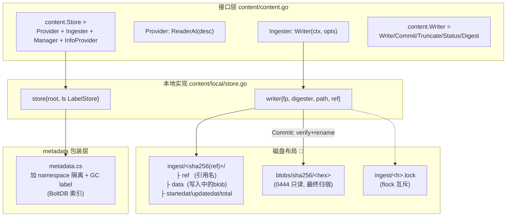
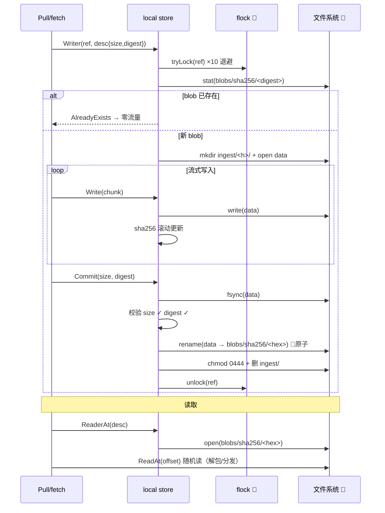

# 第七篇：Content Store / CAS 内容存储

> containerd v1.5.x (commit 5280530a0) 源码剖析系列 7/N
> 核心文件：`content/content.go`、`content/local/store.go`、`content/local/writer.go`、`content/helpers.go`

---

## 1. 概述

一句话：**Content Store 是一个按 digest 寻址的文件系统 CAS——写入走 `ingest/<hash(ref)>/data` 临时区（边写边算哈希、支持断点续传），`Commit` 时校验 size+digest 后一次 `rename` 原子搬进 `blobs/sha256/<hex>` 并置只读；同 ref 文件锁保证并发写互斥，blob 已存在直接返回 `AlreadyExists` 实现天然去重；读取就是 open 文件，ReaderAt 支持随机偏移。**

在架构中的位置：最底层存储插件（第一篇 Layer 0），被 Metadata 插件包装后对所有 Service 可见。Pull 写入、Unpack 读取、GC 删除都落在它上面。

```
写入路径 (Ingester):
  Writer(ref) → ingest/<h>/data 流式写 → Commit(size, digest) → rename → blobs/sha256/<hex> (0444)

读取路径 (Provider):
  ReaderAt(desc) → open(blobs/sha256/<hex>) → ReadAt(offset)
```

---

## 2. 架构图



---

## 3. 核心数据结构

| 结构体/接口 | 所在文件 | 关键成员 | 作用 |
|---|---|---|---|
| `content.Store` | `content/content.go` | Provider+Ingester+Manager | 完整存储接口 |
| `content.Writer` | `content/content.go` | `Write`、`Commit`、`Truncate`、`Status`、`Digest` | 写入会话（兼 io.WriteCloser） |
| `store` | `content/local/store.go:68` | `root`、`ls LabelStore` | 本地文件系统实现 |
| `writer` | `content/local/writer.go` | `fp`、`digester`、`path`、`ref`、`total` | 单个 blob 的写入器 |
| `content.Status` | `content/content.go` | `Ref`、`Offset`、`Total`、`StartedAt`、`UpdatedAt` | 断点续传状态 |
| `ocispec.Descriptor` | OCI spec | `Digest`、`Size`、`MediaType` | 读取/校验凭证 |

---

## 4. 源码逐步剖析

### 4.1 磁盘布局（store.go:627-650）

```go
// blob 最终位置
func (s *store) blobPath(dgst digest.Digest) (string, error) {
	if err := dgst.Validate(); err != nil { ... }
	return filepath.Join(s.root, "blobs", dgst.Algorithm().String(), dgst.Hex()), nil
	// wy: <root>/blobs/sha256/<hex>
}

// 写入临时区: 对 ref 取哈希做目录名（定长，避免 ref 里特殊字符/超长问题）
func (s *store) ingestRoot(ref string) string {
	dgst := digest.FromString(ref)
	return filepath.Join(s.root, "ingest", dgst.Hex())
}

// ingest 目录三件套:
//   ref  → 引用名文本（校验身份用）
//   data → 实际写入的字节流
//   (另有 startedat/updatedat/total 状态文件，status() 读取)
```

完整布局：

```
/var/lib/containerd/io.containerd.content.v1.content/
├── blobs/sha256/
│   ├── 3c3a4604a545...     ← 0444 只读 blob（Commit 后永不修改）
│   └── ...
└── ingest/
    ├── 7f8e9a.../          ← sha256(ref) 命名的临时目录
    │   ├── ref             ← "extract-xxx layer1" 等引用字符串
    │   ├── data            ← 下载/写入中的内容
    │   ├── startedat
    │   ├── updatedat
    │   └── total
    └── 7f8e9a....lock      ← 🚀 flock 文件锁
```

### 4.2 Writer：获取写入器（store.go:454）

```go
func (s *store) Writer(ctx context.Context, opts ...content.WriterOpt) (content.Writer, error) {
	// wy: ref 必填——同一 blob 的并发写入靠 ref 锁串行化
	if wOpts.Ref == "" { return nil, ErrInvalidArgument }

	// wy: 🚀 重试式抢锁: flock 非阻塞尝试 × 10，指数随机退避
	var lockErr error
	for count := uint64(0); count < 10; count++ {
		if err := tryLock(wOpts.Ref); err != nil {
			if !errdefs.IsUnavailable(err) { return nil, err }
			lockErr = err
		} else { lockErr = nil; break }
		time.Sleep(time.Millisecond * time.Duration(rand.Intn(1<<count)))
	}
	if lockErr != nil { return nil, lockErr }

	w, err := s.writer(ctx, wOpts.Ref, wOpts.Desc.Size, wOpts.Desc.Digest)
	if err != nil {
		unlock(wOpts.Ref)   // wy: 失败放锁
		return nil, err
	}
	return w, nil // wy: 🚀 锁移交给 writer，Commit/Close 时释放
}
```

`store.writer`（store.go:525）的两个关键分支：

```go
func (s *store) writer(ctx, ref, total, expected) (content.Writer, error) {
	// wy: 🚀 去重捷径: expected digest 的 blob 已存在 → AlreadyExists
	// （第五篇 fetch() 就靠这个实现零流量跳过）
	if expected != "" {
		if _, err := os.Stat(s.blobPath(expected)); err == nil {
			return nil, errdefs.ErrAlreadyExists
		}
	}

	path, refp, data := s.ingestPaths(ref)
	if err := os.Mkdir(path, 0755); err != nil {
		if !os.IsExist(err) { return nil, err }
		// wy: 🚀 ingest 目录已存在 → 断点续传路径:
		status, err := s.resumeStatus(ref, total, digester)
		// resumeStatus 内部: 读 ref 文件校验身份一致，
		// 然后把已有 data 整个过一遍 hash（"slow slow slow!!" 原注释），
		// 恢复 offset——之后写入从 offset 继续
		offset = status.Offset
	}
	// wy: 打开 data 文件 (O_WRONLY|O_CREATE)，O_APPEND 模式续写
	...
}
```

### 4.3 写入流：边写边哈希

`writer.Write` 每次调用同时做两件事：`fp.Write(p)` 落盘 + `digester.Hash().Write(p)` 滚动计算 sha256。任何时刻 `w.Digest()` 可取当前进度的哈希，`Status()` 返回 `{Ref, Offset, Total}` 供进度展示（`ctr content active`）。

### 4.4 Commit：校验 + 原子 rename（writer.go:76）

```go
func (w *writer) Commit(ctx context.Context, size int64, expected digest.Digest, opts ...content.Opt) error {
	defer unlock(w.ref)   // wy: 🚀 无论成败都放锁

	fp := w.fp
	w.fp = nil
	if fp == nil { return ErrFailedPrecondition }  // wy: 防二次 Commit

	// Step 1: 🚀 fsync——确保数据落盘，断电不丢
	if err := fp.Sync(); err != nil { ... }

	// Step 2: 双重校验
	fi, _ := fp.Stat()
	if size > 0 && size != fi.Size() {
		return FailedPrecondition("unexpected commit size")   // wy: size 不符
	}
	dgst := w.digester.Digest()
	if expected != "" && expected != dgst {
		return FailedPrecondition("unexpected commit digest") // wy: 🚀 digest 不符 → 数据损坏
	}

	// Step 3: 🚀 原子搬家
	target, _ := w.s.blobPath(dgst)
	os.MkdirAll(filepath.Dir(target), 0755)

	if _, err := os.Stat(target); err == nil {
		os.RemoveAll(w.path)   // wy: 别人抢先提交了同一 blob → 删自己的临时区
		return errdefs.ErrAlreadyExists
	}
	if err := os.Rename(ingest, target); err != nil {   // wy: 🚀 同文件系统 rename = 原子操作
		return err
	}

	// Step 4: 收尾（失败只记日志——blob 已可见，不能回滚）
	os.Chtimes(target, commitTime, commitTime)  // wy: mtime = 提交时间（GC LRU 用）
	os.RemoveAll(w.path)                        // wy: 清 ingest 临时目录
	os.Chmod(target, 0444)                      // wy: 🚀 置只读——CAS 不可变性的文件级保证
}
```

**rename 的原子性是整个 CAS 的基石**：读者永远看到完整 blob 或看不到——不存在"半个 blob"。这也是为什么 Commit 前必须 fsync：rename 原子但内容若还在 page cache，断电后可能得到空文件。

### 4.5 读取：ReaderAt（store.go:129）

```go
func (s *store) ReaderAt(ctx context.Context, desc ocispec.Descriptor) (content.ReaderAt, error) {
	p, err := s.blobPath(desc.Digest)      // wy: 纯路径计算，无 IO
	reader, err := OpenReader(p)           // wy: os.Open → *os.File
	return reader, nil                     // wy: 调用方 ReadAt(offset) 随机读
}
```

`content.ReaderAt` = `io.ReaderAt + io.Closer + Size() + Digest()`。读取层 blob 解包时（第六篇 diff.Apply），differ 拿到的就是文件句柄，流式 gunzip 消费，**全程零拷贝进内存缓存**。

### 4.6 辅助：helpers.go 的 OpenWriter/ReadBlob

```go
// content/helpers.go
func OpenWriter(ctx, cs Ingester, opts...) (Writer, error)     // wy: Writer 语法糖
func ReadBlob(ctx, provider Provider, desc) ([]byte, error)    // wy: 一次性读小 blob（config/manifest）
func Copy(ctx, ingester, provider, desc) error                 // wy: store 间拷贝
func WriteBlob(ctx, ingester, ref, r io.Reader, desc) error    // wy: 流式写（Pull 下载用）
```

---

## 5. 写入/读取时序图



---

## 6. 关键数据路径与元数据

```
content store 自身: 纯文件，无数据库
  blobs/sha256/<hex>          ← blob 本体 (0444)
  ingest/<sha256(ref)>/       ← 写入临时区
  ingest/<sha256(ref)>.lock   ← flock 锁文件

BoltDB (metadata 层包装后补充的索引):
  v1/content/<ns>/blobs/<digest> → Info{Size, Digest, CreatedAt, UpdatedAt, Labels}
  └── Labels:
      ├── containerd.io/gc.ref.content.l.0 → 子节点引用（GC 边，第五篇打的）
      └── containerd.io/distribution.source.<registry>/<repo> → 跨仓库 mount 复用标签
  v1/ingests/<ns>/<ref> → 进行中的写入状态（供 ctr content active 展示）
```

---

## 7. 并发模型

| 场景 | 机制 |
|---|---|
| 同 ref 并发写 | flock（`tryLock` 10 次指数退避），锁由 writer 持有到 Commit/Close |
| 不同 ref 写同一 digest | 先 Commit 者 rename 成功；后者 Commit 时 Stat 命中 → AlreadyExists，临时区自删 |
| 读写并发 | 读者只 open blobs/ 下文件；写者在 ingest/ 下——目录隔离，rename 瞬间切换，无锁 |
| 读读并发 | 无限制（只读文件） |
| 删除并发 | `Delete` = `os.Remove`；调用方（GC）需保证无引用，store 层只保证文件级原子 |

**无全局锁设计**：靠"写临时区 + 原子 rename + digest 去重"三件套，写入路径上唯一的锁是 per-ref 的 flock。

---

## 8. 错误路径与恢复

| 场景 | 行为 | 恢复 |
|---|---|---|
| 写入中途崩溃/断网 | ingest/ 残留 data（部分内容） | 同 ref 重新 Writer → resumeStatus 读回 offset，**但会重算全量哈希**（慢但正确）；HTTP Range 从 offset 续传（第五篇） |
| Commit size 不符 | 报错，临时区保留 | 调用方 Abort(ref) 清理或覆盖重写 |
| Commit digest 不符 | 报错（数据损坏/中间人篡改） | 同上 |
| fsync 失败 | Commit 失败 | 磁盘故障，需人工介入 |
| rename 失败 | 报错，临时区保留 | 重试；极少见（跨文件系统不可能，同分区） |
| ingest 孤儿目录（ref 无人认领） | 残留占磁盘 | metadata 层 ingests GC 按 updatedat 超时清理 |
| blob 被误删 | ReaderAt 报 NotFound | 重新 Pull（digest 驱动，自动补回） |

`Abort`（store.go:614）：删 ingest 目录 + 放锁，主动放弃一次写入。

---

## 9. 设计要点与踩坑

### 设计精髓

1. **内容寻址 = 天然去重 + 天然校验**：digest 既是地址又是校验和，"已存在"判断和"完整性"判断合二为一。
2. **ingest 临时区隔离**：写入中的半成品永远不在 blobs/ 出现，读者视角里 blob 要么完整要么不存在。
3. **rename 前 fsync，rename 后 chmod 0444**：前者防断电空文件，后者防意外修改破坏 CAS 不变量。
4. **ref 锁而非 digest 锁**：允许两个不同来源（不同 ref）同时写同一 digest，最后一个被 AlreadyExists 优雅拒绝——Pull 和 CRI 并发拉同镜像不打架。
5. **mtime = Commit 时间**：为 GC 的 LRU 策略提供"最近使用"依据（Chtimes 同时设 atime/mtime）。

### 踩坑 / 调试

| 现象 | 原因 | 排查 |
|---|---|---|
| `ctr content active` 一堆卡住的 ingest | 拉取中断未 Abort | 等超时 GC 或重启 daemon 清理 |
| 磁盘满后 blob 损坏 | 满盘时 fsync 失败但没处理好 | 校验失败会拒绝 Commit，损坏 blob 进不来；但解压（第六篇）可能失败 |
| 手动删了 blobs/ 下文件 | 以为省空间 | meta.db 索引还在 → `ctr content ls` 显示但读取 NotFound；`ctr images rm` 后 GC 清索引 |
| 想看某 blob 内容 | — | 直接 `cat blobs/sha256/<hex> \| gunzip \| tar tv`（layer）或 `jq`（config/manifest） |
| 续传很慢 | resumeStatus 全量重算哈希（源码原注释 "slow slow slow"） | 已知限制，大 blob 续传第一次会卡 |

常用命令：

```bash
ctr content ls                          # 所有 blob 索引
ctr content active                      # 进行中的 ingest
ctr content fetch-object <digest>       # 读 blob
ctr content delete <digest>             # 删（需无引用）
```

---

## 10. 下一篇预告

**第八篇：Snapshotter 与 overlayfs** —— Kind 三态（Active/Committed/View）、Prepare/Commit/Mounts/Remove 语义、overlayfs 插件如何把快照链翻译成 lowerdir/upperdir/workdir、native 与 overlay 的实现对比，以及 snapshotter 私有 metadata.db 与全局 meta.db 的双库设计。
