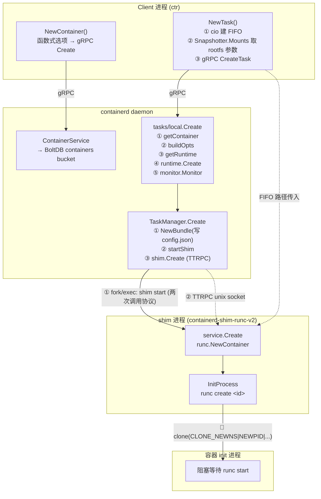
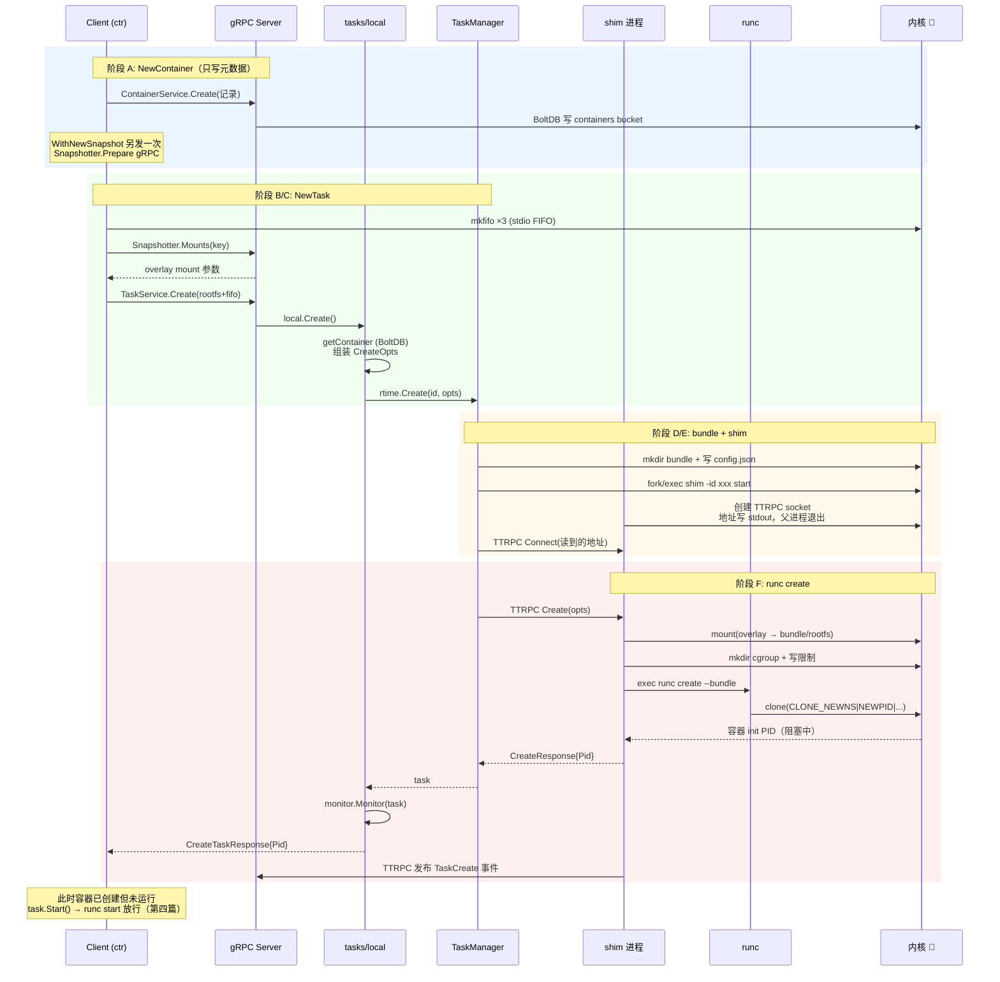
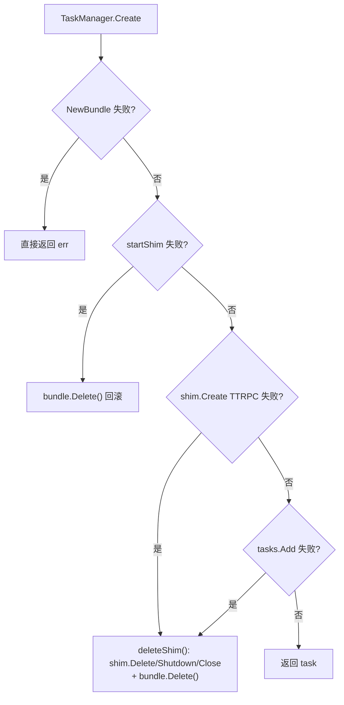

# 第三篇：容器创建（NewContainer + NewTask）全链路

> containerd v1.5.x (commit 5280530a0) 源码剖析系列 3/N
> 核心文件：`client.go`、`container.go`、`services/tasks/local.go`、`runtime/v2/manager.go`、`runtime/v2/binary.go`、`runtime/v2/runc/v2/service.go`

---

## 1. 概述

一句话：**容器创建分两个 RPC——`NewContainer` 只在 BoltDB 写一条容器记录（元数据）；`NewTask` 才真正干活：Client 取 rootfs mounts → daemon 建 bundle → fork shim 进程 → TTRPC 调 shim → shim 挂载 rootfs 并 `runc create` 出停在入口处的容器 init 进程。**

关键认知：

- **Container ≠ Task**。Container 是静态记录（镜像、spec、snapshot key），Task 是活的进程。一个 Container 可以反复创建 Task（容器退出后重启）。
- `NewTask` 结束时容器进程**已存在但没运行**（runc create 后进程阻塞在预置位置），`task.Start()`（第四篇）才 `runc start` 放行。

在架构中的位置：本篇纵穿全部 5 层。

```
Client 层        NewContainer / NewTask
   │ gRPC
Daemon Services  services/tasks/local.go Create()  ← Step 1~5
   │ 内部调用
Runtime V2       TaskManager.Create → startShim    ← fork/exec + TTRPC
   │ TTRPC
Shim 层          runc/v2/service.go Create()
   │ fork/exec
runc             runc create <id> → clone(CLONE_NEW*) → 阻塞
```

---

## 2. 架构图



---

## 3. 核心数据结构

| 结构体 | 所在文件 | 关键字段 | 作用 |
|---|---|---|---|
| `containers.Container` | `containers/containers.go` | `ID`、`Image`、`Runtime`、`Spec`(Any)、`Snapshotter`、`SnapshotKey` | 容器元数据记录（存 BoltDB） |
| `tasks.CreateTaskRequest` | `api/services/tasks/v1` | `ContainerID`、`Rootfs []*Mount`、`Stdin/Stdout/Stderr`、`Terminal`、`Options` | NewTask 的 gRPC 请求 |
| `runtime.CreateOpts` | `runtime/runtime.go` | `Spec`、`IO`、`Rootfs []mount.Mount`、`Runtime`、`RuntimeOptions`、`Checkpoint` | daemon 内部传递给 runtime 的创建参数 |
| `Bundle` | `runtime/v2/bundle.go` | `ID`、`Path`、`Namespace` | OCI bundle 目录（config.json + rootfs/） |
| `runc.Container` | `runtime/v2/runc/container.go` | `ID`、`Bundle`、`process`(InitProcess)、`cgroup` | shim 内的容器对象 |
| `process.Init` | `pkg/process/init.go` | `id`、`Bundle`、`stdio`、`status` | init 进程管理者，`runc create` 的实际执行者 |

---

## 4. 源码逐步剖析

### 阶段 A：NewContainer —— 只写元数据（client.go:316）

```go
func (c *Client) NewContainer(ctx context.Context, id string, opts ...NewContainerOpts) (Container, error) {
	ctx, done, err := c.WithLease(ctx)   // wy: 挂 GC 租约，防创建中途被 GC
	defer done(ctx)

	container := containers.Container{
		ID: id,
		Runtime: containers.RuntimeInfo{
			Name: c.runtime,   // wy: 默认 "io.containerd.runc.v2"
		},
	}

	// wy: 🚀 函数式选项模式——每个 opt 修改 container 并可能产生副作用
	// WithImage(image)       → container.Image、默认 snapshotter
	// WithSnapshotter(name)  → container.Snapshotter = "overlayfs"
	// WithNewSnapshot(id, image) → 🚀 调 Snapshotter.Prepare() 真正建快照层，
	//                              写入 container.SnapshotKey
	// WithNewSpec(opts...)   → oci.GenerateSpec 生成 config.json，塞进 container.Spec
	for _, o := range opts {
		if err := o(ctx, c, &container); err != nil { return nil, err }
	}

	// wy: 🚀 唯一的网络动作: gRPC → daemon → BoltDB 写 containers bucket
	r, err := c.ContainerService().Create(ctx, container)
	return containerFromRecord(c, r), nil
}
```

**注意顺序**：`WithNewSnapshot` 在 Client 进程里就直接 gRPC 调用了 daemon 的 Snapshotter service 建好快照——所以 NewContainer 返回时，磁盘上 overlay 的 upper/work 目录已经存在。

### 阶段 B：NewTask —— Client 侧准备（container.go:218）

```go
func (c *container) NewTask(ctx context.Context, ioCreate cio.Creator, opts ...NewTaskOpts) (_ Task, err error) {
	// Step 1: 🚀 创建 IO FIFO 管道（mkfifo 系统调用）
	// /run/containerd/fifos/<id>-stdin / -stdout / -stderr
	i, err := ioCreate(c.id)
	cfg := i.Config()
	request := &tasks.CreateTaskRequest{
		ContainerID: c.id,
		Terminal:    cfg.Terminal,
		Stdin:       cfg.Stdin,    // wy: FIFO 路径字符串，shim 负责打开
		Stdout:      cfg.Stdout,
		Stderr:      cfg.Stderr,
	}

	// Step 2: 🚀 从 Snapshotter 获取 rootfs 挂载参数
	r, err := c.get(ctx)   // wy: 拉取容器元数据记录
	if r.SnapshotKey != "" {
		s, _ := c.client.getSnapshotter(ctx, r.Snapshotter)
		mounts, err := s.Mounts(ctx, r.SnapshotKey)   // wy: gRPC → daemon → overlayfs 插件
		// wy: overlayfs 返回的 mounts:
		//   Type: "overlay"
		//   Options: ["workdir=.../work", "upperdir=.../fs",
		//             "lowerdir=.../layerN:.../layer1", "index=off"]
		for _, m := range mounts {
			request.Rootfs = append(request.Rootfs, &types.Mount{...})
		}
	}

	// Step 3: gRPC CreateTask → daemon
	response, err := c.client.TaskService().Create(ctx, request)
	// wy: response.Pid = 容器 init 进程 PID（此刻处于 created 状态，未运行）
}
```

**关键设计**：Client 只负责"描述" rootfs 怎么挂（mount 参数），**真正的 `mount()` 系统调用由 shim 执行**——因为挂载必须发生在 shim 的 mount namespace 视角下，且 daemon 不应持有容器挂载（崩溃时泄漏）。

### 阶段 C：daemon 侧 local.Create（services/tasks/local.go:170）

```go
func (l *local) Create(ctx context.Context, r *api.CreateTaskRequest, ...) (*api.CreateTaskResponse, error) {
	// Step 1: 从 BoltDB 取容器记录（spec、runtime name、snapshot 信息都在里面）
	container, err := l.getContainer(ctx, r.ContainerID)

	// Step 2: 组装 runtime.CreateOpts
	opts := runtime.CreateOpts{
		Spec: container.Spec,   // wy: OCI spec（config.json 内容，protobuf Any）
		IO: runtime.IO{
			Stdin: r.Stdin, Stdout: r.Stdout, Stderr: r.Stderr,
			Terminal: r.Terminal,
		},
		Checkpoint:     checkpointPath,
		Runtime:        container.Runtime.Name,     // wy: "io.containerd.runc.v2"
		RuntimeOptions: container.Runtime.Options,  // wy: 如 SystemdCgroup=true
	}
	for _, m := range r.Rootfs {   // wy: Client 传来的 rootfs 挂载参数
		opts.Rootfs = append(opts.Rootfs, mount.Mount{...})
	}

	// Step 3: 按 runtime name 找到 TaskManager（v2）
	rtime, err := l.getRuntime(container.Runtime.Name)

	// wy: 防重复创建: task 已存在直接报错
	_, err = rtime.Get(ctx, r.ContainerID)
	if err == nil { return nil, errors "task already exists" }

	// Step 4: 🚀 核心——runtime.Create（见阶段 D）
	c, err := rtime.Create(ctx, r.ContainerID, opts)

	// Step 5: 注册到 monitor（cgroups OOM 监控、退出事件，第四篇详述）
	l.monitor.Monitor(c, labels)

	return &api.CreateTaskResponse{
		ContainerID: r.ContainerID,
		Pid:         c.PID(),   // wy: 容器 init 进程 PID
	}
}
```

### 阶段 D：TaskManager.Create —— bundle + shim（runtime/v2/manager.go:148）

```go
func (m *TaskManager) Create(ctx context.Context, id string, opts runtime.CreateOpts) (_ runtime.Task, retErr error) {
	// Step 1: 🚀 创建 OCI bundle 目录
	// /run/containerd/io.containerd.runtime.v2.task/<ns>/<id>/
	//   ├── config.json   ← opts.Spec.Value 解码写入
	//   └── rootfs/       ← 待 shim 挂载 overlay 到此
	bundle, err := NewBundle(ctx, m.root, m.state, id, opts.Spec.Value)
	defer func() { if retErr != nil { bundle.Delete() } }()   // wy: 失败回滚

	// Step 2: 🚀 fork/exec 启动 shim（见阶段 E）
	shim, err := m.startShim(ctx, bundle, id, opts)
	defer func() { if retErr != nil { m.deleteShim(shim) } }()  // wy: 失败回滚

	// Step 3: 🚀 TTRPC 调用 shim 的 Create → shim 内执行 runc create（见阶段 F）
	t, err := shim.Create(ctx, opts)

	m.tasks.Add(ctx, t)   // wy: 加入 daemon 内存 task 表
	return t, nil
}
```

三步全部带 defer 回滚：任何一步失败，前面的产物（bundle 目录、shim 进程）都被清理。

### 阶段 E：startShim —— 两次调用协议（runtime/v2/manager.go:205 + binary.go:59）

```go
func (m *TaskManager) startShim(ctx, bundle, id, opts) (*shim, error) {
	// wy: runtime name → shim 二进制名
	// "io.containerd.runc.v2" → PATH 中查找 "containerd-shim-runc-v2"
	b := shimBinary(ctx, bundle, opts.Runtime, m.containerdAddress, m.containerdTTRPCAddress, ...)

	shim, err := b.Start(ctx, topts, func() {
		// wy: onClose 回调: shim 意外死亡时触发
		cleanupAfterDeadShim(...)   // wy: 清容器、发退出事件
		m.tasks.Delete(ctx, id)
	})
	return shim, nil
}
```

`binary.Start`（runtime/v2/binary.go:59）：

```go
func (b *binary) Start(ctx context.Context, opts *types.Any, onClose func()) (_ *shim, err error) {
	args := []string{"-id", b.bundle.ID}
	args = append(args, "start")     // wy: 🚀 第 1 次调用: "containerd-shim-runc-v2 -id xxx start"

	cmd, err := client.Command(ctx, b.runtime, b.containerdAddress,
		b.containerdTTRPCAddress, b.bundle.Path, opts, args...)

	// wy: 🚀 协议核心（run() 内 action=start 分支，runtime/v2/shim/shim.go）:
	//   父进程: 创建 TTRPC socket (abstract namespace)，把地址打印到 stdout，退出
	//   子进程: setsid 脱离父进程，作为 shim server 在该 socket 上 Serve()
	// daemon 从 stdout 读到 socket 地址 → TTRPC Connect
}
```

**为什么要两次调用？** shim 必须活过 daemon 重启（daemon 升级时容器不能死）。用 `start` 子命令 fork 出脱离的 daemon 化子进程，父进程立即退出——这样 shim 不是 containerd 的子进程，containerd 崩溃/重启不影响它。daemon 重启后靠扫描 state 目录 + socket 地址文件重连（`loadExistingTasks`，manager.go:274）。

### 阶段 F：shim 内 service.Create（runtime/v2/runc/v2/service.go:362）

```go
func (s *service) Create(ctx context.Context, r *taskAPI.CreateTaskRequest) (*taskAPI.CreateTaskResponse, error) {
	s.mu.Lock()
	defer s.mu.Unlock()

	// wy: 🚀 runc.NewContainer 内部:
	//   1. 读 bundle/config.json
	//   2. 创建 InitProcess（pkg/process/init.go）
	//   3. p.Create():
	//      - 挂载 rootfs: mount("overlay", bundle/rootfs, ...)  🚀 mount 系统调用
	//      - 创建 cgroup 目录，写入资源限制
	//      - exec "runc create --bundle <bundle> <id>"
	//        runc: clone(CLONE_NEWPID|NEWNS|NEWUTS|NEWIPC|NEWNET) 创建容器 init 进程，
	//              init 进程 execve 用户命令前阻塞在预置点（通过 pipe 等 runc start）
	container, err := runc.NewContainer(ctx, s.platform, r)

	s.containers[r.ID] = container   // wy: 一个 shim 可管多个容器（runc.v2 特性）

	// wy: 发布 TaskCreate 事件 → 事件队列 → forward goroutine → daemon TTRPC
	s.send(&eventstypes.TaskCreate{
		ContainerID: r.ID, Bundle: r.Bundle, Rootfs: r.Rootfs,
		Pid: uint32(container.Pid()),
	})

	return &taskAPI.CreateTaskResponse{Pid: uint32(container.Pid())}
}
```

---

## 5. 完整时序图



---

## 6. 关键数据路径

```
/run/containerd/ (State, tmpfs)
├── fifos/
│   ├── <id>-stdin / -stdout / -stderr         ← 阶段 B Step1 mkfifo
└── io.containerd.runtime.v2.task/<ns>/<id>/   ← 阶段 D bundle
    ├── config.json                            ← OCI spec
    ├── rootfs/                                ← 阶段 F shim 挂载 overlay 到此
    ├── address                                ← shim TTRPC socket 地址（daemon 重启重连用）
    ├── log                                    ← shim 日志 fifo
    └── shim.pid                               ← shim 进程 PID

/var/lib/containerd/ (Root, 磁盘)
├── io.containerd.metadata.v1.bolt/meta.db     ← 阶段 A 容器记录写入
└── io.containerd.snapshotter.v1.overlayfs/
    └── snapshots/<N>/
        ├── fs/      ← upperdir（可写层）     ← NewContainer 时 Prepare 建好
        └── work/    ← overlay workdir

cgroup 文件系统
└── /sys/fs/cgroup/.../<container-id>/         ← 阶段 F runc create 建好
```

BoltDB 读写：

| 阶段 | bucket | 操作 |
|---|---|---|
| A | `v1/containers/<ns>/<id>` | PUT 容器记录 |
| A | `v1/snapshots/<ns>/overlayfs/<key>` | PUT 快照记录（Prepare） |
| C | `v1/containers/<ns>/<id>` | GET 读 spec/runtime |

---

## 7. 并发模型与同步

| 点 | 机制 |
|---|---|
| Client NewTask | 单 goroutine 串行三步 |
| daemon local.Create | gRPC handler goroutine；`rtime.Get` 防重复创建（先查后建，靠 task 表锁兜底） |
| shim service.Create | `s.mu.Lock()` 整个 Create 临界区——同一 shim 内容器串行创建 |
| shim ↔ daemon 事件 | shim 内事件队列 + 独立 forward goroutine，异步回传 |
| shim 启动 | 父进程 stdout 传 socket 地址是同步握手点：daemon 阻塞读直到拿到地址 |

---

## 8. 错误路径与回滚



| 失败点 | 清理动作 | 残留风险 |
|---|---|---|
| shim fork 成功但 TTRPC 握手失败 | `deleteShim` 带 cleanupTimeout 尝试 Delete，超时则 Shutdown+Close | 极端情况 shim 孤儿，靠 `ctr` 手动清或 daemon 重启扫描 |
| shim 运行中死亡 | onClose 回调 → `cleanupAfterDeadShim`：杀容器进程、发退出事件、task 表移除 | rootfs 挂载点可能残留，daemon 重启时 CleanupTempMounts 处理 |
| runc create 失败（如 cgroup 路径冲突） | shim 内返回错误，daemon 走 deleteShim 回滚 | — |
| Client 端 mkfifo 成功但 CreateTask 失败 | `defer i.Cancel(); i.Close()` 删 FIFO | — |

---

## 9. 设计要点与踩坑

### 设计精髓

1. **Container/Task 分离**：元数据与进程解耦，容器退出后 `NewTask` 可复用同一 Container 记录重启；也是 checkpoint/restore 的基础。
2. **Client 描述、shim 挂载**：rootfs mount 参数经 gRPC 两跳传到 shim，`mount()` 发生在 shim 进程——daemon 不持有容器挂载，崩溃不泄漏。
3. **两次调用协议**：shim 脱离 daemon 生命周期，daemon 可独立升级重启，容器无感知。
4. **一路 defer 回滚**：Create 三步每步都有清理闭包，任何失败不留半成品。
5. **一个 shim 多容器（runc.v2）**：Pod 内共享 shim，Kubernetes 场景下进程数从 2N 降到 N+1。

### 踩坑 / 调试

| 现象 | 原因 | 排查 |
|---|---|---|
| `task already exists` | 上次 task 没 Delete 就再 NewTask | `ctr tasks ls`，先 kill+delete |
| NewTask 卡住 | shim 启动握手超时（shim 二进制缺失/无执行权限） | `which containerd-shim-runc-v2`，看 bundle 目录 log |
| `OCI runtime create failed` | config.json 问题（seccomp/cgroup 驱动不匹配） | 读 bundle/config.json，配 `SystemdCgroup` 一致性 |
| 残留 shim 进程 | daemon 崩溃时未清理 | `ps aux \| grep shim`，`ctr tasks ls` 对照 |
| 想看容器 init 卡在哪 | runc create 后进程本来就该阻塞 | `cat /proc/<pid>/stack` 或 `runc state <id>` |

手动验证完整链路：

```bash
ctr image pull docker.io/library/alpine:latest
ctr run -d docker.io/library/alpine:latest test1 sleep 100
# 观察:
ls /run/containerd/io.containerd.runtime.v2.task/default/test1/   # bundle
cat .../test1/address                                              # shim socket
ps aux | grep -E "shim|sleep"                                      # shim + 容器进程
```

---

## 10. 下一篇预告

**第四篇：Exec / Wait / Kill / Delete 任务管理** —— Task 状态机（Created→Running→Stopped）、`Start` 的 runc start + cgroup OOM 注册、`Wait` 如何通过事件流实现、`Kill` 的信号传递、exec 进程与 init 进程的差异，以及 Reaper 如何 wait4 回收僵尸进程。
