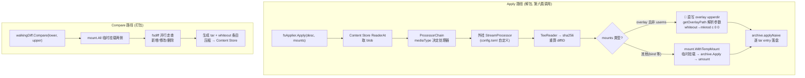
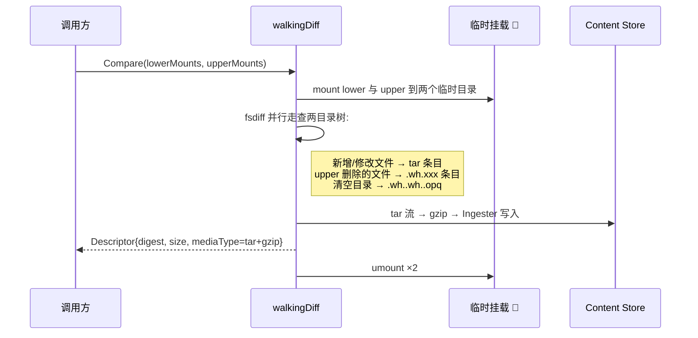
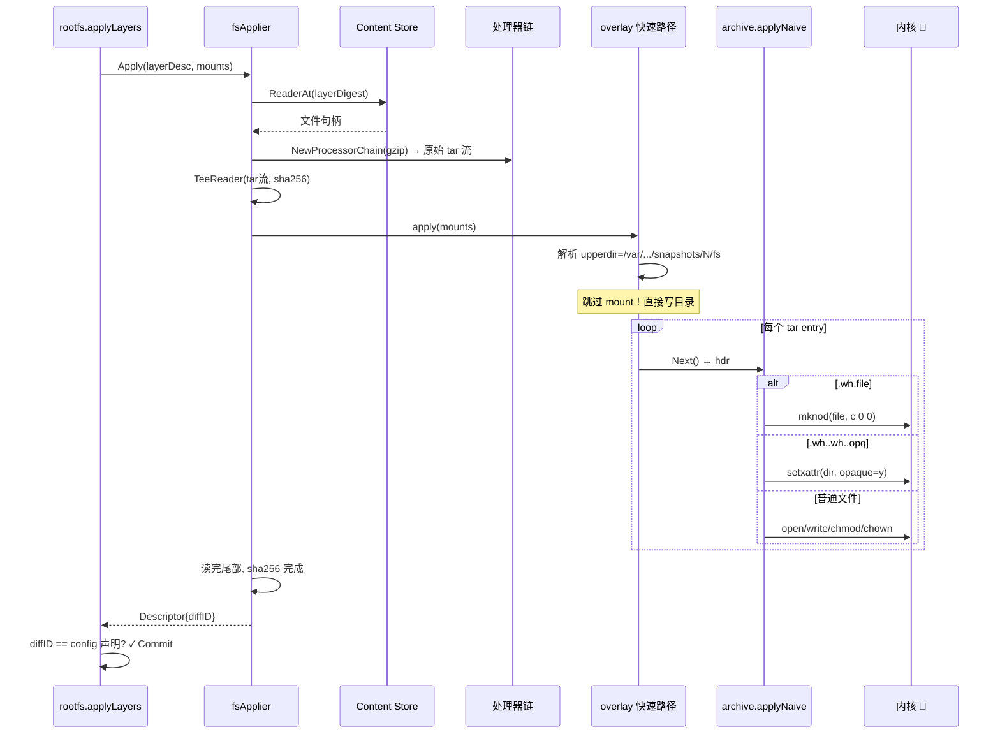

# 第九篇：Diff 与层应用（walking differ / fs applier）

> containerd v1.5.x (commit 5280530a0) 源码剖析系列 9/N
> 核心文件：`diff/diff.go`、`diff/apply/apply.go`、`diff/apply/apply_linux.go`、`diff/walking/differ.go`、`archive/tar.go`

---

## 1. 概述

一句话：**Diff 子系统有两条相反的路径——Apply（解包）把 Content Store 里的压缩 layer blob 经"处理器链（解压）→ 流式算 diffID → 写入快照目录"还原成文件树；Compare（打包）双目录并行走查生成带 whiteout 的增量 tar。Linux 上 Apply 有一个关键优化：识别出 overlay 挂载参数后直接写 upperdir 目录，跳过 mount/umount 系统调用，whiteout 文件用 `mknod c 0 0` 翻译成 overlay 原生删除标记。**

在架构中的位置：DiffPlugin（walking）+ ServicePlugin（diff service），被 Unpack（Apply 路径，第六篇）和容器 Commit/checkpoint（Compare 路径）消费。

```
Apply:  blob(压缩tar) → [处理器链: gunzip] → tar流 → archive.Apply → 快照目录
                     └ TeeReader 同步算 sha256 → 返回 diffID 供校验

Compare: lower目录 + upper目录 → walking 对比 → tar流(含whiteout) → Content Store blob
```

---

## 2. 架构图



---

## 3. 核心数据结构

| 结构体/接口 | 所在文件 | 作用 |
|---|---|---|
| `diff.Applier` | `diff/diff.go` | `Apply(ctx, desc, mounts) → Descriptor`（解包接口） |
| `diff.Comparer` | `diff/diff.go` | `Compare(ctx, lower, upper) → Descriptor`（打包接口） |
| `diff.StreamProcessor` | `diff/stream_processor.go` | 媒体类型转换处理器（如 gzip 解压、外挂二进制） |
| `fsApplier` | `diff/apply/apply.go:44` | Applier 实现：Provider + 处理器链 |
| `walkingDiff` | `diff/walking/differ.go` | Comparer 实现：目录行走对比 |
| `ApplyOptions` | `archive/tar_opts.go` | tar 解包选项（whiteout 转换函数、父层列表） |

---

## 4. 源码逐步剖析（Apply 路径）

### 4.1 fsApplier.Apply：流式解包主流程（diff/apply/apply.go:52）

```go
func (s *fsApplier) Apply(ctx, desc ocispec.Descriptor, mounts []mount.Mount, opts...) (d ocispec.Descriptor, err error) {
	// Step 1: 从 Content Store 读 blob（第七篇 ReaderAt）
	ra, err := s.store.ReaderAt(ctx, desc)
	defer ra.Close()

	// Step 2: 🚀 构建处理器链——按 MediaType 逐层解包到原始 tar
	//   application/vnd.docker.image.rootfs.diff.tar.gzip → gzip 处理器 → 原始 tar
	//   application/vnd.oci.image.layer.v1.tar            → 直通
	//   自定义类型 → 查 config.toml 的 stream_processors 外挂二进制
	processor := diff.NewProcessorChain(desc.MediaType, content.NewReader(ra))
	for {
		processor, err = diff.GetProcessor(ctx, processor, config.ProcessorPayloads)
		processors = append(processors, processor)
		if processor.MediaType() == ocispec.MediaTypeImageLayer {
			break   // wy: 解到原始 tar 为止
		}
	}

	// Step 3: 🚀 TeeReader 分流——一路写磁盘，一路喂 sha256
	// 解包完成时 diffID 同时算好，零额外遍历
	digester := digest.Canonical.Digester()
	rc := &readCounter{ r: io.TeeReader(processor, digester.Hash()) }

	// Step 4: 实际落盘（见 4.2）
	if err := apply(ctx, mounts, rc); err != nil { return emptyDesc, err }

	io.Copy(ioutil.Discard, rc)   // wy: 读完尾部，确保哈希完整

	return ocispec.Descriptor{
		MediaType: ocispec.MediaTypeImageLayer,
		Size:      rc.c,                 // wy: 解压后大小
		Digest:    digester.Digest(),    // wy: 🚀 重算的 diffID（第六篇 Commit 前校验它）
	}, nil
}
```

**为什么重算 diffID 而非信任 config？** blob 的 digest（压缩后）在 Content Store 读取时已校验；但解压后的内容是否等于 config 声明的 diffID 只有解完才知道——这是防镜像篡改/损坏的最后一关。

### 4.2 apply()：overlay 直写优化（diff/apply/apply_linux.go:33）

```go
func apply(ctx context.Context, mounts []mount.Mount, r io.Reader) error {
	switch {
	// wy: 🚀 快速路径: 目标是 overlay 且不在 userns 中
	case len(mounts) == 1 && mounts[0].Type == "overlay":
		if userns.RunningInUserNS() { break }  // userns 里 mknod 不可用，退回慢路径

		// wy: 直接从挂载参数里抠出 upperdir 路径——不挂载，直接写目录！
		path, parents, err := getOverlayPath(mounts[0].Options)
		//   getOverlayPath: 解析 "upperdir=..." 和 "lowerdir=..."

		opts := []archive.ApplyOpt{
			archive.WithConvertWhiteout(archive.OverlayConvertWhiteout), // wy: whiteout 翻译
		}
		if len(parents) > 0 {
			opts = append(opts, archive.WithParents(parents)) // wy: 父层路径（opaque 校验用）
		}
		_, err = archive.Apply(ctx, path, r, opts...)   // wy: 写入 upperdir 目录
		return err

	// wy: aufs 同理（略）

	// wy: 🚀 慢速回退路径: bind/其他类型 → 真挂载到临时目录再解
	default:
		return mount.WithTempMount(ctx, mounts, func(root string) error {
			_, err := archive.Apply(ctx, root, r)   // wy: mount → 写入 → umount
			return err
		})
	}
}
```

**优化的本质**：overlay 的 upperdir 就是一个普通目录，解包产物最终就落在那里——`mount(overlay)` 只是把 lower+upper 叠起来给人看，对"往 upper 写文件"这个动作毫无必要。省掉 mount/umount 一对系统调用 + 挂载点生命周期管理，大镜像解包显著提速。

### 4.3 whiteout 翻译（archive/tar_opts_linux.go:36）

OCI tar 用特殊文件名表达删除，overlay 用自己的机制——Apply 负责翻译：

```go
func OverlayConvertWhiteout(hdr *tar.Header, path string) (bool, error) {
	base := filepath.Base(path)
	dir := filepath.Dir(path)

	// 情况 1: 整目录 opaque（.wh..wh..opq）→ overlay xattr
	if base == whiteoutOpaqueDir {
		return false, unix.Setxattr(dir, "trusted.overlay.opaque", []byte{'y'}, 0)
		// wy: 🚀 overlay 挂载时，此 xattr 让内核隐藏下层同名目录全部内容
	}

	// 情况 2: 单文件删除（.wh.<name>）→ 0 号字符设备
	if strings.HasPrefix(base, whiteoutPrefix) {
		originalPath := filepath.Join(dir, base[len(whiteoutPrefix):])
		return false, unix.Mknod(originalPath, unix.S_IFCHR, 0)
		// wy: 🚀 mknod c 0 0 = overlay 的 whiteout 标记，挂载后下层同名文件被遮挡
	}
	return true, nil  // 普通文件，正常写入
}
```

| OCI tar 条目 | 含义 | overlay 翻译 |
|---|---|---|
| `.wh.somefile` | 删除下层 somefile | `mknod somefile c 0 0`（字符设备 0,0） |
| `somedir/.wh..wh..opq` | 清空下层 somedir 内容 | `setxattr somedir trusted.overlay.opaque=y` |
| 普通文件 | 新增/覆盖 | 直接写入 upperdir |

**慢路径（真挂载后解包）**则不需要翻译——直接在 overlay 挂载点上 `unlink`/创建文件，内核自动生成 whiteout。两条路径产物等价。

### 4.4 archive.applyNaive：tar 逐条目落盘（archive/tar.go:144）

```go
func applyNaive(ctx, root, r, options) (size int64, err error) {
	tr := tar.NewReader(r)
	for {
		hdr, err := tr.Next()
		if err == io.EOF { break }

		path := filepath.Join(root, hdr.Name)

		// wy: whiteout 条目 → 调用 ConvertWhiteout（overlay 翻译或真删除）
		if whiteout conversion handled { continue }

		// wy: 按 entry 类型分发:
		//   TypeReg  → 创建文件 + 流式 copy 内容（支持硬链接复用）
		//   TypeDir  → mkdir（含权限/xattr 恢复）
		//   TypeSymlink → symlink
		//   TypeLink → 硬链接（指向同层已解包文件）
		//   TypeChar/Block/Fifo → mknod/mkfifo
		createTarFile(ctx, path, root, hdr, tr)

		// wy: 最后统一恢复 mtime（写入会改变 mtime，需按 tar 头复原）
	}
}
```

---

## 5. Compare 路径（打包，简述）

`walkingDiff.Compare`（diff/walking/differ.go:60）用于 `ctr containers checkpoint` / 镜像 Commit 场景：



与 Apply 相反：Apply 消费 whiteout，Compare 生产 whiteout。两条路径共享 `archive` 包的 whiteout 语义定义。

---

## 6. 完整 Apply 时序图



---

## 7. 关键数据路径

```
输入:  /var/lib/containerd/io.containerd.content.v1.content/blobs/sha256/<layerDigest>  (tar.gz)
输出:  /var/lib/containerd/io.containerd.snapshotter.v1.overlayfs/snapshots/<id>/fs/     (文件树)

whiteout 产物:
  snapshots/<id>/fs/etc/.wh.hostname      ← 字符设备 c 0 0（删除下层 hostname）
  snapshots/<id>/fs/var/                  ← xattr trusted.overlay.opaque=y（清空下层 var）
```

**无任何数据库写入**——Apply 是纯文件操作 + 返回描述符，元数据更新由调用方（第六篇 Commit）负责。

---

## 8. 并发模型

| 环节 | 并发 |
|---|---|
| 单次 Apply | 单 goroutine 顺序读 tar（gzip 不可并行解压） |
| 多镜像并行解包 | 不同 goroutine 各写各的快照目录，互不干扰 |
| 处理器链 | 链内管道式流处理（reader 串联），无独立 goroutine（外挂处理器除外，走 stdin/stdout 管道进程） |
| Compare | 单流；两目录行走是顺序递归 |

---

## 9. 错误路径

| 场景 | 行为 |
|---|---|
| blob 读取失败 | Apply 直接返回错误，快照层由第六篇 defer Remove 清理 |
| 解压中途 tar 损坏 | applyNaive 返回错误 → 已写入部分文件残留在 upperdir → 上层删快照目录整体清理（目录级回滚，不需文件级） |
| diffID 重算不符 | 第六篇 Commit 前拦截，`wrong diff id` 错误 |
| mknod 失败（userns/rootless） | 快速路径入口就检测 `RunningInUserNS()` 绕开，走真挂载慢路径由内核生成 whiteout |
| setxattr opaque 失败（文件系统不支持 xattr） | 返回错误；此类文件系统通常也不支持 overlay，snapshotter 已降级 native |
| 外挂 stream processor 崩溃 | `processors[i].Err()` 收集错误，Apply 返回失败 |

---

## 10. 设计要点与踩坑

### 设计精髓

1. **直写 upperdir 跳过挂载**：识别 overlay 参数直接写目录，把"挂载"留给真正需要叠合视图的消费者——解包根本不需要看叠合效果。
2. **TeeReader 一趟算 diffID**：解压数据流过一次同时完成落盘和校验哈希，无第二趟 IO。
3. **whiteout 双语翻译层**：OCI 语义（`.wh.` 文件名）与 overlay 语义（mknod/xattr）之间的适配集中在一个 ConvertWhiteout 函数，慢路径/快路径/Compare 三方共享语义。
4. **处理器链可扩展**：config.toml 的 `[stream_processors]` 可挂外部二进制处理自定义媒体类型（如加密层、去重层），containerd 核心不认识也能解。
5. **回滚粒度 = 整个快照目录**：不解单文件事务，失败删目录即可——与第六篇 `sn.Remove(key)` 配合天然干净。

### 踩坑 / 调试

| 现象 | 原因 | 排查 |
|---|---|---|
| 解包报 `operation not permitted` | rootless 下走了快速路径但 mknod 被禁 | 升级版本（userns 检测修复见 issue #3762）或用 native snapshotter |
| "wrong diff id calculated on extraction" | 镜像 blob 损坏或 registry 传输错误 | 删镜像重拉；校验 registry 存储 |
| 解包极慢 | 大 layer + 单流 gzip 不可并行 | 正常瓶颈；可用 `pigz` 打包的镜像（仍是 gzip 格式）无帮助，解压侧单线程是设计限制 |
| 容器内看不到某文件（应存在） | 上层有 whiteout 遮挡 | `ls -la snapshots/<id>/fs/...` 查字符设备 0,0 或 opaque xattr |
| 想自定义解包（如加密镜像） | — | config.toml 配 `[stream_processors."io.custom.decrypt"]`，指定二进制路径与 accepts/returns 媒体类型 |

---

## 11. 下一篇预告

**第十篇：Metadata 与 BoltDB** —— `metadata/db.go` 如何把 BoltDB + Content Store + Snapshotter 封装成统一数据中枢：事务包装器、namespace 隔离、`v1/` bucket 布局、GC 标记扫描（Mark 阶段如何遍历所有 bucket 建引用图），以及与第七/八篇双库的协作关系。
