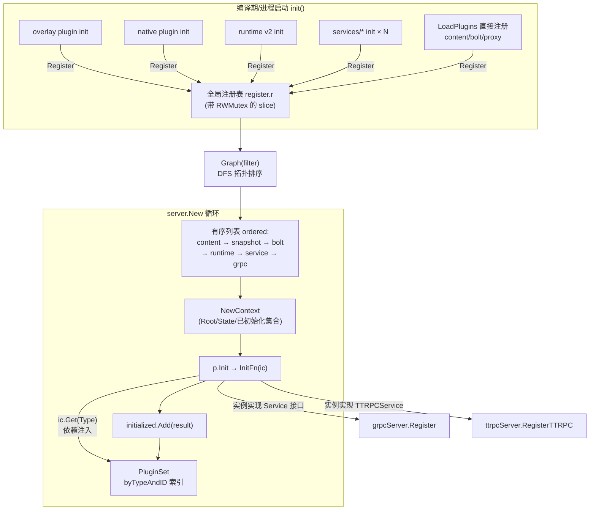
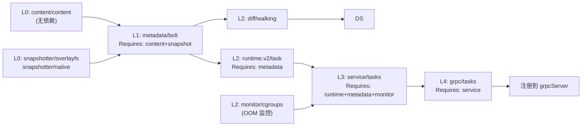
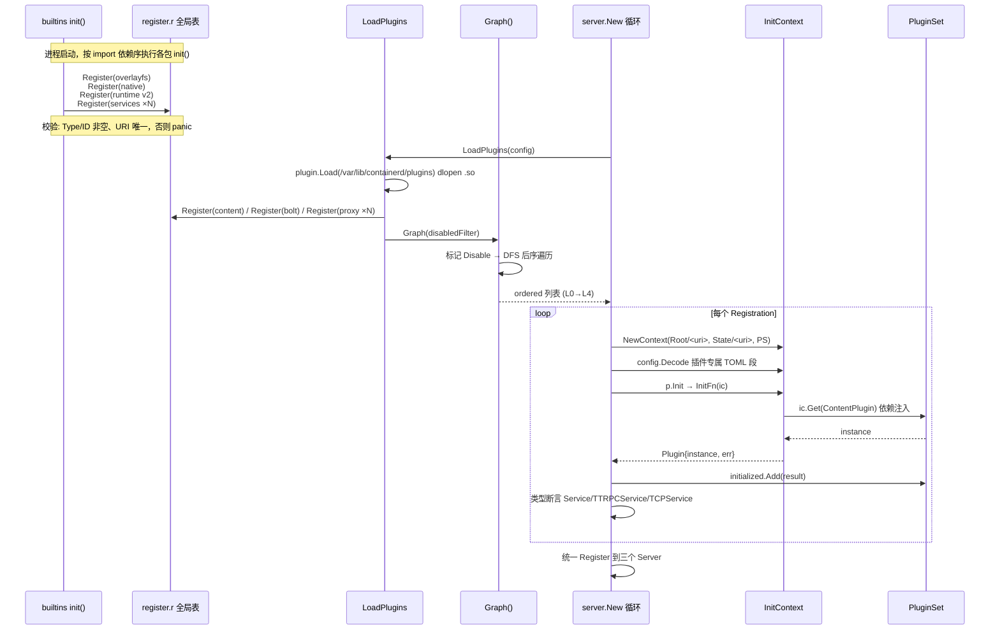
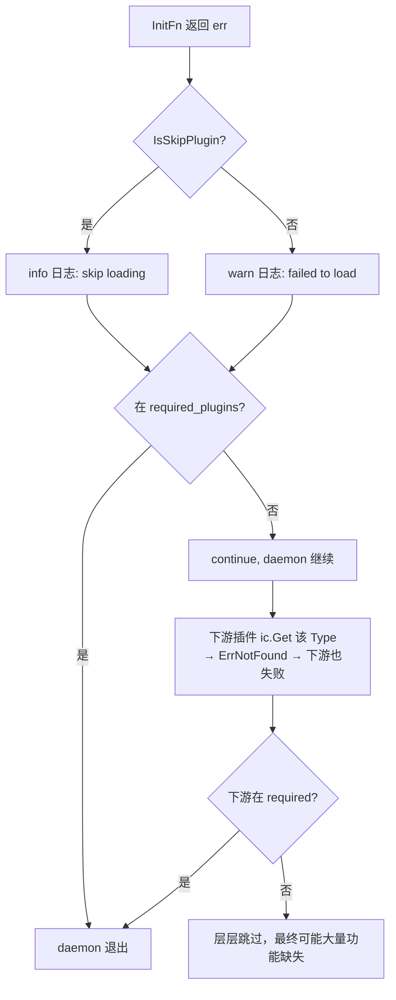

# 第二篇：Plugin 机制与拓扑排序

> containerd v1.5.x (commit 5280530a0) 源码剖析系列 2/N
> 核心文件：`plugin/plugin.go`、`plugin/context.go`、`services/tasks/local.go`、`services/tasks/service.go`

---

## 1. 概述

一句话：**containerd 把整个 daemon 的所有功能（存储、运行时、服务、监控、GC）都抽象为 Plugin，通过 `Type+ID` 标识、`Requires` 声明依赖、`Graph()` 做 DFS 拓扑排序，按"被依赖者先初始化"的顺序执行各自的 `InitFn`，并用 `InitContext` 完成依赖注入。**

在架构中的位置：这是第一篇 Step 7 `server.New()` 背后真正干活的机制。理解了它，就理解了 containerd 为什么能"任意替换 snapshotter / runtime / content store"。

---

## 2. 架构图



---

## 3. 核心数据结构

| 结构体 | 所在文件:行 | 关键字段 | 作用 |
|---|---|---|---|
| `Type` | `plugin/plugin.go:51` | string 别名 | 插件类型常量，10 种（见下） |
| `Registration` | `plugin/plugin.go:134` | `Type`、`ID`、`Config`、`Requires`、`InitFn`、`Disable` | 插件注册信息，全局唯一标识 = `URI()` = `Type.ID` |
| `Plugin` | `plugin/context.go:71` | `Registration`、`instance`、`err`、`Meta` | InitFn 执行结果包装（实例**或**错误，二者共存） |
| `InitContext` | `plugin/context.go` | `Context`、`Root`、`State`、`plugins`、`Config`、`Events`、`Address` | 传给 InitFn 的依赖注入上下文 |
| `PluginSet` | `plugin/context.go` | `ordered`、`byTypeAndID` | 已初始化插件集合，`Get/GetByType` 查找 |
| `Meta` | `plugin/context.go:64` | `Platforms`、`Exports`、`Capabilities` | 插件向外界声明的能力元信息（`ctr plugins ls` 可见） |

### 10 种 Plugin Type（plugin/plugin.go:65-108）

| Type 常量 | URI 前缀 | 默认实现 | 职责 |
|---|---|---|---|
| `InternalPlugin` | `io.containerd.internal.v1` | — | 内部组件 |
| `RuntimePlugin` | `io.containerd.runtime.v1` | runtime/v1/linux | v1 运行时（废弃） |
| `RuntimePluginV2` | `io.containerd.runtime.v2` | runtime/v2 `TaskManager` (ID=task) | 🚀 管理 shim 进程 |
| `ServicePlugin` | `io.containerd.service.v1` | services/tasks 等 | gRPC handler 的业务实现 |
| `GRPCPlugin` | `io.containerd.grpc.v1` | services/*/service.go | 把 ServicePlugin 包装注册到 gRPC Server |
| `SnapshotPlugin` | `io.containerd.snapshotter.v1` | overlay / native | 🚀 rootfs 快照 |
| `TaskMonitorPlugin` | `io.containerd.monitor.v1` | cgroups OOM monitor | 监控 task 退出/OOM |
| `DiffPlugin` | `io.containerd.differ.v1` | walking differ | tar 生成与应用 |
| `MetadataPlugin` | `io.containerd.metadata.v1` | metadata.DB (ID=bolt) | 🚀 BoltDB 元数据中枢 |
| `ContentPlugin` | `io.containerd.content.v1` | content/local.Store | CAS blob 存储 |
| `GCPlugin` | `io.containerd.gc.v1` | gc/scheduler | 垃圾回收策略 |

### 三个 Runtime 名称常量（plugin/plugin.go:115-126）

```go
RuntimeLinuxV1 = "io.containerd.runtime.v1.linux"  // wy: v1 legacy
RuntimeRuncV1  = "io.containerd.runc.v1"           // wy: 每容器一个 shim（废弃）
RuntimeRuncV2  = "io.containerd.runc.v2"           // wy: 🚀 生产默认，一个 shim 管多容器（Pod 共享）
```

这些名字决定容器创建时 `startShim` 去 PATH 里找哪个二进制：`containerd-shim-<name>-<version>` → `containerd-shim-runc-v2`（第三篇详述）。

---

## 4. 源码逐步剖析

### 4.1 注册：Register()（plugin/plugin.go:236）

```go
var register = struct {
	sync.RWMutex
	r []*Registration    // wy: 🚀 全局注册表就是一个加锁的 slice，简单到极致
}{}

func Register(r *Registration) {
	register.Lock()
	defer register.Unlock()

	if r.Type == "" { panic(ErrNoType) }       // wy: 注册期 panic = 编译集成问题，启动就炸
	if r.ID == ""   { panic(ErrNoPluginID) }
	if err := checkUnique(r); err != nil {
		panic(err)                             // wy: URI 重复 → panic（防重复 blank import）
	}
	for _, requires := range r.Requires {
		if requires == "*" && len(r.Requires) != 1 {
			panic(ErrInvalidRequires)          // wy: "*" 必须单独使用
		}
	}
	register.r = append(register.r, r)
}
```

调用者示例（`runtime/v2/manager.go:52`）：

```go
func init() {
	plugin.Register(&plugin.Registration{
		Type: plugin.RuntimePluginV2,
		ID:   "task",
		Requires: []plugin.Type{
			plugin.MetadataPlugin,   // wy: 声明依赖 → Graph() 据此排序
		},
		Config: &Config{ Platforms: defaultPlatforms() },
		InitFn: func(ic *plugin.InitContext) (interface{}, error) {
			// wy: 真正创建 TaskManager（第三篇主角）
		},
	})
}
```

**设计要点**：注册（`init()` 追加元信息）与初始化（`InitFn` 执行）完全分离。`init()` 阶段零成本、零副作用，所有重活（打开文件、起协程）都推迟到 daemon 真正启动时按拓扑序执行。

### 4.2 拓扑排序：Graph() + children()（plugin/plugin.go:287-338）

```go
func Graph(filter DisableFilter) (ordered []*Registration) {
	register.RLock()
	defer register.RUnlock()

	// Step 1: 按 disabled_plugins 配置标记禁用
	for _, r := range register.r {
		if filter(r) { r.Disable = true }
	}

	// Step 2: DFS 后序遍历——先放依赖，再放自己
	added := map[*Registration]bool{}
	for _, r := range register.r {
		if r.Disable { continue }
		children(r, added, &ordered)          // wy: 先把 r 的全部依赖递归放入 ordered
		if !added[r] {
			ordered = append(ordered, r)
			added[r] = true
		}
	}
	return ordered
}

// children: 递归收集 reg 依赖的所有插件
func children(reg *Registration, added map[*Registration]bool, ordered *[]*Registration) {
	for _, t := range reg.Requires {
		for _, r := range register.r {
			if !r.Disable &&
				r.URI() != reg.URI() &&              // wy: 排除自身
				(t == "*" || r.Type == t) {          // wy: 按 Type 匹配，"*" 匹配全部
				children(r, added, ordered)          // wy: 递归：r 的依赖比 r 更靠前
				if !added[r] {
					*ordered = append(*ordered, r)
					added[r] = true
				}
			}
		}
	}
}
```

**算法本质**：对依赖图做 DFS 后序遍历（post-order），`added` map 去重。注意两点：

1. **依赖是按 Type 而非按具体插件**——`Requires: [MetadataPlugin]` 意味着依赖"所有 metadata 类型插件"。实际上每类通常只有一个实现。
2. **不检测环**——若 A 依赖 B、B 依赖 A，`added` map 让谁先进入谁先排，不会死循环但结果无意义。官方靠约定避免：依赖方向永远向下（service → runtime → metadata → content/snapshot）。

### 4.3 实际排序结果（Layer 0 → 4）

根据各插件真实的 `Requires` 声明推导：



| Layer | 插件 | Requires | 源码依据 |
|---|---|---|---|
| 0 | `content/content`、`snapshotter/overlayfs`、`snapshotter/native` | 无 | server.go:400, snapshots/*/plugin |
| 1 | `metadata/bolt` | Content + Snapshot | server.go:418 |
| 2 | `runtime.v2/task` | Metadata | runtime/v2/manager.go:55 |
| 2 | `diff/walking`、`monitor/cgroups` | Metadata | diff/walking/plugin, metrics |
| 3 | `service/tasks` | RuntimeV1 + RuntimeV2 + Metadata + Monitor | services/tasks/local_unix.go:28 |
| 4 | `grpc/tasks` | Service | services/tasks/service.go:38 |

`service/tasks` 的依赖声明（`services/tasks/local_unix.go:28`）：

```go
var tasksServiceRequires = []plugin.Type{
	plugin.RuntimePlugin,     // wy: v1 runtime（unix 平台保留兼容）
	plugin.RuntimePluginV2,   // wy: v2 TaskManager
	plugin.MetadataPlugin,    // wy: BoltDB
	plugin.TaskMonitorPlugin, // wy: OOM 监控器
}
```

### 4.4 依赖注入：InitContext.Get / GetByType（plugin/context.go）

```go
// Get 按 Type 取第一个已初始化的插件实例
func (i *InitContext) Get(t Type) (interface{}, error) {
	return i.plugins.Get(t)    // wy: plugins 是 *PluginSet，只含"已初始化"的插件
}

// GetByType 取某 Type 下全部实例（如多个 snapshotter）
func (i *InitContext) GetByType(t Type) (map[string]*Plugin, error) {
	p, ok := i.plugins.byTypeAndID[t]
	if !ok {
		return nil, errors.Wrapf(errdefs.ErrNotFound, "no plugins registered for %s", t)
	}
	return p, nil
}
```

`PluginSet` 由 `server.New()` 循环中 `initialized.Add(result)` 逐个填充——**拓扑排序保证：当 B 的 InitFn 执行 `ic.Get(A类型)` 时，A 一定已经在 PluginSet 里**。这就是 containerd 的"穷人版依赖注入框架"。

消费端示例（`services/tasks/service.go:41`，GRPCPlugin 包装层）：

```go
InitFn: func(ic *plugin.InitContext) (interface{}, error) {
	plugins, err := ic.GetByType(plugin.ServicePlugin)  // wy: 拿到所有 service 实例
	p, ok := plugins[services.TasksService]             // wy: 按 ID 精确取 tasks service
	if !ok {
		return nil, errors.New("tasks service not found")
	}
	// wy: 包装成 gRPC service 对象，返回后由 server.New 统一 Register
}
```

### 4.5 三种服务接口与"鸭子类型"注册（plugin/plugin.go:191-207）

```go
type Service interface {                      // wy: 实现 → 注册到 Unix Socket gRPC
	Register(*grpc.Server) error
}
type TTRPCService interface {                 // wy: 实现 → 注册到 TTRPC（shim 用）
	RegisterTTRPC(*ttrpc.Server) error
}
type TCPService interface {                   // wy: 实现 → 注册到 TCP gRPC（远程）
	RegisterTCP(*grpc.Server) error
}
```

注册逻辑是**类型断言驱动**的（server.go:259-267，第一篇已引）：实例实现了哪个接口就注册到哪个 Server，一个实例可以实现多个。没有注解、没有反射扫描——Go 接口鸭子类型的经典用法。

### 4.6 动态插件 Load()（plugin/plugin.go:215）

```go
func Load(path string) (err error) {
	defer func() {
		if v := recover(); v != nil {   // wy: 🚀 Go plugin 包 dlopen .so 失败会 panic，这里兜底
			...
			err = rerr
		}
	}()
	return loadPlugins(path)   // wy: Linux 实现用 golang.org/x/plugin 遍历目录加载 .so
}
```

默认扫描 `/var/lib/containerd/plugins/`。`.so` 内的 `init()` 同样调用 `Register()`，与内置插件汇入同一注册表——对 Graph() 完全透明。

### 4.7 ErrSkipPlugin：跳过 ≠ 失败（plugin/plugin.go:38）

```go
var ErrSkipPlugin = errors.New("skip plugin")

func IsSkipPlugin(err error) bool {
	return errors.Is(err, ErrSkipPlugin)
}
```

InitFn 返回 `ErrSkipPlugin` 表示"环境不满足条件，主动跳过"（如内核不支持 overlayfs、非 Linux 平台）。与普通 error 的区别：日志级别是 info 而非 warn。但无论哪种，**依赖它的下游插件调用 `ic.Get()` 都会拿到 ErrNotFound 而连锁失败**。

---

## 5. 初始化时序图



---

## 6. 关键数据路径

插件在磁盘上的足迹（每个插件的 Root/State 子目录由 `NewContext` 按 `p.URI()` 拼接）：

```
/var/lib/containerd/<plugin-URI>/      ← ic.Root，插件持久化目录
  例: io.containerd.content.v1.content/
      io.containerd.metadata.v1.bolt/meta.db
      io.containerd.snapshotter.v1.overlayfs/

/run/containerd/<plugin-URI>/          ← ic.State，插件运行时目录
  例: io.containerd.runtime.v2.task/<ns>/<id>/

/etc/containerd/config.toml            ← 插件配置来源
  [plugins."io.containerd.snapshotter.v1.overlayfs"]
    root_path = "..."
  [plugins."io.containerd.grpc.v1.cri".containerd.runtimes.runc]
    runtime_type = "io.containerd.runc.v2"
  disabled_plugins = []
  required_plugins = []
```

---

## 7. 并发模型

| 环节 | 并发情况 |
|---|---|
| `Register()` | 互斥锁保护，仅在 init()/启动串行阶段调用 |
| `Graph()` | 读锁；单 goroutine |
| InitFn 循环 | **完全串行**——依赖注入要求被依赖者已就绪，无法并行 |
| 插件内部 | InitFn 可自行启动后台 goroutine（GC 调度器、OOM 监控等） |

---

## 8. 错误路径与连锁反应



**关键结论**：content 或 metadata 插件挂了，几乎所有 service 都会连锁失败；而单个 snapshotter（如 native）挂了只影响它自己。这也是为什么生产环境把关键插件写进 `required_plugins` fail fast。

---

## 9. 设计要点与踩坑

### 设计精髓

1. **注册与初始化分离**：`init()` 只追加元信息，零副作用；可编译性在 `Register` 的 panic 中提前暴露。
2. **按 Type 依赖 + 拓扑排序**：依赖关系是"类型级"的粗粒度声明，天然支持"一个接口多个实现"（overlayfs/native 并存）。
3. **PluginSet 即穷人版 DI 容器**：没有代码生成、没有反射，靠排序保证 `Get` 一定命中。
4. **ServicePlugin / GRPCPlugin 两层拆分**：业务逻辑（local）与协议适配（gRPC wrapper）解耦，同一个 local 实现可以同时暴露 gRPC 和 TTRPC。
5. **URI 命名即配置键**：`Type.ID` 既是插件标识，也是 config.toml 里 `[plugins."..."]` 的键、磁盘子目录名，三位一体。

### 踩坑 / 调试

| 现象 | 原因 | 排查 |
|---|---|---|
| 启动 panic "id already registered" | 同一个插件被 import 两次（路径不同，如 vendor 问题） | 检查 go.mod 与 import 路径 |
| 插件列表里看不到某插件 | 没被 blank import 编译进来 | 检查 `cmd/containerd/builtins*.go` |
| `ic.Get` 报 "no plugins registered for xxx" | 依赖插件 skip 或失败，**不是**没排序 | 往上翻日志找真正的失败/skip 行 |
| 想临时禁用某插件 | 改配置重启 | `disabled_plugins = ["io.containerd.snapshotter.v1.native"]`（V2 格式用完整 URI 或 type/id） |
| 查看插件依赖图 | — | `ctr plugins ls` 显示 REQUIRES 列 |

---

## 10. 下一篇预告

**第三篇：容器创建（NewContainer + NewTask）全链路** —— 从 `Client.NewContainer()` 的 gRPC 写入，到 `NewTask()` 的 FIFO 创建、rootfs mounts 获取，再到 daemon 侧 `services/tasks/local.go: Create()` 五步、`TaskManager.Create()` 的 Bundle 准备与两次调用协议启动 shim，最终 `runc create`。
