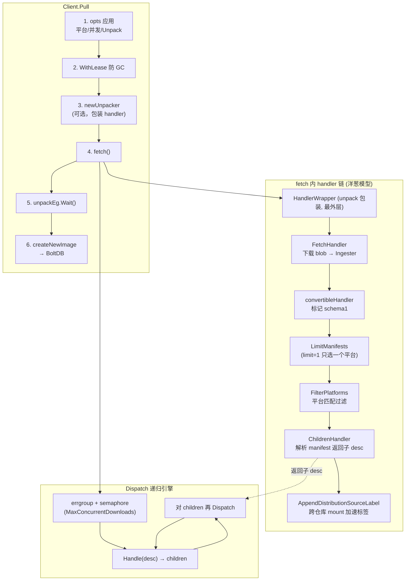
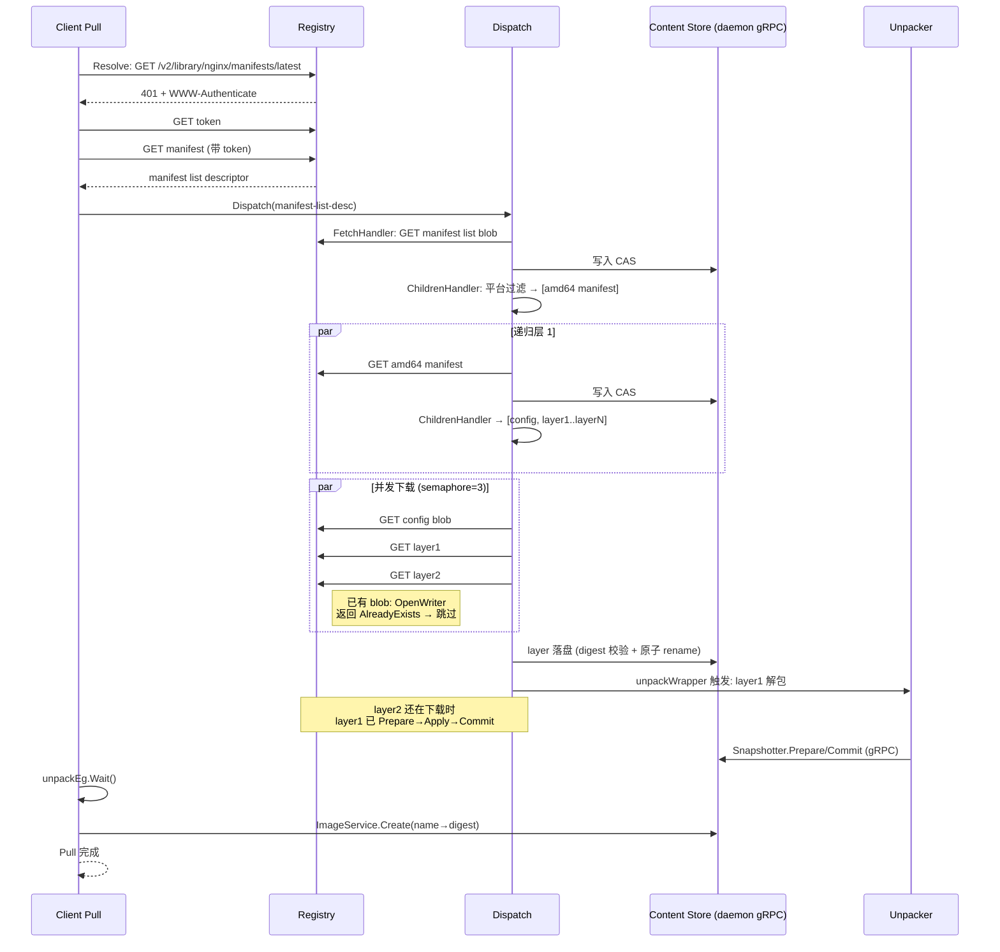

# 第五篇：镜像拉取 Pull 与 Dispatch 分发

> containerd v1.5.x (commit 5280530a0) 源码剖析系列 5/N
> 核心文件：`pull.go`、`images/handlers.go`、`remotes/handlers.go`、`remotes/docker/resolver.go`

---

## 1. 概述

一句话：**`Pull` = Resolver 解析引用拿 manifest descriptor → 组装"FetchHandler + ChildrenHandler + 平台过滤 + Unpack 包装"的 handler 链 → `Dispatch` 用 errgroup+信号量递归并发遍历整棵 descriptor 树，边下载 blob 边流式写 Content Store，layer 落盘后立即触发解包流水线 → 最后写一条 Image 记录进 BoltDB。**

三个关键认知：

1. **拉取是树遍历，不是文件列表下载**：manifest list → manifest → (config + N×layer)，Dispatch 递归展开，每层一个 goroutine。
2. **下载与解包流水线并行**：layer N 解包时 layer N+1 还在下载（第六篇细讲 Unpack）。
3. **本地已有的 blob 零流量**：`content.OpenWriter` 发现 digest 已存在直接返回 AlreadyExists，fetch 视为成功跳过。

在架构中的位置：本篇主要在 **Client 层**（Pull 逻辑跑在 ctr/docker 进程里，通过 gRPC 把 blob 写进 daemon 的 Content Store），Resolver 与 Registry 直接走 HTTP，**不经过 daemon**。

```
Client (ctr)                        Registry (HTTP)          Daemon (gRPC)
  Pull()                              │                          │
   ├─ Resolve ──────── GET manifest ──┤                          │
   ├─ Dispatch/handler 链:                                     │
   │   FetchHandler ── GET blob ──────┼──→ Content Ingester ────┤→ CAS 落盘
   │   ChildrenHandler(读已下载 manifest 解析子节点)            │
   │   UnpackHandler ─────────────────┼──→ Snapshotter.Prepare ─┤→ overlay 层
   └─ createNewImage ─────────────────┼──→ ImageService.Create ─┤→ BoltDB
```

---

## 2. 架构图



---

## 3. 核心数据结构

| 结构体 | 所在文件 | 关键字段 | 作用 |
|---|---|---|---|
| `ocispec.Descriptor` | OCI image spec | `MediaType`、`Digest`、`Size`、`Platform`、`Annotations` | 一切 blob 的索引条目（树节点） |
| `RemoteContext` | `pull.go`/`client_opts.go` | `Resolver`、`Platforms`、`PlatformMatcher`、`Unpack`、`MaxConcurrentDownloads`、`HandlerWrapper` | Pull 选项集合 |
| `images.Handler` | `images/handlers.go` | `Handle(ctx, desc) ([]Descriptor, error)` | 处理器接口：处理一个节点，返回子节点 |
| `Resolver` / `Fetcher` | `remotes/docker/resolver.go` | HTTP client、token、host | 解析引用、提供 blob 下载器 |
| `content.Ingester` | `content/content.go` | `Writer(ctx, opts...)` | CAS 写入器（第七篇） |

---

## 4. 源码逐步剖析

### 4.1 Pull 主流程（pull.go:50）

```go
func (c *Client) Pull(ctx context.Context, ref string, opts ...RemoteOpt) (_ Image, retErr error) {
	pullCtx := defaultRemoteContext()
	for _, o := range opts { o(c, pullCtx) }

	// wy: 平台匹配器——多平台镜像只拉本机架构
	// PlatformMatcher=nil 且未指定平台 → 用 c.platform（当前机器 OS/Arch）
	if pullCtx.PlatformMatcher == nil {
		if len(pullCtx.Platforms) > 1 {
			return nil, errors.New("cannot pull multiplatform image locally, try Fetch")
		} else if len(pullCtx.Platforms) == 0 {
			pullCtx.PlatformMatcher = c.platform
		} else {
			pullCtx.PlatformMatcher = platforms.Only(platforms.Parse(pullCtx.Platforms[0]))
		}
	}

	// wy: 🚀 整个 Pull 期间持有 lease，GC 不会回收下载了一半的 blob
	ctx, done, err := c.WithLease(ctx)
	defer done(ctx)

	// wy: 🚀 Unpack 开关: 包一层 handlerWrapper，下载完 layer 立即异步解包
	if pullCtx.Unpack {
		u, err := c.newUnpacker(ctx, pullCtx)
		unpackWrapper, unpackEg = u.handlerWrapper(ctx, pullCtx, &unpacks)
		pullCtx.HandlerWrapper = func(h images.Handler) images.Handler {
			return unpackWrapper(h)   // wy: 包在整条 handler 链最外层
		}
	}

	// wy: 🚀 核心: 递归下载整棵 descriptor 树
	img, err := c.fetch(ctx, pullCtx, ref, 1)   // wy: limit=1 → 只拉一个平台的 manifest

	if pullCtx.Unpack {
		unpackEg.Wait()   // wy: 等所有异步解包完成
	}

	// wy: 写 Image 记录: name → Target(manifest digest) 进 BoltDB
	img, err = c.createNewImage(ctx, img)
	return img, nil
}
```

### 4.2 fetch：Resolve + 组装 handler 链（pull.go:163）

```go
func (c *Client) fetch(ctx context.Context, rCtx *RemoteContext, ref string, limit int) (images.Image, error) {
	store := c.ContentStore()

	// Step 1: 🚀 Resolve——与 Registry 的 HTTP 协商
	//   "docker.io/library/nginx:latest"
	//   1. tag → digest: GET /v2/library/nginx/manifests/latest
	//      (带 Accept 头列出支持的 manifest 类型)
	//   2. 401 → 按 WWW-Authenticate 去 auth server 换 token
	//   3. 返回 descriptor: {MediaType: manifest list 或 manifest, Digest, Size}
	name, desc, err := rCtx.Resolver.Resolve(ctx, ref)

	// Step 2: 拿 Fetcher（绑定 name 的 blob 下载器，复用认证 token）
	fetcher, err := rCtx.Resolver.Fetcher(ctx, name)

	// Step 3: 🚀 组装 handler 链（洋葱模型，自内向外）
	childrenHandler := images.ChildrenHandler(store)        // 解析 manifest 得子节点
	childrenHandler = images.SetChildrenMappedLabels(...)    // 打 GC 引用标签
	childrenHandler = images.FilterPlatforms(childrenHandler, rCtx.PlatformMatcher) // 平台过滤
	if limit > 0 {
		childrenHandler = images.LimitManifests(childrenHandler, rCtx.PlatformMatcher, limit)
	}

	handlers := append(rCtx.BaseHandlers,
		remotes.FetchHandler(store, fetcher),  // ① 下载
		convertibleHandler,                    // ② schema1 标记
		childrenHandler,                       // ③ 返回子节点
		appendDistSrcLabelHandler,             // ④ 分发源标签（跨仓库 mount 复用）
	)
	handler = images.Handlers(handlers...)     // 串联成单个 Handler

	if rCtx.HandlerWrapper != nil {
		handler = rCtx.HandlerWrapper(handler) // ⑤ unpack 包装（最外层）
	}

	// Step 4: 🚀 递归分发
	if rCtx.MaxConcurrentDownloads > 0 {
		limiter = semaphore.NewWeighted(int64(rCtx.MaxConcurrentDownloads)) // 默认 3
	}
	if err := images.Dispatch(ctx, handler, limiter, desc); err != nil {
		return images.Image{}, err
	}

	return images.Image{Name: name, Target: desc, Labels: rCtx.Labels}, nil
}
```

### 4.3 Dispatch：递归并发引擎（images/handlers.go:120）

```go
func Dispatch(ctx context.Context, handler Handler, limiter *semaphore.Weighted, descs ...ocispec.Descriptor) error {
	eg, ctx2 := errgroup.WithContext(ctx)
	for _, desc := range descs {
		if limiter != nil {
			limiter.Acquire(ctx, 1)   // wy: 🚀 全局并发配额（下载+解析都占一格）
		}
		eg.Go(func() error {
			children, err := handler.Handle(ctx2, desc)   // wy: 执行 handler 链
			if limiter != nil { limiter.Release(1) }      // wy: Handle 返回即释放——
			                                              //    子节点的下载重新抢配额
			if err != nil {
				if errors.Is(err, ErrSkipDesc) { return nil }  // wy: 跳过但不失败
				return err
			}
			if len(children) > 0 {
				return Dispatch(ctx2, handler, limiter, children...)  // wy: 🚀 递归
			}
			return nil
		})
	}
	return eg.Wait()
}
```

**精妙之处**：信号量在 `Handle` 返回后立即释放，而不是等整棵子树完成。manifest list 的 N 个平台 manifest 因此能立刻把配额让给真正的 layer 下载，配额始终喂给"正在干活的叶子"。

### 4.4 FetchHandler：blob 下载与去重（remotes/handlers.go:91）

```go
func FetchHandler(ingester content.Ingester, fetcher Fetcher) images.HandlerFunc {
	return func(ctx context.Context, desc ocispec.Descriptor) ([]ocispec.Descriptor, error) {
		err := fetch(ctx, ingester, fetcher, desc)
		return nil, err   // wy: 叶子 handler，不返回子节点
	}
}

func fetch(ctx context.Context, ingester content.Ingester, fetcher Fetcher, desc ocispec.Descriptor) error {
	// wy: 🚀 向 Content Store 申请写入器（按 digest 去重）
	cw, err := content.OpenWriter(ctx, ingester,
		content.WithRef(MakeRefKey(ctx, desc)),
		content.WithDescriptor(desc))
	if err != nil {
		if errdefs.IsAlreadyExists(err) {
			return nil   // wy: 🚀 本地已有此 blob → 零流量跳过（增量拉取的核心）
		}
		return err
	}
	defer cw.Close()
	// wy: 断点续传: Status() 拿到已写入 offset → HTTP Range 从 offset 继续下
	// wy: 流式 copy: registry body → cw.Write → verify digest → Commit 原子落盘
	// （细节见第七篇 Content Store）
}
```

### 4.5 ChildrenHandler + 平台过滤

`ChildrenHandler` 从 Content Store 读回刚下载的 manifest（或本地已有），按 MediaType 解析：

| 输入 MediaType | 返回的子 Descriptors |
|---|---|
| manifest list / OCI index | 各平台 manifest desc（经 `FilterPlatforms` 过滤 + `LimitManifests` 限 1 个） |
| 单平台 manifest | `[config desc, layer1 desc, layer2 desc, ...]` |
| config / layer | `[]`（叶子） |

过滤链顺序决定流量：`LimitManifests` 在 list 层就只放行一个平台的 manifest，其他平台的 manifest 及其 layers **根本不会进入 Dispatch**——多架构镜像只付一份带宽。

### 4.6 createNewImage：幂等写记录（pull.go:273 附近）

```go
func (c *Client) createNewImage(ctx context.Context, img images.Image) (images.Image, error) {
	is := c.ImageService()
	for {
		if created, err := is.Create(ctx, img); err != nil {
			if !errdefs.IsAlreadyExists(err) { return ..., err }
			updated, err := is.Update(ctx, img)   // wy: 同名镜像已存在 → 更新 Target
			if errdefs.IsNotFound(err) { continue } // wy: 更新时被人删了 → 重试 Create
			...
		}
	}
}
```

Image 记录只是 `name → Target(manifest digest)` 的指针；blob 在 CAS 里按 digest 天然去重，两个 tag 指向同一 manifest 时存储零浪费。

---

## 5. 完整时序图（以 nginx:latest 多平台镜像为例）



---

## 6. 关键数据路径

```
/var/lib/containerd/io.containerd.content.v1.content/
├── ingest/                                 ← 下载中: <ref>/data + ingest.ref
└── blobs/sha256/
    ├── <manifest-list-digest>              ← Resolve 后的 list
    ├── <amd64-manifest-digest>             ← 平台 manifest
    ├── <config-digest>                     ← 镜像 config JSON
    └── <layer-N-digest>                    ← 各 layer tar.gz

/var/lib/containerd/io.containerd.metadata.v1.bolt/meta.db
├── v1/images/<ns>/<name>                   ← createNewImage 写入
├── v1/content/<ns>/blobs/<digest>          ← 每个 blob 的索引+标签
│   └── labels: containerd.io/gc.ref.content.l.N → 子节点引用（GC 用）
└── v1/leases/<ns>/<lease-id>               ← Pull 期间的 GC 租约
```

`SetChildrenMappedLabels` 打的 `gc.ref.content.*` 标签是 GC 的引用边——manifest blob 通过这些 label 指向 config 和 layers，形成 GC 可达性图（第十四篇）。

---

## 7. 并发模型

| 并发单元 | 上限 | 控制 |
|---|---|---|
| Dispatch 递归 goroutine | 每层每节点一个，随树展开 | errgroup（任一失败全部取消 ctx2） |
| 实际下载并发 | `MaxConcurrentDownloads`（默认 3） | semaphore.Weighted |
| Unpack 并发 | `MaxConcurrentDownloads` 同源 + 内部按层依赖串行 | unpacker errgroup |
| 同 digest 并发写 | 1 | Content Store 按 ref 锁 + AlreadyExists 短路 |

**流水线效果**：N 层镜像的 Pull 耗时 ≈ `下载 N 层 ÷ 3 并发` 与 `解包 N 层` 的**重叠**，而不是相加。

---

## 8. 错误路径与断点续传

| 场景 | 行为 |
|---|---|
| 网络中断 | errgroup 取消 ctx2 → 所有在途下载失败；已 Commit 的 blob 保留，重跑 Pull 自动跳过 |
| 下载到一半崩溃 | ingest/ 目录残留，Content Store 的 ingest GC 或下次同 ref OpenWriter 续传（Status offset + HTTP Range） |
| digest 校验失败 | Commit 时 verify 不过 → 报错，blob 不进 CAS |
| 平台不匹配 | LimitManifests/FilterPlatforms 过滤后无 manifest → "no match for platform" 错误 |
| Pull 中途 daemon GC | lease 保护所有新 blob 不被回收 |
| 同名镜像已存在 | createNewImage 走 Update 路径（Target 指向新 digest），旧 manifest 失去引用后由 GC 回收 |
| registry 返回 size=0 | fetch 直接报错（防御性检查，避免提交空 blob） |

---

## 9. 设计要点与踩坑

### 设计精髓

1. **Handler 链 + 递归 Dispatch**：下载逻辑、平台过滤、子节点解析、解包触发全部正交可插拔；同一套引擎复用于 Pull/Fetch/Push/GC 扫描。
2. **配额在 Handle 返回时释放**：中间节点（manifest）不长期占配额，叶子节点（layer）充分并行。
3. **digest 去重 = 增量拉取**：没有任何"已下载清单"，CAS 的 `AlreadyExists` 天然幂等——重复 Pull 同一镜像几乎零流量。
4. **gc.ref label 即引用图**：GC 不需要懂镜像格式，顺着 label 遍历即可标记可达 blob。
5. **lease 全程保护**：下载中途崩溃也不会留下被 GC 咬掉一半的 manifest。

### 踩坑 / 调试

| 现象 | 原因 | 排查 |
|---|---|---|
| Pull 慢、带宽打不满 | 默认并发只有 3 | `WithMaxConcurrentDownloads(10)` |
| "no match for platform in manifest list" | 指定了 registry 没有的平台 | `ctr image pull --platform linux/amd64` |
| 重复 Pull 仍有流量 | config/manifest 本身也要 GET 协商 | 正常；layer 才是大头，layer 会跳过 |
| Pull 卡住不动 | 单 blob 无响应且无超时配置 | `ctr --debug` 看 HTTP 请求；检查 registry/代理 |
| 拉完镜像 `ctr image ls` 看不到 | namespace 不对 | `ctr -n <ns> image ls`（默认 namespace 是 default，k8s 用 k8s.io） |
| 磁盘空间没释放（删镜像后） | GC 异步，或有 lease 未释放 | `ctr leases ls`，等 GC 调度（第十四篇） |

---

## 10. 下一篇预告

**第六篇：Unpack 解包与 chainID** —— unpacker 的 `handlerWrapper` 如何把下载事件转成解包任务、`rootfs.ApplyLayers` 的 Prepare→diff.Apply→Commit 逐层流程、chainID 的计算（`chainID = SHA256(parentChainID + " " + diffID)`）、以及为什么解包必须按层序串行而下载可以并行。
