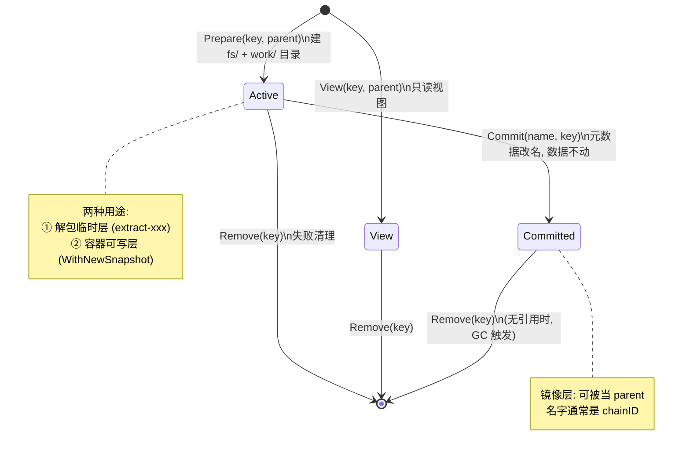
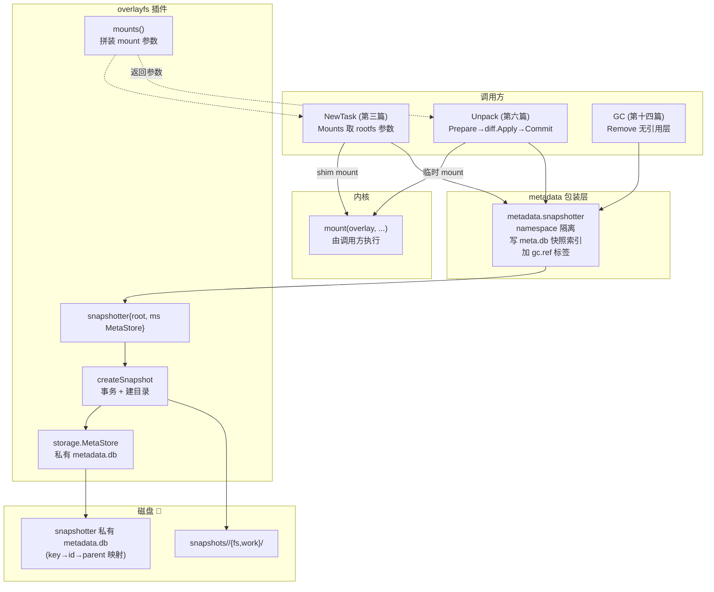
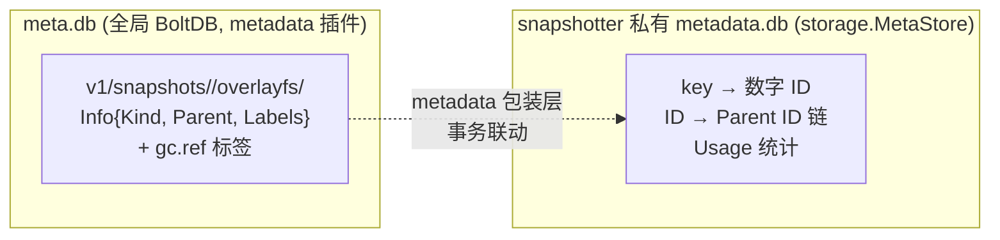
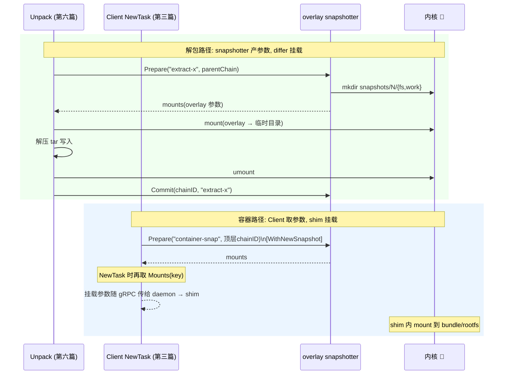

# 第八篇：Snapshotter 与 overlayfs

> containerd v1.5.x (commit 5280530a0) 源码剖析系列 8/N
> 核心文件：`snapshots/snapshotter.go`、`snapshots/overlay/overlay.go`、`snapshots/storage/`、`snapshots/native/`

---

## 1. 概述

一句话：**Snapshotter 把"层叠文件系统"抽象成三态模型——`Prepare` 建 Active 可写快照（新建 upperdir/workdir，父层链作 lowerdir），`Commit` 把 Active 固化为 Committed 只读层（只改元数据，目录改名不动数据），`Mounts` 把快照链翻译成一组 mount 参数交给调用方执行；overlayfs 插件的 `mounts()` 就是纯粹的 lowerdir/upperdir/workdir 字符串拼装，真正的 `mount()` 系统调用发生在 daemon 之外（differ 解包时、shim 起容器时）。**

三个关键认知：

1. **Snapshotter 自己不挂载**（解包场景）：它只生产 mount 参数，挂载/卸载由使用者负责——第六篇 diff.Apply 临时挂载解包，第三篇 shim 挂载 rootfs。
2. **Commit 是元数据操作**：数据目录原地保留只换名字，O(1) 完成——这也是"解包一层就固化一层"可行的原因。
3. **快照链 = 父链 ID 数组**：`storage.Snapshot.ParentIDs` 决定 lowerdir 顺序，第一层无父则退化为 bind mount。

在架构中的位置：Layer 0 基础插件，被 Metadata 插件包装（加 namespace + GC 标签），被 Diff/Unpack/NewTask 三条路径消费。

---

## 2. 三态模型与生命周期



| Kind | 创建 | 可写 | 可作 parent | 典型用途 |
|---|---|---|---|---|
| `KindActive` | `Prepare(key, parent)` | ✅ | ❌（须先 Commit） | 解包临时层、容器可写层 |
| `KindCommitted` | `Commit(name, key)` | ❌ | ✅ | 镜像层（chainID 命名） |
| `KindView` | `View(key, parent)` | ❌ | ❌ | 只读查看镜像内容 |

（定义与注释：`snapshots/snapshotter.go:39-64`）

---

## 3. 架构图



---

## 4. 源码逐步剖析

### 4.1 Snapshotter 接口（snapshots/snapshotter.go）

```go
type Snapshotter interface {
	Stat(ctx, key) (Info, error)                    // 查快照元信息
	Update(ctx, info, fieldpaths...) (Info, error)  // 改标签
	Usage(ctx, key) (Usage, error)                  // 磁盘占用
	Mounts(ctx, key) ([]mount.Mount, error)         // 🚀 取挂载参数（不挂载！）
	Prepare(ctx, key, parent, opts...) ([]mount.Mount, error)  // 建 Active
	View(ctx, key, parent, opts...) ([]mount.Mount, error)     // 建 View
	Commit(ctx, name, key, opts...) error           // Active → Committed
	Remove(ctx, key) error                          // 删除
	Walk(ctx, fn, fs...) error                      // 遍历所有快照
	Close() error
	Cleanup(ctx) error                              // 清理孤儿目录
}
```

### 4.2 Prepare：事务 + 建目录（overlay.go:221, 404）

```go
func (o *snapshotter) Prepare(ctx, key, parent string, opts...) ([]mount.Mount, error) {
	return o.createSnapshot(ctx, snapshots.KindActive, key, parent, opts)
}

func (o *snapshotter) createSnapshot(ctx, kind, key, parent string, opts) (_ []mount.Mount, err error) {
	ctx, t, err := o.ms.TransactionContext(ctx, true)  // wy: 开 bolt 写事务

	// Step 1: 🚀 先建临时目录 new-XXX（TempDir），而非直接建最终目录
	snapshotDir := filepath.Join(o.root, "snapshots")
	td, err = o.prepareDirectory(ctx, snapshotDir, kind)
	// prepareDirectory:
	//   mkdir new-XXX/fs     (0755)  ← upperdir 内容目录
	//   mkdir new-XXX/work   (0711)  ← overlay workdir（仅 Active 需要）

	// Step 2: 写元数据——分配数字 ID、记录 parent 链、key→ID 映射
	s, err := storage.CreateSnapshot(ctx, kind, key, parent, opts...)

	// Step 3: 🚀 继承父层 owner（容器内创建文件的属主正确性）
	if len(s.ParentIDs) > 0 {
		st, _ := os.Stat(o.upperPath(s.ParentIDs[0]))
		stat := st.Sys().(*syscall.Stat_t)
		os.Lchown(filepath.Join(td, "fs"), int(stat.Uid), int(stat.Gid))
	}

	// Step 4: 临时目录改名为正式编号目录 new-XXX → snapshots/<id>
	path = filepath.Join(snapshotDir, s.ID)
	os.Rename(td, path)

	t.Commit()   // wy: 元数据事务提交
	return o.mounts(s), nil   // wy: 🚀 返回挂载参数，不执行挂载
}
```

**失败回滚**（defer 闭包）：事务回滚 + 删临时目录 `td` + 若已改名则删 `path`——任何一步失败不留孤儿。

### 4.3 mounts()：翻译为 overlay 参数（overlay.go:498）

```go
func (o *snapshotter) mounts(s storage.Snapshot) []mount.Mount {
	// 情况 1: 🚀 无父层 → overlay 无法单层工作，退化为 bind mount
	if len(s.ParentIDs) == 0 {
		roFlag := "rw"
		if s.Kind == snapshots.KindView { roFlag = "ro" }
		return []mount.Mount{{
			Source:  o.upperPath(s.ID),   // snapshots/<id>/fs
			Type:    "bind",
			Options: []string{roFlag, "rbind"},
		}}
	}

	var options []string
	if o.indexOff  { options = append(options, "index=off") }    // wy: 关索引提速（内核≥4.13）
	if o.userxattr { options = append(options, "userxattr") }    // wy: rootless 用 user xattr

	// 情况 2: 🚀 Active → 完整 overlay（可写）
	if s.Kind == snapshots.KindActive {
		options = append(options,
			fmt.Sprintf("workdir=%s",  o.workPath(s.ID)),    // snapshots/<id>/work
			fmt.Sprintf("upperdir=%s", o.upperPath(s.ID)),   // snapshots/<id>/fs
		)
	} else if len(s.ParentIDs) == 1 {
		// 情况 3: View 且只有一个父层 → 只读 bind
		return []mount.Mount{{Source: o.upperPath(s.ParentIDs[0]), Type: "bind", Options: []string{"ro","rbind"}}}
	}

	// 情况 4: 🚀 lowerdir = 所有父层的 fs 目录，按 parent 链顺序用 ":" 拼
	parentPaths := make([]string, len(s.ParentIDs))
	for i := range s.ParentIDs {
		parentPaths[i] = o.upperPath(s.ParentIDs[i])
	}
	options = append(options, fmt.Sprintf("lowerdir=%s", strings.Join(parentPaths, ":")))

	return []mount.Mount{{Type: "overlay", Source: "overlay", Options: options}}
}
```

以 3 层镜像的容器可写层为例，`Mounts` 返回：

```
type:    overlay
options: [index=off,
          workdir=/var/lib/containerd/io.containerd.snapshotter.v1.overlayfs/snapshots/4/work,
          upperdir=.../snapshots/4/fs,          ← 容器可写层
          lowerdir=.../3/fs:.../2/fs:.../1/fs]  ← 镜像层(新→旧)
```

### 4.4 Commit：O(1) 固化（overlay.go:246）

```go
func (o *snapshotter) Commit(ctx, name, key string, opts...) error {
	ctx, t, err := o.ms.TransactionContext(ctx, true)
	defer func() { if err != nil { t.Rollback() } }()

	id, _, _, err := storage.GetInfo(ctx, key)          // wy: 取 Active 快照的数字 ID
	usage, err := fs.DiskUsage(ctx, o.upperPath(id))    // wy: 统计用量（du fs/ 目录）

	// wy: 🚀 核心: 只改元数据——Kind Active→Committed，key 换成 name(=chainID)
	// 磁盘上 snapshots/<id>/fs 目录原封不动，瞬间完成
	if _, err = storage.CommitActive(ctx, key, name, snapshots.Usage(usage), opts...); err != nil {
		return err
	}
	return t.Commit()
}
```

**为什么不移动数据？** 因为 Active 的 fs/ 目录本身就是最终形态——overlay 的 upperdir 内容即该层的增量。Commit 只是宣告"此层从此只读、可被引用"。

### 4.5 Remove 与 Cleanup（overlay.go:279）

```go
func (o *snapshotter) Remove(ctx, key string) error {
	// 事务内: 检查无子快照引用 → 从元数据删除
	_, _, err = storage.Remove(ctx, key)
	// 同步模式: 立即删 snapshots/<id>/ 目录
	// 异步模式(asyncRemove): 只标记，Cleanup() 批量删
}
```

被引用的层无法 Remove（storage 层返回错误）——GC（第十四篇）负责按引用图找到可删的层再调 Remove。

### 4.6 双库设计



| 库 | 内容 | 为什么需要 |
|---|---|---|
| meta.db | namespace 化的 key→Info + GC 标签 | 多租户隔离、GC 引用图、与其他资源同事务 |
| 私有 metadata.db | key→数字ID→父链 | snapshotter 内部实现细节（数字 ID 做目录名），可独立运行/测试 |

metadata 包装层保证两库同事务更新——上层 Service 只见 meta.db 视图。

---

## 5. 两条消费路径时序对比



---

## 6. 关键数据路径

```
/var/lib/containerd/io.containerd.snapshotter.v1.overlayfs/
├── metadata.db                    ← 私有库: key/ID/parent/usage
└── snapshots/
    ├── new-XXXX/                  ← Prepare 中间态（正常不可见，崩溃残留=孤儿）
    ├── 1/fs/                      ← 镜像层1 (Committed, 名字=chainID₀)
    ├── 2/{fs}/                    ← 镜像层2
    ├── 3/{fs}/                    ← 镜像层3
    └── 4/{fs,work}/               ← 容器可写层 (Active)

挂载效果（容器视角）:
  / (rootfs) = overlay(lower=3/fs:2/fs:1/fs, upper=4/fs, work=4/work)
  写文件 → 落在 4/fs（copy-up 时从 lower 拷上来）
  删文件 → 4/fs 里出现 whiteout 字符设备遮挡 lower
```

---

## 7. 并发模型

| 操作 | 锁/事务 |
|---|---|
| 所有写操作（Prepare/Commit/Remove） | MetaStore bolt 写事务（单写者串行） |
| Mounts/Stat | bolt 读事务（并发） |
| 目录创建 | 临时目录 `new-XXX` 随机名避免冲突，最后 rename 进事务保护的编号 |
| 同 key 并发 Prepare | 事务内 key 唯一约束，后者报 AlreadyExists |

---

## 8. 错误路径

| 场景 | 行为 |
|---|---|
| Prepare 中途失败 | defer 回滚事务 + 删 `new-XXX`/`path` 目录 |
| Commit 前 daemon 崩溃 | Active 快照残留（extract-* 或容器层），无引用者由 GC 清理 |
| Remove 有引用的层 | storage 拒绝（"cannot remove snapshot with children"） |
| 磁盘满 | Prepare mkdir 失败，事务回滚，上层（Unpack）按第六篇路径清理 |
| 孤儿 `new-XXX` 目录 | `Cleanup()` 扫描无元数据对应的目录删除（daemon 启动/定期触发） |
| overlay mount 失败（shim 侧） | 内核日志常见原因：lowerdir 层数超限（默认 128）、workdir 与 upperdir 不同文件系统 |

---

## 9. overlayfs / native 对比

| 维度 | overlayfs（默认） | native（兜底） |
|---|---|---|
| Prepare | 建空 upper/work 目录 | **完整拷贝父层全部文件** |
| Commit | 改元数据（O(1)） | 改元数据 |
| Mounts | overlay 参数 | bind mount |
| 磁盘占用 | 增量 | 每层全量（N 倍膨胀） |
| 速度 | 快 | 慢（大镜像拷贝耗时） |
| 依赖 | 内核 ≥ 4.0 + overlay 模块 | 无 |
| 适用 | 生产 | 不支持 overlay 的文件系统（如某些网络存储、老内核） |

native 的 Prepare 就是 `fs.CopyDir(parent.fs, td.fs)`——理解它有助于体会 overlay 的精髓：**把"拷贝"推迟成"挂载时的叠加"**。

---

## 10. 设计要点与踩坑

### 设计精髓

1. **参数与执行分离**：Snapshotter 只产出 mount 描述，跨进程传递后由执行者挂载——daemon 不持有任何容器挂载，崩溃零泄漏。
2. **三态约束即正确性**：Active 不可被引用强制了"先 Commit 再用"，层链永远由只读层构成，杜绝运行时层被篡改。
3. **Commit O(1)**：固化只是元数据改名，支撑了"解一层固化一层"的流式 Unpack。
4. **数字 ID 做目录名**：key 可以是任意字符串（chainID、extract-随机、容器ID），目录名统一短数字，路径长度可控。
5. **bind 退化**：单层场景不用 overlay（内核不允许单层 overlay），自动降级 bind——调用方完全无感。

### 踩坑 / 调试

| 现象 | 原因 | 排查 |
|---|---|---|
| `failed to prepare extraction snapshot` | 磁盘满 / overlay 模块没加载 | `df`、`modprobe overlay`、`dmesg` |
| 容器启动报 `invalid argument` 挂载失败 | lowerdir 超过内核层数上限（128） | 合并镜像层；升级内核（5.11+ 放宽到 500） |
| 快照数量远多于镜像层数 | 容器可写层 + extract 残留 | `ctr snapshots ls`，查 GC 是否正常 |
| 删镜像空间不释放 | 层被其他镜像/容器引用 | `ctr snapshots ls \| grep <chainID前缀>` 看谁在用 |
| rootless 下 overlay 不可用 | 内核不支持 userxattr | 自动降级 native，或内核 ≥ 5.11 |
| 想看某快照的实际文件 | — | 直接 `ls snapshots/<id>/fs`（注意是增量，不含 lower） |

---

## 11. 下一篇预告

**第九篇：Diff 与层应用（walking differ）** —— `diff.Apply` 如何临时挂载 snapshot 后流式解压 tar（含 whiteout/opaque 处理）、`Compare` 如何双目录行走生成增量 tar、`diff_id` 重算校验，以及 stream processor 外挂解压器机制。
