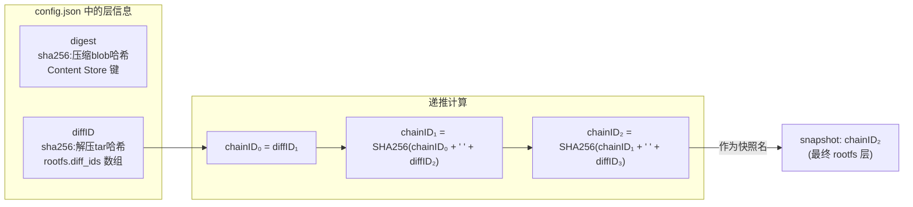
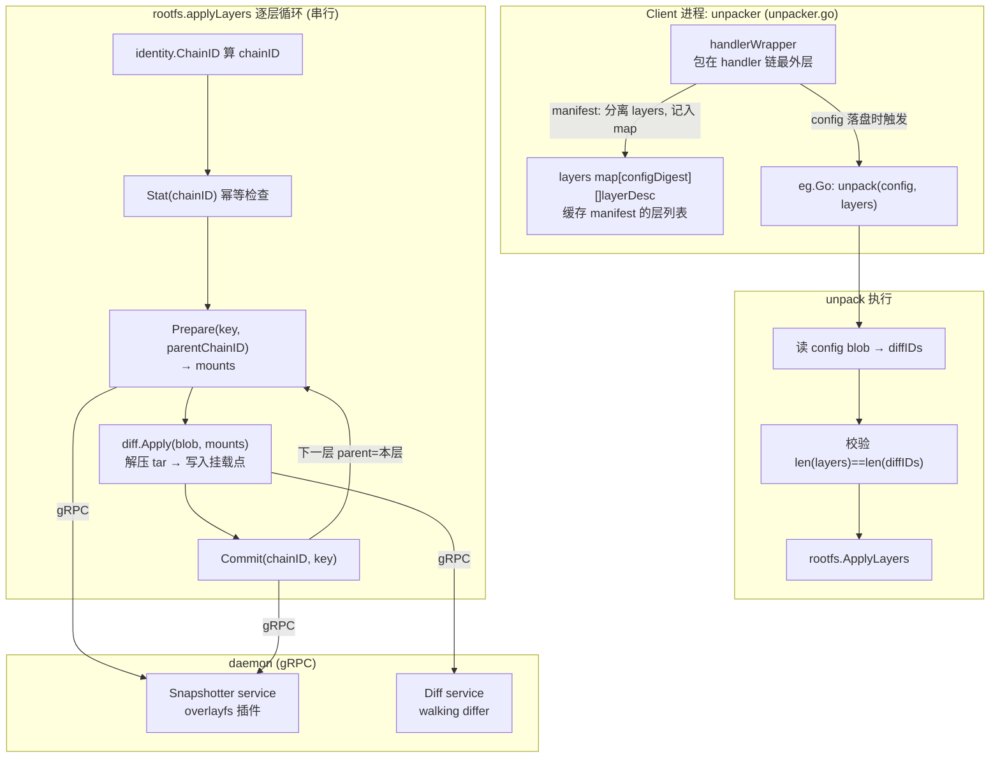
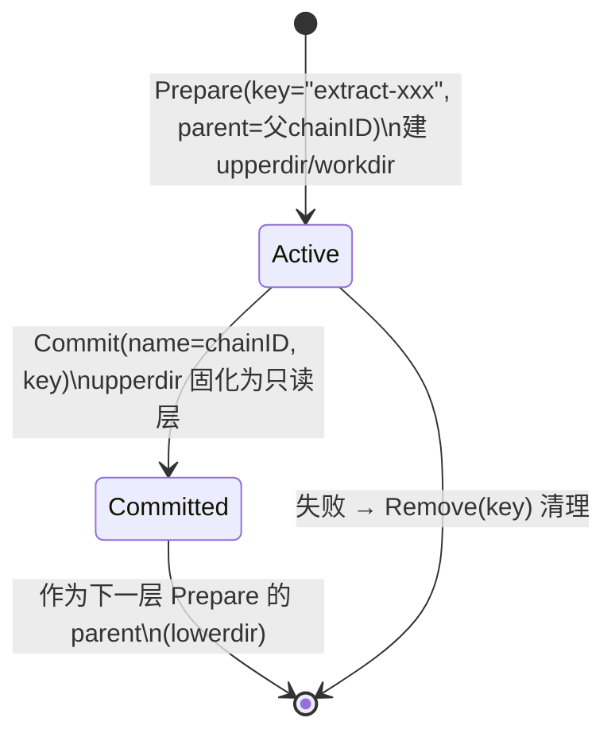
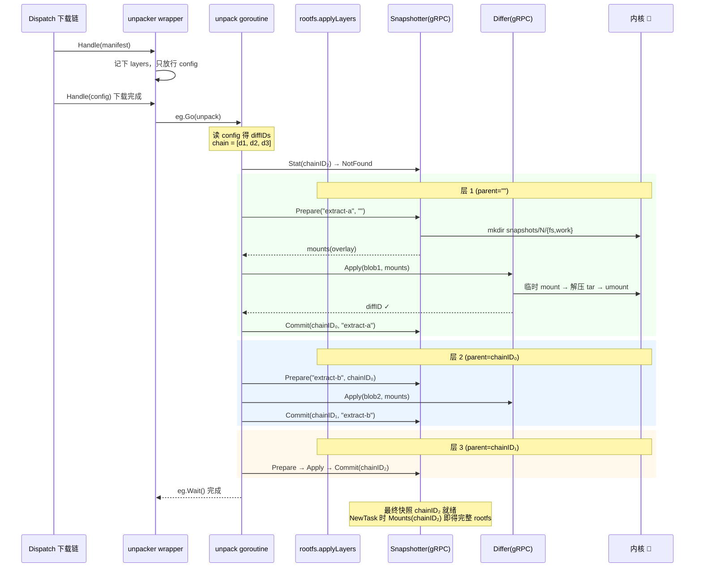

# 第六篇：Unpack 解包与 chainID

> containerd v1.5.x (commit 5280530a0) 源码剖析系列 6/N
> 核心文件：`unpacker.go`、`rootfs/apply.go`、`vendor/.../image-spec/identity/chainid.go`、`diff/walking/`

---

## 1. 概述

一句话：**Unpack 把 Content Store 里的压缩 layer blob 逐层还原成 Snapshot 链——每层执行 `Prepare(父chainID) → diff.Apply(解压tar写入) → Commit(chainID)`，其中 chainID 由 diffID 序列递推 SHA256 得到，既是快照名又是"这组层已解包"的幂等键；下载侧通过 unpacker 的 handlerWrapper 在 config blob 落盘时立即异步触发解包，实现下载/解包流水线。**

三个关键认知：

1. **diffID ≠ digest ≠ chainID**：digest 是压缩 blob 的哈希（传输用），diffID 是解压后 tar 的哈希（config 里记录），chainID 是层序列的递推哈希（快照命名用）。
2. **解包串行、下载并行**：layer N 的快照 parent 是 layer N-1 的 chainID，层间有严格依赖，不能并行解包。
3. **幂等靠 `Stat(chainID)`**：chainID 快照存在 → 整条链已解包，直接返回。

在架构中的位置：本篇横跨 Client（unpacker 调度，跑在 ctr 进程）与 Daemon（Snapshotter/Diff service 经 gRPC），是第五篇 Pull 的下半场。

---

## 2. 三种 ID 的关系



chainID 实现（`vendor/github.com/opencontainers/image-spec/identity/chainid.go:56`）：

```go
func ChainIDs(dgsts []digest.Digest) []digest.Digest {
	if len(dgsts) < 2 { return dgsts }
	// wy: 🚀 递推: chainID[i] = SHA256(chainID[i-1] + " " + diffID[i])
	parent := digest.FromBytes([]byte(dgsts[0] + " " + dgsts[1]))
	...
}
```

**为什么需要 chainID？** 两个镜像共享前 3 层、各自第 4 层不同——前 3 层的 chainID 完全相同，快照直接复用，磁盘只存一份。digest 做不到这点（压缩参数不同会导致 digest 不同，但解压后内容相同→diffID 相同→chainID 相同）。

---

## 3. 架构图



---

## 4. 源码逐步剖析

### 4.1 触发点：unpacker.handlerWrapper（unpacker.go:292）

第五篇提到 `HandlerWrapper` 包在 handler 链最外层。它的核心技巧——**用 config 的到达作为"全部 layer 就绪"的信号**：

```go
func (u *unpacker) handlerWrapper(uctx, rCtx, unpacks *int32) (func(images.Handler) images.Handler, *errgroup.Group) {
	eg, uctx := errgroup.WithContext(uctx)
	return func(f images.Handler) images.Handler {
		var (
			lock   sync.Mutex
			layers = map[digest.Digest][]ocispec.Descriptor{}  // wy: configDigest → 该 manifest 的 layer 列表
		)
		return images.HandlerFunc(func(ctx context.Context, desc ocispec.Descriptor) ([]ocispec.Descriptor, error) {
			children, err := f.Handle(ctx, desc)   // wy: 先让内层链(下载等)跑完
			if err != nil { return children, err }

			switch desc.MediaType {
			case images.MediaTypeDockerSchema2Manifest, ocispec.MediaTypeImageManifest:
				// wy: 🚀 技巧: manifest 的子节点 = [config, layer1..N]
				// 把 layers 暂存 map，只向 Dispatch 返回 config
				// → Dispatch 下一步处理 config 时，layers 已下载完毕（同一批并发）
				var nonLayers, manifestLayers []ocispec.Descriptor
				for _, child := range children {
					if images.IsLayerType(child.MediaType) { manifestLayers = append(...) } else { nonLayers = append(...) }
				}
				lock.Lock()
				for _, nl := range nonLayers { layers[nl.Digest] = manifestLayers }
				lock.Unlock()
				children = nonLayers   // wy: Dispatch 只见 config

			case images.MediaTypeDockerSchema2Config, ocispec.MediaTypeImageConfig:
				// wy: 🚀 config 处理完毕（blob 已落盘）→ 异步启动解包
				l := layers[desc.Digest]
				if len(l) > 0 {
					atomic.AddInt32(unpacks, 1)
					eg.Go(func() error {
						return u.unpack(uctx, rCtx, f, desc, l)  // wy: 不阻塞下载主流程
					})
				}
			}
			return children, nil
		})
	}
}
```

**为什么要等 config？** config 里有 `rootfs.diff_ids` 数组——解包必须知道每层的 diffID 来算 chainID 和校验。manifest 提供 layer 顺序，config 提供 diffID，两者都就绪才能开解。

### 4.2 unpack：读 config → ApplyLayers（unpacker.go:76）

```go
func (u *unpacker) unpack(ctx, rCtx, h, config, layers) error {
	// wy: 读 config blob（已在 Content Store）
	p, err := content.ReadBlob(ctx, u.c.ContentStore(), config)
	var i ocispec.Image
	json.Unmarshal(p, &i)
	diffIDs := i.RootFS.DiffIDs

	// wy: 🚀 一致性校验: manifest 层数必须等于 config diffID 数
	if len(layers) != len(diffIDs) {
		return errors.Errorf("number of layers and diffIDs don't match: %d != %d", ...)
	}

	// wy: 组装 Layer 列表: 每层 = {Blob: layer desc(压缩), Diff: diffID desc(解压后)}
	// 然后调 rootfs.ApplyLayers（或按 snapshotter 能力走增量路径）
	...
}
```

### 4.3 ApplyLayers：幂等 + 逐层链式应用（rootfs/apply.go:62）

```go
func ApplyLayersWithOpts(ctx, layers, sn, a, applyOpts) (digest.Digest, error) {
	chain := make([]digest.Digest, len(layers))
	for i, layer := range layers { chain[i] = layer.Diff.Digest }  // wy: diffID 序列
	chainID := identity.ChainID(chain)                            // wy: 最终 chainID

	// wy: 🚀 幂等检查: 最终层快照存在 → 整条链解包过，零开销返回
	_, err := sn.Stat(ctx, chainID.String())
	if err != nil {
		if !errdefs.IsNotFound(err) { return "", err }
		if err := applyLayers(ctx, layers, chain, sn, a, nil, applyOpts); err != nil && !errdefs.IsAlreadyExists(err) {
			return "", err
		}
	}
	return chainID, nil
}
```

### 4.4 applyLayers：单层 Prepare→Apply→Commit（rootfs/apply.go:133）

```go
func applyLayers(ctx, layers, chain, sn, a, opts, applyOpts) error {
	var (
		parent  = identity.ChainID(chain[:len(chain)-1])  // wy: 父层 chainID（第一层为 ""）
		chainID = identity.ChainID(chain)                 // wy: 本层 chainID
		layer   = layers[len(layers)-1]                   // wy: 🚀 注意: 从最后一层开始处理
	)

	for {
		key = fmt.Sprintf(snapshots.UnpackKeyFormat, uniquePart(), chainID)
		// wy: "extract-<纳秒>-<随机> <chainID>" 格式的临时 key

		// Step 1: 🚀 Prepare——从 parent 派生 Active 快照，返回挂载参数
		mounts, err = sn.Prepare(ctx, key, parent.String(), opts...)
		if err != nil {
			if errdefs.IsNotFound(err) && len(layers) > 1 {
				// wy: 🚀 父层缺失 → 递归先解包前面的层，再回来继续
				applyLayers(ctx, layers[:len(layers)-1], chain[:len(chain)-1], ...)
				layers = nil
				continue
			} else if errdefs.IsAlreadyExists(err) {
				continue   // wy: 随机 key 撞车，换 key 重试
			}
			return err
		}
		break
	}
	defer func() {
		if err != nil { sn.Remove(ctx, key) }   // wy: 失败清理临时快照
	}()

	// Step 2: 🚀 diff.Apply——解压 layer blob(tar.gz) 写入快照挂载点
	//   daemon 侧 walking differ:
	//   1. 临时挂载 mounts 到临时目录
	//   2. 流式读 blob → gunzip → tar 遍历
	//   3. 每个 entry: 创建文件/目录/硬链接；whiteout 文件(.wh.*) → 删除下层对应项
	//   4. 返回实际写入内容的 diffID 用于校验
	diff, err = a.Apply(ctx, layer.Blob, mounts, applyOpts...)
	if diff.Digest != layer.Diff.Digest {
		return errors.Errorf("wrong diff id calculated on extraction %q", diff.Digest)
		// wy: 🚀 解压后重算 diffID 与 config 声明不符 → 镜像损坏/篡改
	}

	// Step 3: 🚀 Commit——Active 快照转为 Committed，名字就是 chainID
	if err = sn.Commit(ctx, chainID.String(), key, opts...); err != nil {
		return err
	}
	return nil
}
```

**从最后一层开始 + 递归补父层**的设计：如果镜像 A 的前 3 层已解包过（被其他镜像共享），`Stat` 检查会发现父层存在，递归在缺口处停止——只解包缺失的层。

### 4.5 快照三态在本篇的流转（第八篇详述 Snapshotter）



---

## 5. 完整时序图（3 层镜像）



---

## 6. 关键数据路径

```
/var/lib/containerd/io.containerd.snapshotter.v1.overlayfs/
├── metadata.db                    ← 快照器自己的 bolt（与 meta.db 不同！）
└── snapshots/
    ├── 1/                         ← 层1 (chainID₀ 对应的内部编号)
    │   └── fs/                    ← 解压后的文件 (committed 后只读)
    ├── 2/
    │   ├── fs/                    ← 层2 增量
    │   └── work/                  ← overlay workdir（仅 active 时有意义）
    └── 3/fs/                      ← 层3 增量

容器运行时挂载（第三篇 NewTask）:
  overlay mount:
    lowerdir = snapshots/1/fs:snapshots/2/fs:snapshots/3/fs  ← 全部只读层
    upperdir = snapshots/<容器active层>/fs                    ← WithNewSnapshot 建的可写层
    workdir  = snapshots/<容器active层>/work
```

meta.db 侧：`v1/snapshots/<ns>/overlayfs/<chainID>` 存每个 committed 快照的 Kind/Parent 记录，GC 据此判引用。

---

## 7. 并发模型

| 环节 | 并发 | 说明 |
|---|---|---|
| 下载 | 并行（semaphore=3，第五篇） | 各 blob 独立 |
| 同镜像解包 | **串行** | 层间 chainID 依赖，`applyLayers` 单 goroutine 顺序执行 |
| 多镜像解包 | 并行 | 不同 unpack goroutine；共享层靠 `Commit` 的 AlreadyExists 兜底（并发同层时一个成功一个报已存在，均视为成功） |
| diff.Apply 内部 | 单流 | tar 必须顺序读（gzip 不可 seek） |

**并发安全点**：两个镜像同时解包相同的层 1 → 两个 `Commit(chainID₀)`，第二个得到 AlreadyExists → `!errdefs.IsAlreadyExists(err)` 过滤掉，都算成功。

---

## 8. 错误路径

| 失败点 | 清理 | 后果 |
|---|---|---|
| Prepare 失败 | 无产物 | 返回错误，Pull 整体失败（lease 到期后已下载 blob 被 GC） |
| diff.Apply 中途失败 | `defer sn.Remove(key)` 删 active 快照 | 该层不留残骸；已 Commit 的前序层保留（可复用） |
| diffID 校验不符 | 同上 Remove | 镜像内容损坏，必须重新 Pull |
| Commit 失败 | Remove(key) | 少见（磁盘满等） |
| daemon 崩溃中途 | active 快照残留 | daemon 重启后无主 active 快照由 GC 清理（无 gc.ref 指向） |
| 磁盘空间不足 | Apply 写一半失败 → Remove | 前序层保留，空间释放后重跑 Pull 续解 |

**部分解包是安全状态**：前 N-1 层已 Commit 就永久有效，重试只补最后一层。

---

## 9. 设计要点与踩坑

### 设计精髓

1. **chainID 一物三用**：快照名、幂等键、GC 引用点。递推式哈希保证"前缀相同→共享"，天然支持跨镜像层共享。
2. **config 到达即触发**：利用 manifest children 的拆分把解包时机卡在所有 layer 下载之后、不阻塞 Dispatch 主循环——零额外同步原语。
3. **倒序处理 + 递归补链**：从目标层向父层递归，遇到已存在即停，增量解包逻辑自然涌现。
4. **extract- 前缀临时 key**：解包中的 active 快照与最终 committed 快照分离，失败清理不影响任何已完成层。
5. **解压后重算 diffID**：在 Commit 前做最后一道完整性校验，坏 blob 绝不会固化成快照。

### 踩坑 / 调试

| 现象 | 原因 | 排查 |
|---|---|---|
| Pull 完成但首次启动容器慢 | Pull 时 `Unpack=false`，启动时才解包 | 默认 ctr pull 会解包；检查调用方选项 |
| "number of layers and diffIDs don't match" | 镜像 manifest 与 config 不一致（registry 数据损坏） | 换源重拉；`skopeo inspect` 比对 |
| 磁盘占用远大于镜像 size | 解压后膨胀 + overlay 元数据 | 正常；压缩比高的层解压可达 3-5 倍 |
| `extract-*` 快照大量残留 | 解包反复失败或 GC 未跑 | `ctr snapshots ls \| grep extract`，查 GC（第十四篇） |
| 想看某镜像的 chainID | — | `ctr image ls` + `ctr content ls` 对照 config 的 diff_ids 手算，或 `ctr snapshots ls` 看 sha256 名字的快照 |

---

## 10. 下一篇预告

**第七篇：Content Store / CAS** —— `content/local/store.go` 的文件布局、`Ingester` 写入状态机（ingest/ → verify → rename 原子提交）、断点续传的 offset 机制、按 digest 去重的锁设计，以及 ReaderAt/Provider 的零拷贝读取。
