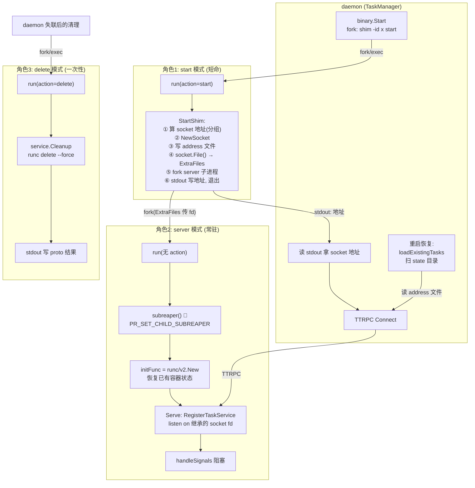
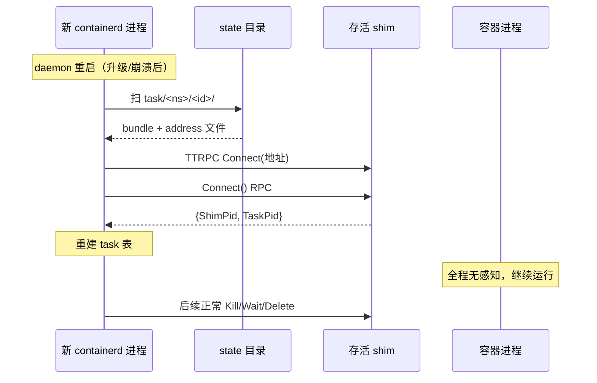
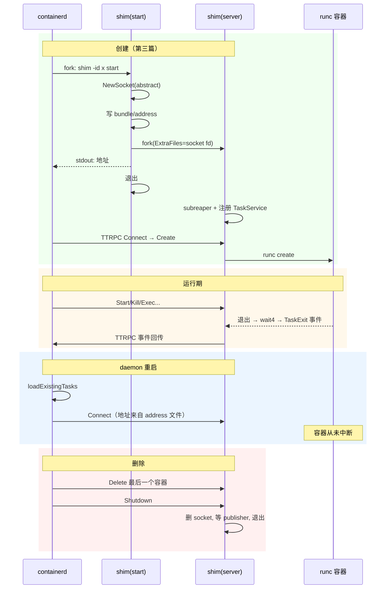

# 第十一篇：Shim 生命周期与两次调用协议

> containerd v1.5.x (commit 5280530a0) 源码剖析系列 11/N
> 核心文件：`runtime/v2/shim/shim.go`、`runtime/v2/runc/v2/service.go`（StartShim）、`runtime/v2/manager.go`（loadExistingTasks）、`runtime/v2/binary.go`

---

## 1. 概述

一句话：**同一个 `containerd-shim-runc-v2` 二进制靠命令行参数扮演三种角色——`start`（daemon 直接拉起：建 TTRPC socket、把 socket fd 塞进 `cmd.ExtraFiles`、fork 出 server 子进程、自己把地址打到 stdout 后退出）、无参数 server（子进程：继承 socket fd、注册 TaskService、subreaper + 信号循环常驻）、`delete`（一次性清理：`runc delete --force` 后把结果 proto 序列化到 stdout）；daemon 重启后靠扫描 state 目录的 bundle + `address` 文件重连每个存活 shim，实现"daemon 随便重启、容器毫发无伤"。**

核心问题意识：**为什么 shim 要独立于 daemon 存活？** containerd 自身升级/崩溃时容器不能死。shim 是容器进程的看护人（reaper），只要 shim 活着，容器退出状态就有人收、stdio 就有人转发。

在架构中的位置：第 4 层 Shim 层的进程模型本体，第三篇的 `startShim` 在这里展开。

---

## 2. 三角色架构图



---

## 3. 核心数据结构

| 结构体/函数 | 所在文件 | 作用 |
|---|---|---|
| `shim.Run(id, initFunc)` | `runtime/v2/shim/shim.go:162` | shim 二进制统一入口（main 调它） |
| `run()` 的 `action` | shim.go:240-305 | 三态分发：start / delete / server |
| `service.StartShim` | `runc/v2/service.go:199` | start 角色的核心：socket + fork |
| `Client.Serve` | shim.go:326 | server 角色主循环 |
| `binary.Start` | `runtime/v2/binary.go:59` | daemon 侧 fork start 进程 |
| `loadExistingTasks` | `runtime/v2/manager.go:274` | daemon 重启恢复 |
| `groupLabels` | runc/v2/service.go | Pod 分组注解（多容器共享 shim） |

---

## 4. 源码逐步剖析

### 4.1 统一入口 run()：环境准备（shim.go:186）

三种角色共用的前置步骤：

```go
func run(id string, initFunc Init, config Config) error {
	parseFlags()   // wy: -id / -namespace / -address / -bundle / -debug / action

	// wy: 🚀 资源克制: shim 是海量常驻进程（每 Pod 一个），必须省资源
	setRuntime()   // GOGC=40, GOMAXPROCS=2, 定期 madvise 释放内存

	signals, err := setupSignals(config)   // wy: 全信号自管（不依赖默认处理）

	// wy: 🚀 核心底层交互: 成为 subreaper
	// prctl(PR_SET_CHILD_SUBREAPER) —— 容器内孤儿子进程归 shim 收养而非 PID 1
	// 这是第四篇 reaper wait4(-1) 能通收的前提
	if !config.NoSubreaper {
		subreaper()
	}

	// wy: 事件发布器: TTRPC 回连 daemon 的 .ttrpc 端口
	ttrpcAddress := os.Getenv(ttrpcAddressEnv)
	publisher, err := NewPublisher(ttrpcAddress)

	ctx := namespaces.WithNamespace(context.Background(), namespaceFlag)
	ctx = context.WithValue(ctx, OptsKey{}, Opts{BundlePath: bundlePath, Debug: debugFlag})

	// wy: 调用 runc/v2.New —— 加载 bundle 里已有容器状态（重启恢复关键）
	service, err := initFunc(ctx, idFlag, publisher, cancel)

	switch action { ... }   // wy: 三态分发，见下
}
```

### 4.2 角色一：start 模式（shim.go:262 + service.go:199）

daemon 执行 `containerd-shim-runc-v2 -namespace x -id y -address /run/containerd/containerd.sock start`，进程内走到：

```go
case "start":
	opts := StartOpts{ ID: idFlag, ContainerdBinary: ..., Address: addressFlag, TTRPCAddress: ttrpcAddress }
	address, err := service.StartShim(ctx, opts)   // wy: 核心，见下
	os.Stdout.WriteString(address)                 // wy: 🚀 协议: 地址走 stdout
	return nil                                     // wy: start 进程退出，shim 生命交给子进程
```

`StartShim`（runc/v2/service.go:199）六步：

```go
func (s *service) StartShim(ctx context.Context, opts shim.StartOpts) (_ string, retErr error) {
	cmd, err := newCommand(ctx, ...)   // wy: 构造 fork 自己的命令（server 模式参数）

	// wy: 🚀 分组: Pod 场景多容器共享一个 shim
	// spec 注解 "io.kubernetes.cri.sandbox-id" 或 "io.containerd.runc.v2.group"
	// 相同分组 → 相同 socket 地址 → 复用已有 shim
	grouping := opts.ID
	spec, _ := readSpec()
	for _, group := range groupLabels {
		if groupID, ok := spec.Annotations[group]; ok { grouping = groupID; break }
	}
	address, err := shim.SocketAddress(ctx, opts.Address, grouping)

	socket, err := shim.NewSocket(address)   // wy: abstract namespace unix socket
	if err != nil {
		if !shim.SocketEaddrinuse(err) { return "", err }
		// 地址已占用:
		if shim.CanConnect(address) {
			// wy: 🚀 已有同组 shim 存活 → 不 fork！记下地址直接返回
			// （Pod 第二个容器创建时走这条路，加入现有 shim）
			shim.WriteAddress("address", address)
			return address, nil
		}
		shim.RemoveSocket(address)   // wy: 旧 shim 死透了 → 清残留 socket 重建
		socket, _ = shim.NewSocket(address)
	}

	shim.WriteAddress("address", address)   // wy: 🚀 地址持久化到 bundle/address 文件
	                                        //    daemon 重启恢复就读它

	// wy: 🚀 核心底层交互: fd 传递
	f, _ := socket.File()                   // socket → dup 出 fd
	cmd.ExtraFiles = append(cmd.ExtraFiles, f)  // fork 时继承为子进程的 fd 3

	cmd.Start()                             // wy: fork server 子进程
	go cmd.Wait()                           // start 进程不等子进程（它马上退出）

	// wy: 可选: 把 shim 进程塞进指定 cgroup（ShimCgroup 选项，限制 shim 自身资源）
	if data, err := ioutil.ReadAll(os.Stdin); err == nil { ... }

	return address, nil
}
```

**进程树演变**：

```
fork 前:
  containerd ── containerd-shim-runc-v2 (start 模式)

fork 后 start 退出:
  containerd     (与 shim 无父子关系！)
  shim server  ← 被 PID 1 或 daemon 化脱离
    └─ (将来) runc 容器进程
```

子进程不是 containerd 的子进程——**containerd 死掉不会连锁杀 shim**（无父进程死亡信号传递，且 shim 已 setsid 脱离会话）。

### 4.3 角色二：server 模式（shim.go default 分支 + Serve）

fork 出的子进程重新 exec 同一二进制（无 action），走到 default 分支：

```go
default:
	setLogger(ctx, idFlag)   // wy: 日志重定向到 bundle/log 管道（daemon 侧可读）

	client := NewShimClient(ctx, service, signals)
	client.Serve()           // wy: 主循环，见下

	// wy: 退出清理
	if address, err := ReadAddress("address"); err == nil {
		RemoveSocket(address)   // wy: 删 socket 文件
	}
	select {
	case <-publisher.Done():                    // wy: 等未发完的事件投递完
	case <-time.After(5 * time.Second):         // wy: 最多等 5s
	}
```

`Serve`（shim.go:326）：

```go
func (s *Client) Serve() error {
	dump := make(chan os.Signal, 32)
	setupDumpStacks(dump)        // wy: SIGUSR1 → goroutine 栈 dump

	server, _ := newServer()     // wy: ttrpc.Server

	// wy: 🚀 注册 TaskService —— daemon 能调的全部 RPC:
	//   Create/Start/Kill/Delete/Exec/State/Wait/Pids/Connect/Shutdown...
	shimapi.RegisterTaskService(server, s.service)

	// wy: listen: 从继承的 socket fd (ExtraFiles, fd 3) 建 listener
	// serveListener 识别 "-address" 与 fd 继承两种来源
	serve(s.context, server, socketFlag)

	go func() { for range dump { dumpStacks(logger) } }()

	return handleSignals(s.context, logger, s.signals)  // wy: 🚀 阻塞在信号循环直到退出
}
```

server 的退出条件：

1. 所有容器删除 + daemon 调 `Shutdown` → 主动退出（runc.v2 的 Shutdown 会检查容器列表为空）
2. SIGTERM（少见，通常不被外部发）
3. 异常崩溃 → daemon onClose 回调走 delete 模式清理

### 4.4 角色三：delete 模式（shim.go:241）

daemon 发现 shim 失联（TTRPC 断开）或需要强制清理时，fork `containerd-shim-runc-v2 ... delete`：

```go
case "delete":
	go handleSignals(ctx, logger, signals)
	response, err := service.Cleanup(ctx)   // wy: 内部: 扫 bundle 里的容器 → runc delete --force
	data, _ := proto.Marshal(response)      // wy: DeleteResponse{pid, exit_status, exited_at}
	os.Stdout.Write(data)                   // wy: 🚀 结果走 stdout 回传 daemon
	return nil
```

`cleanupAfterDeadShim`（manager.go）fork 这个进程，从 stdout 反序列化拿到退出信息，补发 TaskExit 事件——**shim 死了容器的退出状态依然能送达**。

### 4.5 daemon 重启恢复：loadExistingTasks（manager.go:274）

TaskManager 初始化时调用：

```go
func (m *TaskManager) loadExistingTasks(ctx context.Context) error {
	// wy: 遍历 /run/containerd/io.containerd.runtime.v2.task/<ns>/<id>/
	for 每个 namespace 目录 {
		for 每个 id 目录 {
			bundle := LoadBundle(...)      // wy: 读回 config.json 等
			// 快速路径检查 bundle 完整性，损坏则 bundle.Delete()
			// 然后: 读 bundle/address 文件 → TTRPC Connect → shim.Connect()
			//   拿到 shim pid + 各容器 task pid → 重建内存 task 表
			// 连接失败 → fork delete 模式清理
		}
		cleanupWorkDirs(...)               // wy: 清理失效工作目录
	}
}
```

恢复链条：



---

## 5. 完整生命周期时序图



---

## 6. 关键数据路径

```
/run/containerd/io.containerd.runtime.v2.task/<ns>/<id>/
├── address        ← 🚀 TTRPC socket 地址（abstract: unix://...）daemon 重启恢复的钥匙
├── config.json    ← OCI spec（server 启动时读回）
├── log            ← shim 日志 FIFO（daemon 侧 openShimLog 读取）
├── rootfs/        ← 容器 rootfs 挂载点
└── <container 状态文件>

abstract namespace socket（不在文件系统，内核内）:
  containerd-shim-<ns>-<grouping>.sock   ← 分组共享: 同 Pod 容器用同一 socket
```

**为什么用 abstract socket？** 不占文件系统、进程退出自动消失无残留文件；配合 `address` 文件（持久地址记录）实现"socket 本身易失、地址可恢复"。

---

## 7. 并发与资源模型

| 点 | 设计 |
|---|---|
| shim 进程资源 | GOGC=40 / GOMAXPROCS=2 / 定期释放内存——海量 shim 下压低总开销 |
| 一 shim 多容器（runc.v2） | Pod 内分组共享，N 个容器 = 1 个 shim（v1 时代是 N 个） |
| 信号 | 全部自管：SIGCHLD→reaper、SIGTERM→优雅退出、SIGUSR1→栈 dump、SIGPIPE 忽略 |
| 事件发送 | publisher 队列 + 重试，退出前 5s 内尽力投递完 |
| TTRPC handler | 每 RPC 一个 goroutine，`s.mu` 保护容器表 |

---

## 8. 错误路径

| 场景 | 行为 |
|---|---|
| start 时地址已被存活 shim 占用（分组复用） | `CanConnect` 成功 → 不 fork，返回已有地址，新容器加入现有 shim |
| start 时地址被死 shim 残留占用 | `CanConnect` 失败 → RemoveSocket 重建 |
| fork 的 server 子进程秒挂 | daemon 读 stdout 超时/Connect 失败 → Create 报错，bundle 回滚清理 |
| shim 被 OOM killer 杀 | daemon TTRPC 断开 → onClose → fork delete 模式 → `runc delete --force` 清容器 + 补发退出事件 |
| daemon 崩溃重启 | loadExistingTasks 全量重连；address 文件缺失的 bundle 走 delete 清理 |
| delete 模式清理失败 | 超时（cleanupTimeout）后 daemon 记错误，残留靠人工或下次重启再清 |
| server 退出时事件没发完 | 5s 超时强制退出，daemon 侧靠 Connect 探活补偿状态 |

---

## 9. 设计要点与踩坑

### 设计精髓

1. **单二进制三角色**：start/server/delete 同一可执行文件不同参数——部署简单、版本天然一致（不会出现 shim 与 daemon 版本错配的子进程）。
2. **socket fd 继承**：父进程建 socket、子进程继承监听，避免"先 fork 再建 socket"的竞态，daemon 拿到地址时 server 必然可连。
3. **分组 + CanConnect 探测**：Pod 共享 shim 不靠中心登记，靠"同地址能连上就加入"的无状态协议。
4. **address 文件 = 重启恢复锚点**：abstract socket 地址持久化到一个文本文件，daemon 无状态重建全部连接。
5. **delete 兜底模式**：shim 死透也能清理容器——任何故障路径都有终态，不留永久孤儿。
6. **shim 不是 daemon 子进程**：fork 后立即脱离，daemon 生命周期与容器解耦——这是整个 v2 架构的灵魂。

### 踩坑 / 调试

| 现象 | 原因 | 排查 |
|---|---|---|
| shim 进程泄漏（无对应容器） | 死锁/bug 导致没走 Shutdown | `ps aux \| grep shim`，对照 `ctr tasks ls`；手动 kill 后看 daemon 是否 delete 清理 |
| daemon 重启后 tasks ls 为空 | address 文件丢失或 socket 失效 | 看 bundle 目录；debug 日志 "loading tasks in namespace" |
| Pod 内容器各占一个 shim | 分组注解没传（非 CRI 场景手动建容器） | 加 annotation `io.containerd.runc.v2.group` 或 CRI 自动带 sandbox-id |
| shim 内存高 | 默认已压制（GOGC=40），仍高通常是 stdio 缓冲/日志 | 检查 FIFO 消费端是否卡住（第四/十三篇） |
| 想看 shim 内部状态 | — | `kill -USR1 <shim-pid>` 栈 dump 进 shim 日志；bundle/log 可读 |
| "shim disconnected" 日志 | shim 崩溃 | 后续应有 cleanupAfterDeadShim 清理；容器进程会被杀 |

---

## 10. 下一篇预告

**第十二篇：Reaper / OOM / Cgroups** —— 深入第四篇点到的 reaper：subreaper 的 prctl 语义、SIGCHLD 与 wait4(-1) 的配合、缓冲 channel 广播模型；cgroups v1（eventfd on memory.oom_control）与 v2（memory.events 轮询）两种 OOM 监听实现；资源限制从 OCI spec 到 cgroup fs 的下发路径。
