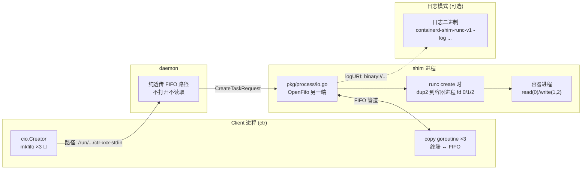
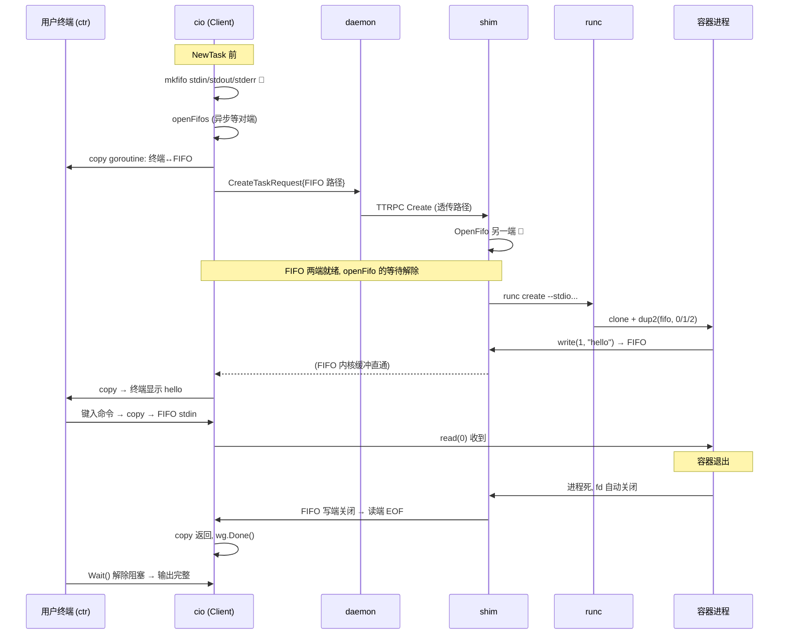

# 第十三篇：CIO 与 IO 管道

> containerd v1.5.x (commit 5280530a0) 源码剖析系列 13/N
> 核心文件：`cio/io.go`、`cio/io_unix.go`、`pkg/process/io.go`（shim 侧）、`pkg/process/utils.go`

---

## 1. 概述

一句话：**容器 stdio 走 FIFO 命名管道中转——Client 侧 `cio.Creator` 先 mkfifo 出三个管道文件并把路径随 CreateTaskRequest 传给 daemon，shim 侧按路径打开 FIFO 一端接容器进程的 stdin/stdout/stderr，另一端由 Client（ctr）或日志二进制打开消费；terminal 模式则不用 stderr FIFO 而走 console socket 传 pty 主设备 fd；logURI/BinaryIO 机制允许把容器输出直接导给外部日志进程，daemon/shim 不经手日志内容。**

核心问题意识：容器进程在独立 PID namespace，它的 stdio 必须跨进程边界送达调用方。containerd 的选择是**全异步管道**：FIFO 天然背压（写满阻塞）、路径可跨进程传递、消费方可以是任意进程（ctr、日志驱动、CRI 流服务器）。

在架构中的位置：横穿 Client（cio 包）→ daemon（透传路径）→ Shim（pkg/process/io.go 打开 FIFO 接 runc），第三篇 NewTask 的 Step 1 在这里展开。

---

## 2. 架构图



---

## 3. 核心数据结构

| 结构体/接口 | 所在文件 | 关键字段 | 作用 |
|---|---|---|---|
| `cio.Config` | `cio/io.go:41` | `Terminal`、`Stdin/Stdout/Stderr`（路径） | IO 配置 = 三个 FIFO 路径 + 是否 tty |
| `cio.IO` | `cio/io.go:53` | `Config()`、`Cancel()`、`Wait()`、`Close()` | Client 侧 IO 会话接口 |
| `cio.Creator` | `cio/io.go:66` | `func(id) (IO, error)` | NewTask 参数：创建 IO 的工厂 |
| `cio.Attach` | `cio/io.go:73` | `func(*FIFOSet) (IO, error)` | 重连已有 FIFO（task 恢复） |
| `FIFOSet` | `cio/io.go:76` | Config + `close` 清理函数 | FIFO 路径集合 + 生命周期 |
| `cio`（小写实现） | `cio/io_unix.go` | `config`、`wg`、`closers`、`cancel` | copyIO 模式的 IO 实例 |
| shim 侧 `stdio` | `pkg/process/io.go` | stdin/stdout/stderr 名 + terminal | 容器进程的 stdio 抽象 |

---

## 4. 源码逐步剖析（Client 侧）

### 4.1 FIFOSet 创建：mkfifo 三件套（cio/io_unix.go:35）

```go
func NewFIFOSetInDir(root, id string, terminal bool) (*FIFOSet, error) {
	os.MkdirAll(root, 0700)
	dir, _ := ioutil.TempDir(root, "")    // wy: 随机临时目录，隔离每次 IO 集
	closer := func() error { return os.RemoveAll(dir) }
	return NewFIFOSet(Config{
		Stdin:    filepath.Join(dir, id+"-stdin"),
		Stdout:   filepath.Join(dir, id+"-stdout"),
		Stderr:   filepath.Join(dir, id+"-stderr"),
		Terminal: terminal,
	}, closer), nil
}
```

**注意**：这里只定路径，`mkfifo` 发生在 `openFifos` 的 `fifo.OpenFifo(O_CREAT)` 内部——打开即创建。

### 4.2 openFifos：打开即创建（cio/io_unix.go:106）

```go
func openFifos(ctx context.Context, fifos *FIFOSet) (f pipes, retErr error) {
	defer func() { if retErr != nil { fifos.Close() } }()  // wy: 失败清理全部

	if fifos.Stdin != "" {
		// wy: 🚀 stdin: 写端（Client 向容器写输入）
		f.Stdin, retErr = fifo.OpenFifo(ctx, fifos.Stdin,
			syscall.O_WRONLY|syscall.O_CREAT|syscall.O_NONBLOCK, 0700)
	}
	if fifos.Stdout != "" {
		// wy: 🚀 stdout: 读端（Client 读容器输出）
		f.Stdout, retErr = fifo.OpenFifo(ctx, fifos.Stdout,
			syscall.O_RDONLY|syscall.O_CREAT|syscall.O_NONBLOCK, 0700)
	}
	if !fifos.Terminal && fifos.Stderr != "" {
		// wy: 🚀 terminal 模式无独立 stderr——pty 把 stdout/stderr 合流
		f.Stderr, _ = fifo.OpenFifo(ctx, fifos.Stderr, O_RDONLY|O_CREAT|O_NONBLOCK, 0700)
	}
	return f, nil
}
```

**FIFO 的单向性决定两端打开方向相反**：

| 管道 | Client 侧 | shim 侧 |
|---|---|---|
| stdin | O_WRONLY | O_RDONLY → 接容器 fd 0 |
| stdout | O_RDONLY | O_WRONLY ← 接容器 fd 1 |
| stderr | O_RDONLY | O_WRONLY ← 接容器 fd 2 |

`fifo.OpenFifo` 是异步打开（容器未起时另一端没人，直接 open 会阻塞）：内部 goroutine 等待对端打开完成，ctx 可取消——这是 containerd/fifo 库的核心价值。

### 4.3 copyIO：三个 copy goroutine（cio/io_unix.go:56）

`ctr run` 用的 `cio.NewCreatorWithStdio` 最终走 copyIO：

```go
func copyIO(fifos *FIFOSet, ioset *Streams) (*cio, error) {
	pipes, err := openFifos(ctx, fifos)

	// stdin: 用户输入 → 容器
	if fifos.Stdin != "" {
		go func() {
			io.CopyBuffer(pipes.Stdin, ioset.Stdin, buf)  // 终端 → FIFO
			pipes.Stdin.Close()                           // wy: 🚀 EOF 传递: 关写端 → 容器读到 EOF
		}()
	}
	// stdout: 容器输出 → 用户终端
	if fifos.Stdout != "" {
		wg.Add(1)
		go func() {
			io.CopyBuffer(ioset.Stdout, pipes.Stdout, buf)  // FIFO → 终端
			pipes.Stdout.Close()
			wg.Done()
		}()
	}
	// stderr: 同 stdout（terminal 模式跳过）
	...
	return &cio{config, wg, closers, cancel}, nil
}
```

`IO.Wait()` = `wg.Wait()`——等 stdout/stderr 两个 copy 结束（容器关闭写端 → FIFO EOF → copy 返回），保证**容器输出不截断**再宣告 task 结束。

### 4.4 日志旁路：LogURI / BinaryIO（cio/io.go:233）

```go
// LogURI: 容器 stdout/stderr 直接写到 URI 指定的目标（fifo/文件/二进制）
func LogURI(uri *url.URL) Creator {
	return func(id string) (IO, error) {
		// 生成 config: Stdout/Stderr = URI 字符串，Stdin = ""
		// shim 侧识别 URI 协议，把容器输出直导目标
	}
}

// BinaryIO: 特例——fork 一个日志二进制，容器输出喂给它
//   binary://path?args → shim 启动该二进制，stdout/stderr 接其 stdin
func BinaryIO(binary string, args map[string]string) Creator {
	uri, _ := LogURIGenerator("binary", binary, args)
	return LogURI(uri)
}
```

**Kubernetes 的容器日志就靠这个**：CRI 插件用 LogURI 把输出导到 `/run/containerd/io.containerd.../<id>.log`，kubelet 读的正是该文件——containerd 不缓冲日志。

---

## 5. 源码逐步剖析（shim 侧）

### 5.1 打开 FIFO 接容器（pkg/process/io.go）

shim 收到 CreateTaskRequest 的 FIFO 路径后，在 `runc create` 前打开：

```go
// 简化逻辑 (pkg/process/io.go:190 附近)
if i.stdout {
	fw, err = fifo.OpenFifo(ctx, i.name, syscall.O_WRONLY, 0)  // wy: 写端 → 容器输出流出
} else {
	fr, err = fifo.OpenFifo(ctx, i.name, syscall.O_RDONLY, 0)  // wy: stdin 读端
}
```

这些 fd 作为 runc create 的 `--stdin/--stdout/--stderr` 或 process.json 的 stdio 配置传入——runc clone 容器进程后 `dup2` 到 fd 0/1/2。容器进程从此对 FIFO 一无所知，`printf` 就写进了管道。

### 5.2 logURI 模式：起日志进程

若 stdio 配置是 URI（`binary://...`），shim 先 fork 日志二进制进程，把它的 stdin 作为容器 stdout/stderr 的写入目标——**日志链路：容器 → 日志进程 → 文件/journald/远端**，shim 零拷贝不经手。

### 5.3 terminal 模式：console socket

```
Terminal=true 时:
  ① shim 创建 socketpair (console socket)
  ② runc create --console-socket=<path>
  ③ runc 内部: 创建 pty，slave 端给容器做 fd 0/1/2，
     master 端 fd 经 SCM_RIGHTS 通过 socketpair 传给 shim 🚀
  ④ shim 把 pty master 的读写桥接到 stdout FIFO（或日志目标）
```

pty master 是跨进程传 fd（Unix 域 socket 的辅助数据），这是终端模式下唯一不用 FIFO 的地方——**pty 设备本身不可路径化，只能传 fd**。

---

## 6. 完整数据流时序图



---

## 7. 关键数据路径

```
/run/containerd/fifos/（或自定义 root）
└── <随机目录>/
    ├── <id>-stdin     ← mkfifo 0700
    ├── <id>-stdout
    └── <id>-stderr

terminal 模式额外:
  bundle 内 console socket (socketpair)
  /dev/pts/N           ← pty slave（容器内可见的 tty）

日志模式:
  logURI 指定的文件/管道，如:
  /run/containerd/io.containerd.internal.v1.opt/log/<ns>/<id>.log
```

---

## 8. 并发模型

| goroutine（Client 侧） | 职责 |
|---|---|
| stdin copy | 终端/输入流 → stdin FIFO；源 EOF → 关写端传 EOF 给容器 |
| stdout copy | stdout FIFO → 输出流 |
| stderr copy | stderr FIFO → 输出流（terminal 无） |
| openFifo 内部 ×3 | 异步等待对端打开（containerd/fifo 库） |

shim 侧：每个容器的 stdio 由 runc 直接持有 fd，无额外 copy goroutine（日志二进制场景是独立进程）。

**背压天然存在**：消费方慢 → FIFO 写满（默认 64KB 内核缓冲）→ 容器 write 阻塞——容器输出不会撑爆内存。

---

## 9. 错误路径与 FIFO 生命周期

| 场景 | 行为 |
|---|---|
| NewTask 失败（Create RPC 出错） | `defer i.Cancel(); i.Close()` → 删除 FIFO 目录（第三篇的 defer） |
| 消费方从不打开 FIFO | openFifo 阻塞等待；ctx 取消（Cancel）解除并清理 |
| 容器被 Kill | 进程死 → fd 关闭 → FIFO 写端消失 → Client copy 得 EOF 正常结束 |
| Client（ctr）崩溃 | FIFO 读端消失 → 容器下次 write 收到 **SIGPIPE**（或写失败）；应用通常因此退出 |
| 容器退出后 Wait 卡住 | stdout copy 未结束——检查消费端是否在持续读 |
| FIFO 残留 | task Delete 时清理；崩溃残留靠目录在 /run（tmpfs）重启自清 |

**FIFO 单读者限制**（cio.Attach 的注释警告）：一个 FIFO 只能有一个读者，多个进程 Attach 同一 task 的 stdout 会随机分流输出——`ctr tasks attach` 独占。

---

## 10. 设计要点与踩坑

### 设计精髓

1. **FIFO = 跨进程 stdio 总线**：路径可序列化进 RPC、天然背压、EOF 语义明确（关端即 EOF）、消费方完全解耦（ctr/日志二进制/CRI 流服务都能接）。
2. **daemon 纯透传不碰 IO**：IO 路径只在 Client ↔ shim 之间，daemon 重启对数据流零影响——与 shim 独立存活的设计一脉相承。
3. **openFifo 异步化**：FIFO 打开会阻塞等对端，containerd/fifo 库用 goroutine + ctx 把"阻塞打开"变成"可取消打开"，避免 NewTask 挂死。
4. **terminal 走 pty + fd 传递**：终端语义（行编辑、信号 Ctrl-C、窗口大小）只有 pty 能给，fd 经 SCM_RIGHTS 跨进程——FIFO 做不到的用 Unix socket 辅助数据补上。
5. **日志外置（logURI）**：containerd 不做日志轮转/存储，交给专用二进制——职责分离，也是 K8s 日志架构的支点。

### 踩坑 / 调试

| 现象 | 原因 | 排查 |
|---|---|---|
| `ctr run` 无输出但容器在跑 | 消费端没读 stdout FIFO（或读错 namespace 的 task） | 确认 Attach/IO creator 正常；`ls /run/containerd/fifos/` |
| 容器内应用莫名退出 | Client 断开 → SIGPIPE；应用没忽略 SIGPIPE | 应用侧 `signal(SIGPIPE, SIG_IGN)` 或检查 ctr 侧 |
| task Wait 返回但输出缺一截 | 没等 IO.Wait() 就读退出码 | 先 `<-io.Wait()` 再处理退出状态 |
| terminal 模式 resize 无效 | 未走 Resize RPC 更新 pty winsize | `task.Resize(ctx, w, h)` |
| FIFO 文件堆积 | Delete 未执行（容器残留） | 清 task 后自动删；/run 重启也清 |
| 日志文件没有内容（K8s 场景） | logURI 配置错误/日志进程起不来 | 查 shim 日志中 binary 启动错误；确认 CRI 配置 |

---

## 11. 下一篇预告

**第十四篇：GC 与 Lease** —— gc/scheduler 的异步调度（mutation 触发 + 防抖 + 最小/最大间隔）、第十篇 GarbageCollect 的调用方、`gc.Node` 图的构建（scanAll 如何从 bucket 布局推导节点与引用边）、lease 如何在 Pull/Unpack 期间注入临时根保护资源，以及 GC 相关的调优参数。
