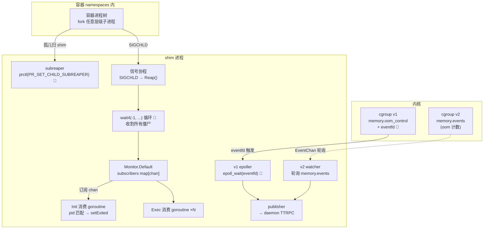
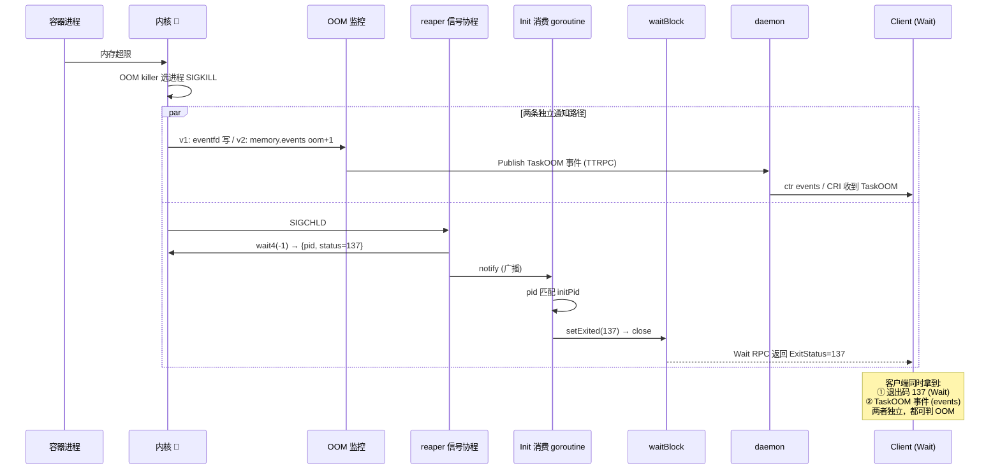

# 第十二篇：Reaper / OOM / Cgroups

> containerd v1.5.x (commit 5280530a0) 源码剖析系列 12/N
> 核心文件：`sys/reaper/reaper_unix.go`、`pkg/oom/v1/v1.go`、`pkg/oom/v2/v2.go`、`runtime/v2/runc/v2/service.go`

---

## 1. 概述

一句话：**shim 作为 subreaper（`prctl(PR_SET_CHILD_SUBREAPER)`）接管容器内一切孤儿子进程，SIGCHLD 信号协程触发 `Reap()` 用 `wait4(-1)` 循环收割全部僵尸并通过发布-订阅 channel 广播 `{pid, status}`，各 Init/Exec 消费协程按 pid 匹配后 `close(waitBlock)`；OOM 监控双实现——cgroups v1 用 eventfd + epoll（`memory.oom_control` 内核事件零轮询），v2 用 `memory.events` 的 oom 计数差值检测（cgroup2 无 eventfd 通知，只能轮询）；cgroup 目录与资源限制则由 runc 按 config.json 创建。**

在架构中的位置：全部在 **Shim 进程内**，是第四篇"进程死亡如何被感知"的底层机制展开。

```
容器进程死亡 ──SIGCHLD──→ reaper 协程 ──wait4(-1)──→ 广播 exit
                                                      ├→ Init 消费 → setExited → close(waitBlock)
                                                      └→ Exec 消费 → 同上

cgroup OOM ──v1: eventfd/epoll──→ 发布 TaskOOM 事件 ──TTRPC──→ daemon ──→ 订阅者
           └─v2: 轮询 memory.events 计数差──┘
```

---

## 2. 架构图



---

## 3. 核心数据结构

| 结构体 | 所在文件 | 关键字段 | 作用 |
|---|---|---|---|
| `reaper.Monitor` | `sys/reaper/reaper_unix.go` | `subscribers map[chan runc.Exit]*subscriber` | exit 事件发布-订阅中心（单例 `Default`） |
| `runc.Exit` | runc 库 | `Pid`、`Status`、`Timestamp` | 一次退出 |
| `epoller`（v1） | `pkg/oom/v1/v1.go` | `fd`(epoll fd)、`set map[fd]*item` | eventfd 集合的 OOM 监听 |
| `watcher`（v2） | `pkg/oom/v2/v2.go` | `itemCh`、`lastOOMMap` | 轮询计数差检测 |
| `oom.Watcher` | `pkg/oom/oom.go` | `Add(id, cgroup)`、`Run(ctx)` | 统一接口，按 cgroup 模式选实现 |

---

## 4. 源码逐步剖析

### 4.1 subreaper：为什么僵尸归 shim（第十一篇已设置，这里讲语义）

```c
prctl(PR_SET_CHILD_SUBREAPER, 1)   // 🚀 shim 启动时
```

效果：shim 的子孙进程中，任何"父进程先死"的孤儿**不再上交给 PID 1**，而是被最近的 subreaper（shim）收养。容器内 `bash -c "sleep 1 & bash"` 这类多层 fork，叶子进程死后变成 shim 的僵尸子进程——**只有 shim 能 wait 它**（wait 只能由父进程调用）。不设 subreaper，容器内后台进程的退出状态将永久丢失，PID 泄漏。

### 4.2 Reap：SIGCHLD → wait4 广播（sys/reaper/reaper_unix.go:61）

```go
// Reap should be called when the process receives SIGCHLD.
func Reap() error {
	now := time.Now()
	exits, err := reap(false)              // wy: 一次收完所有已死进程
	for _, e := range exits {
		done := Default.notify(runc.Exit{  // wy: 广播给所有订阅者
			Pid: e.Pid, Status: e.Status, Timestamp: now,
		})
		select {
		case <-done:
		case <-time.After(1 * time.Second):  // wy: 订阅者卡死也不拖垮 reaper
		}
	}
	return err
}

func reap(flag int) (exits []exit, err error) {
	var ws unix.WaitStatus
	for {
		// wy: 🚀 wait4(-1): -1 = 任意子进程；循环到没有可收的
		pid, err := unix.Wait4(-1, &ws, flag, &rus)  // rus: rusage 资源统计
		if err != nil {
			if err == unix.ECHILD { return exits, nil }  // 没有子进程了
			return exits, err
		}
		if pid <= 0 { return exits, nil }
		exits = append(exits, exit{Pid: pid, Status: exitStatus(ws)})
	}
}

func exitStatus(status unix.WaitStatus) int {
	if status.Signaled() {
		return 128 + int(status.Signal())   // wy: shell 惯例: 137 = 128+SIGKILL(9)
	}
	return status.ExitStatus()
}
```

**为什么 SIGCHLD 要循环 wait 而非收一次？** 信号不排队——10 个进程同时死只来 1 个 SIGCHLD。`wait4(-1)` 循环到 ECHILD 保证一次信号收完全部。

### 4.3 订阅模型：Monitor（sys/reaper/reaper_unix.go）

```go
var Default = &Monitor{
	subscribers: make(map[chan runc.Exit]*subscriber),
}

func (m *Monitor) Subscribe() chan runc.Exit {
	c := make(chan runc.Exit, bufferSize)   // wy: 带缓冲，reaper 不被慢消费者阻塞
	m.Lock(); m.subscribers[c] = &subscriber{c: c}; m.Unlock()
	return c
}

// runc 的 Monitor.Start/Wait 也建在这上面:
func (m *Monitor) Start(c *exec.Cmd) (chan runc.Exit, error) {
	ec := m.Subscribe()      // wy: 先订阅再启动——不漏早期退出
	c.Start()
	return ec, nil
}

func (m *Monitor) Wait(c *exec.Cmd, ec chan runc.Exit) (int, error) {
	for e := range ec {
		if e.Pid == c.Process.Pid {   // wy: 🚀 按 pid 过滤——广播模型每个消费者自己筛
			c.Wait(); m.Unsubscribe(ec)
			return e.Status, nil
		}
	}
	return -1, ErrNoSuchProcess
}
```

**广播 + 自筛**：N 个容器 = N 个订阅者，每次退出广播 N 份，各自比对 pid。O(N) 但 N 很小（单 shim 内容器数），换来零注册表维护——进程 fork 时无需告知 reaper。

### 4.4 Init 侧消费（pkg/process）

InitProcess 创建时（`runc create` 执行 runc 二进制）通过 runc 库的 monitor 订阅，后台 goroutine：

```
for exit := range subscription {
	if exit.Pid == initPid {
		setExited(exit.Status)   // → close(waitBlock)  （第四篇）
		发布 TaskExit 事件
	}
}
```

ExecProcess 同理，各守各的 pid + waitBlock。

### 4.5 OOM v1：eventfd + epoll（pkg/oom/v1/v1.go）

```go
func New(publisher) (oom.Watcher, error) {
	fd, err := unix.EpollCreate1(unix.EPOLL_CLOEXEC)  // wy: 🚀 一个 epoll 管所有容器
	return &epoller{fd: fd, set: make(map[uintptr]*item)}
}

// 每容器 Start 时注册（service.go:426 s.ep.Add）
func (e *epoller) Add(id string, cgx interface{}) error {
	cg := cgx.(cgroups.Cgroup)
	fd, err := cg.OOMEventFD()
	// wy: 🚀 底层: 打开 memory.oom_control，配 eventfd，
	//    写 "cgroup.event_control" 注册: "<eventfd> <oom_control_fd>"
	//    内核 OOM 时向 eventfd 写 1 → epoll 可读
	e.set[fd] = &item{id: id, cg: cg}
	unix.EpollCtl(e.fd, unix.EPOLL_CTL_ADD, int(fd), &unix.EpollEvent{
		Fd: int32(fd), Events: unix.EPOLLHUP | unix.EPOLLIN | unix.EPOLLERR,
	})
}

// 后台循环
func (e *epoller) Run(ctx context.Context) {
	var events [128]unix.EpollEvent
	for {
		n, _ := unix.EpollWait(e.fd, events[:], -1)   // wy: 🚀 阻塞等内核通知，零 CPU
		for i := 0; i < n; i++ { e.process(ctx, uintptr(events[i].Fd)) }
	}
}

func (e *epoller) process(ctx, fd) {
	flush(fd)                        // wy: 读出 eventfd 计数清零
	i := e.set[fd]
	if i.cg.State() == cgroups.Deleted {  // wy: cgroup 已删 → 摘掉
		delete(e.set, fd); unix.Close(int(fd)); return
	}
	e.publisher.Publish(ctx, runtime.TaskOOMEventTopic, &eventstypes.TaskOOM{
		ContainerID: i.id,
	})
}
```

**v1 的优雅**：内核 OOM killer 触发时主动通过 eventfd 通知，epoll 纯被动等待——零轮询、零延迟。

### 4.6 OOM v2：计数差值轮询（pkg/oom/v2/v2.go）

cgroup v2 的 `memory.events` 只有文本计数（`oom N`），无 eventfd 机制（内核 5.14 前无 inotify 支持），只能轮询：

```go
func (w *watcher) Run(ctx context.Context) {
	lastOOMMap := make(map[string]uint64)   // wy: 每容器上次的 oom 计数
	for {
		select {
		case <-ctx.Done(): return
		case i := <-w.itemCh:
			if i.err != nil { delete(lastOOMMap, i.id); continue }  // cgroup 删除
			lastOOM := lastOOMMap[i.id]
			if i.ev.OOM > lastOOM {          // wy: 🚀 计数增长 = 发生过 OOM
				w.publisher.Publish(ctx, runtime.TaskOOMEventTopic, &eventstypes.TaskOOM{
					ContainerID: i.id,
				})
			}
			if i.ev.OOM > 0 { lastOOMMap[i.id] = i.ev.OOM }
		}
	}
}

func (w *watcher) Add(id string, cgx interface{}) error {
	cg := cgx.(*cgroupsv2.Manager)
	eventCh, errCh := cg.EventChan()   // wy: cgroups 库内部 inotify+轮询 memory.events
	go func() {
		for {
			select {
			case ev := <-eventCh: w.itemCh <- item{id: id, ev: ev}
			case err := <-errCh:  w.itemCh <- item{id: id, err: err}; return
			}
		}
	}()
}
```

### 4.7 OOM 监控的注册时机（service.go Start 内，第四篇已见）

```go
case "":   // init 进程启动
	switch cg := container.Cgroup().(type) {
	case cgroups.Cgroup:      s.ep.Add(container.ID, cg)    // v1
	case *cgroupsv2.Manager:  allControllers → w.Add(...)   // v2
	}
```

注意：**OOM 监控在 Start 而非 Create 时注册**——Created 态容器进程未运行，无 OOM 可言。

### 4.8 cgroup 创建与资源限制（runc 侧，containerd 视角）

containerd 本身不直接写 cgroup fs——链路是：

```
config.json (oci spec, 第三篇写入 bundle)
  └ linux.resources: {memory:{limit}, cpu:{shares,quota}, pids:{limit}, ...}
      └ runc create 时:
          v1: mkdir /sys/fs/cgroup/<controller>/<path>/ + 写各限制文件 🚀
          v2: mkdir /sys/fs/cgroup/<path>/ + 写 memory.max / cpu.max ...
      └ SystemdCgroup=true 时: 经 systemd DBus 建 slice/scope 而非直接 mkdir
```

containerd 侧唯一相关选项：`RuntimeOptions{SystemdCgroup: true}`（第三篇 local.Create 透传），决定 runc 用 cgroupfs 驱动还是 systemd 驱动——**必须与 kubelet 的驱动一致**，否则冲突。

---

## 5. 完整时序图（容器被 OOM kill）



**两路并存的意义**：Wait 的 137 只能说明"被 SIGKILL"（可能是人为 kill -9），TaskOOM 事件才确认是内存超限——Kubernetes 靠事件区分 OOMKilled 状态。

---

## 6. 关键数据路径

```
cgroup v1:
/sys/fs/cgroup/memory/<slice>/<container-id>/
├── memory.limit_in_bytes      ← runc 写入限制
├── memory.oom_control         ← OOM eventfd 注册源 🚀
├── cgroup.event_control       ← eventfd 注册写入点
└── cgroup.procs               ← 进程列表（Kill --all 遍历）

cgroup v2:
/sys/fs/cgroup/<slice>/<container-id>/
├── memory.max / cpu.max / pids.max
├── memory.events              ← "oom N" 计数，v2 监控读它
└── cgroup.procs

shim 内（无文件，纯内存）:
  Monitor.Default.subscribers   ← 订阅者表
  epoller.set / lastOOMMap      ← OOM 状态
```

---

## 7. 并发模型

| goroutine | 数量 | 职责 |
|---|---|---|
| 信号处理协程 | 1/shim | SIGCHLD → Reap()；SIGTERM → 退出流程 |
| Init/Exec 消费协程 | 每进程 1 | 订阅 channel 筛 pid → setExited |
| epoller.Run（v1） | 1/shim | epoll_wait 阻塞循环 |
| v2 EventChan 转发 | 每容器 1 | cgroups 库事件 → itemCh |
| watcher.Run（v2） | 1/shim | 计数差检测 + 发布 |

同步：`Monitor.Mutex`（订阅表）、`epoller.mu`（fd 表）、`subscriber` 细粒度锁（防关闭竞态）、waitBlock 无锁。

---

## 8. 错误路径

| 场景 | 行为 |
|---|---|
| SIGCHLD 处理中又来 SIGCHLD | 信号通道有缓冲；下次 Reap 的 wait4 循环兜底收全 |
| 订阅者处理慢 | notify 等 done 最多 1s 超时跳过，reaper 不阻塞 |
| 订阅 channel 满 | bufferSize 缓冲；极端下 reaper 的 notify 会阻塞（select 超时保护在 notify 内部实现） |
| v1 eventfd 对应的 cgroup 被删 | process 时检测 `State()==Deleted` → 摘除并 close fd |
| v2 EventChan 报错（cgroup 删除） | 转发 goroutine 发 err item 后退出，watcher 清 lastOOMMap |
| 进程被 SIGKILL 但无 OOM | 只有 137 退出码，无 TaskOOM 事件——正确（人为 kill） |
| OOM 事件发了但 Wait 还没返回 | 正常，两路异步；客户端应以 Wait 的退出码为最终状态 |
| shim 被 OOM killer 杀（shim 自身超限） | daemon onClose → delete 模式兜底（第十一篇） |

---

## 9. 设计要点与踩坑

### 设计精髓

1. **subreaper + wait4(-1) = 完备收割**：不追踪进程树、不注册 pid，靠内核的收养机制 + 通配 wait 覆盖一切 fork 模式，包括容器内 daemonize 的进程。
2. **信号只提醒、wait4 干活**：SIGCHLD 可能合并丢失，真正的信息来自 wait4 返回值——信号是门铃不是信件。
3. **广播 + 自筛**：避免 reaper 维护"pid→消费者"映射（fork 时无法预知），O(N) 换零注册开销。
4. **v1/v2 OOM 双实现同接口**：`oom.Watcher` 抽象掉内核机制差异，service.go 一处 type switch 分流。
5. **退出码与 OOM 事件解耦**：两条独立链路互为佐证，任一丢失另一路仍可定位问题。

### 踩坑 / 调试

| 现象 | 原因 | 排查 |
|---|---|---|
| 退出码 137 但没 TaskOOM 事件 | 人为 kill -9 或 grace 超时 SIGKILL | 查调用方；真要判 OOM 看事件或 dmesg |
| v2 下 TaskOOM 事件延迟 | 轮询间隔（cgroups 库内部 ~1s） | v2 机制限制；内核 5.14+ 有 memory.events inotify 改善 |
| 僵尸进程堆积在 shim 下 | reaper 协程卡死（如订阅者死锁拖垮——有 1s 超时保护，罕见） | `kill -USR1 <shim>` 看栈 |
| cgroup 路径冲突 | SystemdCgroup 驱动与 kubelet 不一致 | 统一 containerd config 的 `SystemdCgroup = true` 与 kubelet `--cgroup-driver=systemd` |
| 想验证 OOM 链路 | — | `ctr run --memory-limit 10485760 ... sh -c 'head /dev/zero'`，观察 `ctr events` 的 TaskOOM + Wait 返回 137 |
| shim 自身被 OOM kill | 默认不限制 shim cgroup | 用 ShimCgroup 选项（StartShim 支持）把 shim 放入指定 cgroup |

---

## 10. 下一篇预告

**第十三篇：CIO 与 IO 管道** —— `cio` 包的 Creator/IO 接口、mkfifo 创建 stdio FIFO 的时机与路径、shim 如何打开 FIFO 桥接容器 stdio、logURI 机制（二进制日志驱动）、terminal 模式的 console socket 处理，以及 FIFO 生命周期与泄漏防范。
