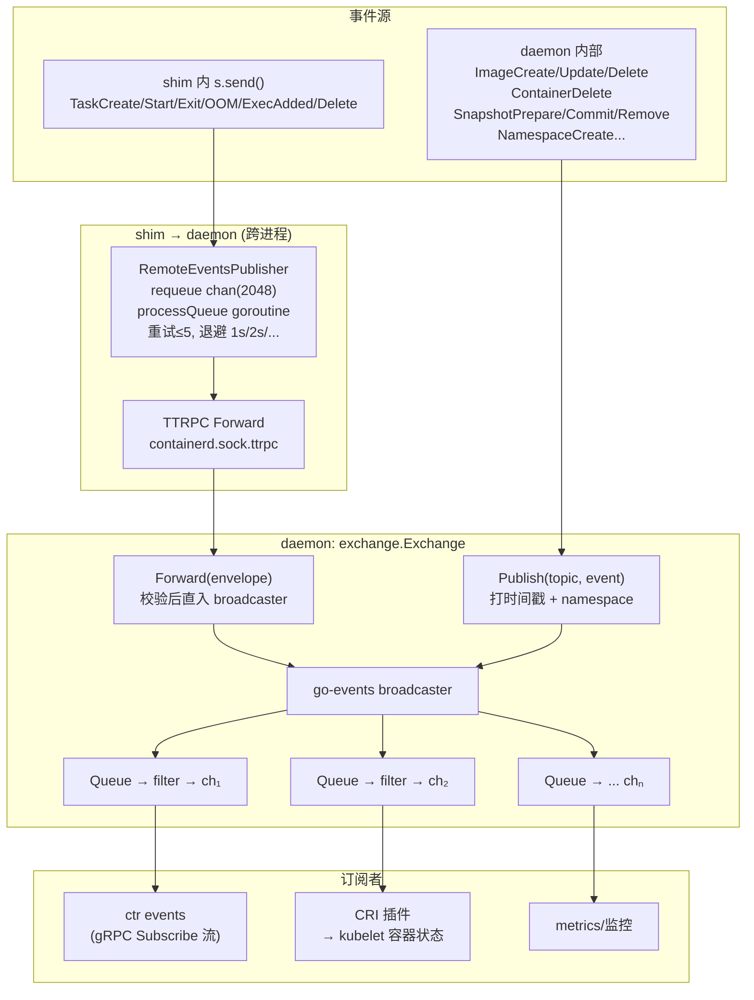
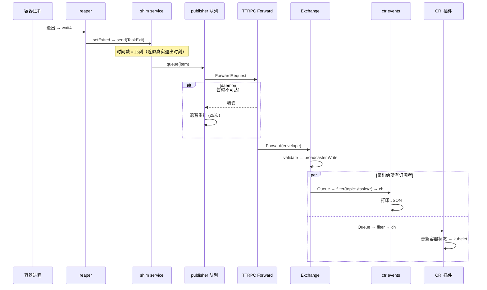

# 第十五篇：Events 事件系统

> containerd v1.5.x (commit 5280530a0) 源码剖析系列 15/N
> 核心文件：`events/exchange/exchange.go`、`runtime/v2/shim/publisher.go`、`services/events/`、`events/events.go`

---

## 1. 概述

一句话：**containerd 事件系统是一个进程内总线 + 跨进程汇聚的两级结构——daemon 内的 `exchange.Exchange` 用 docker/go-events 的 broadcaster 做发布-订阅扇出（Publish 打时间戳 → broadcaster.Write → 所有订阅者的 Queue）；shim 产生的事件（TaskCreate/TaskExit/TaskOOM...）经 `RemoteEventsPublisher` 的 2048 缓冲队列 + 最多 5 次指数退避重试，通过 TTRPC `Events/Forward` 汇入同一个 Exchange；订阅方（ctr events、CRI、metrics）用 filter 表达式按 topic/namespace 过滤。语义是 at-most-once：订阅者消费慢会丢事件（Queue 满丢弃），shim 重试超限也丢，无持久化、无重连重放。**

在架构中的位置：Exchange 在第一篇 server.New 时创建（`exchange.NewExchange()`），注入每个插件的 InitContext.Events；事件源遍布各层（shim 最多），消费者在 Client 层和 CRI 插件。

---

## 2. 架构图



---

## 3. 核心数据结构

| 结构体 | 所在文件 | 关键字段 | 作用 |
|---|---|---|---|
| `events.Envelope` | `api/events/` | `Timestamp`、`Namespace`、`Topic`、`Event`(Any) | 事件信封（跨进程传输单元） |
| `events.Event` | `events/events.go` | `Topic()`、`Marshal/Unmarshal` | 具体事件接口（TaskExit 等） |
| `exchange.Exchange` | `events/exchange/exchange.go` | `broadcaster` | 进程内总线 |
| `RemoteEventsPublisher` | `runtime/v2/shim/publisher.go` | `client`(ttrpc)、`requeue chan *item(2048)` | shim 侧带重试的发送器 |
| `item` | publisher.go | `ev`、`ctx`、`count` | 重试队列条目 |
| go-events `Queue`/`Broadcaster` | docker/go-events | 无界→有丢弃语义的订阅队列 | 扇出基础设施 |

### 主要 Topic 一览

| Topic | 源 | 触发 |
|---|---|---|
| `/tasks/create` | shim | runc create 完成（第三篇） |
| `/tasks/start` | shim | runc start（第四篇） |
| `/tasks/exit` | shim | reaper 收到进程退出 |
| `/tasks/delete` | shim | task 删除 |
| `/tasks/oom` | shim OOM 监控 | cgroup OOM（第十二篇） |
| `/tasks/exec-added` `/tasks/exec-started` | shim | Exec（第四篇） |
| `/images/create\|update\|delete` | daemon ImageService | 镜像记录变更 |
| `/containers/create\|update\|delete` | daemon ContainerService | 容器记录变更 |
| `/snapshots/prepare\|commit\|remove` | daemon Snapshot 包装层 | 快照变更 |
| `/namespaces/create\|update\|delete` | daemon | namespace 操作 |
| `/content/delete` | daemon | blob 删除（GC） |

---

## 4. 源码逐步剖析

### 4.1 Exchange：进程内总线（exchange.go）

```go
func NewExchange() *Exchange {
	return &Exchange{ broadcaster: goevents.NewBroadcaster() }
}

// Publish: daemon 内部发布（第一步打时间戳）
func (e *Exchange) Publish(ctx context.Context, topic string, event events.Event) error {
	namespace, _ := namespaces.Namespace(ctx)
	any, err := typeurl.MarshalAny(event)
	envelope := &events.Envelope{
		Timestamp: time.Now().UTC(),   // wy: 🚀 时间戳在首次 Publish 处固定
		Namespace: namespace,
		Topic:     topic,
		Event:     any,
	}
	return e.broadcaster.Write(envelope)   // wy: 扇出给所有订阅 sink
}

// Forward: 外部（shim）转发来的事件，已有时间戳，直接用
func (e *Exchange) Forward(ctx context.Context, envelope *events.Envelope) error {
	if err := validateEnvelope(envelope); err != nil { return err }
	return e.broadcaster.Write(envelope)
}
```

**Publish vs Forward 的区别**：Publish 是"首次进入系统"（打时间戳、从 ctx 取 namespace），Forward 是"已在别处打过戳的转运"（shim 产生时就打了）。这保证 TaskExit 的时间戳是 shim 内进程死亡的近似时刻，而非到达 daemon 的时刻。

### 4.2 Subscribe：带过滤的订阅（exchange.go:131）

```go
func (e *Exchange) Subscribe(ctx context.Context, fs ...string) (ch <-chan *events.Envelope, errs <-chan error) {
	var (
		evch    = make(chan *events.Envelope)
		errq    = make(chan error, 1)
		channel = goevents.NewChannel(0)      // wy: 无缓冲中间 channel
		queue   = goevents.NewQueue(channel) // wy: 🚀 Queue 为每个订阅者缓冲
		dst     = queue
	)

	if len(fs) > 0 {
		filter, _ := filters.ParseAll(fs...)  // wy: 如 'topic=="/tasks/exit",namespace=="default"'
		dst = goevents.NewFilter(queue, goevents.MatcherFunc(
			func(ev goevents.Event) bool { return filter.Match(adapt(ev)) },
		))
	}

	e.broadcaster.Add(dst)   // wy: 注册到广播器

	go func() {
		// wy: 转发循环: broadcaster → filter → queue → evch → 调用方
		// ctx 取消或 queue 关闭 → closeAll 摘除订阅
	}()
	return evch, errq
}
```

filter 语法（containerd/filters 包）：

```
topic=="/tasks/exit"
topic~="/tasks/*"          # 前缀匹配
namespace=="k8s.io"
event.container_id=="abc"  # 深入事件字段
```

多条件逗号连接 = AND。

### 4.3 shim 侧：RemoteEventsPublisher（publisher.go）

shim 内 `s.send(event)` 最终调 publisher：

```go
const (
	queueSize  = 2048   // wy: 🚀 发送队列上限——daemon 长时间不可达时的缓冲
	maxRequeue = 5      // wy: 单事件最大重试次数
)

func NewPublisher(address string) (*RemoteEventsPublisher, error) {
	client, _ := ttrpcutil.NewClient(address)   // wy: 连 daemon 的 .ttrpc 端口
	l := &RemoteEventsPublisher{
		client:  client,
		requeue: make(chan *item, queueSize),
	}
	go l.processQueue()   // wy: 单 goroutine 串行发送（保序）
	return l, nil
}

// Publish: shim 产生事件 → 打时间戳 → 入队
func (l *RemoteEventsPublisher) Publish(ctx, topic string, event events.Event) error {
	ns, _ := namespaces.NamespaceRequired(ctx)
	any, _ := typeurl.MarshalAny(event)
	return l.queue(&item{
		ev: &v1.Envelope{
			Timestamp: time.Now().UTC(),   // wy: 🚀 时间戳在 shim 侧打
			Namespace: ns, Topic: topic, Event: any,
		},
		ctx: ctx,
	})
}

// processQueue: 发送循环 + 失败重排
func (l *RemoteEventsPublisher) processQueue() {
	for i := range l.requeue {
		if i.count > maxRequeue {
			// wy: 🚀 重试 5 次仍失败 → 丢弃事件（at-most-once）
			logrus.Errorf("evicting %s from queue because of retry count", i.ev.Topic)
			continue
		}
		if err := l.forwardRequest(i.ctx, &v1.ForwardRequest{Envelope: i.ev}); err != nil {
			l.queue(i)   // wy: 重排
		}
	}
}

func (l *RemoteEventsPublisher) queue(i *item) {
	go func() {
		i.count++
		time.Sleep(time.Duration(1*i.count) * time.Second)  // wy: 退避: 1s, 2s, 3s...
		l.requeue <- i
	}()
}
```

### 4.4 daemon 侧接收：events service（services/events/）

daemon 在 TTRPC Server 上注册 `EventsService`（第一篇 Step 5 的统一注册）：

```
TTRPC: /containerd.events.v1.Events/Forward
  → events service → exchange.Forward(envelope) → broadcaster 扇出
TTRPC/gRPC: /containerd.events.v1.Events/Subscribe
  → exchange.Subscribe(filters) → 流式返回给订阅者
```

### 4.5 消费端

**ctr events**：gRPC Subscribe 流 + 可选 filter，逐行打印 JSON。

**CRI 插件**：订阅 `/tasks/*` 维护容器状态机，向 kubelet 的 PLEG/事件流报告容器退出——K8s 里容器重启、OOMKilled 状态的源头。

---

## 5. 完整时序图（容器退出事件全链路）



---

## 6. 关键数据路径

**事件不落盘**——纯内存流转：

```
shim 内存: requeue chan(2048) → TTRPC socket
daemon 内存: broadcaster → 每订阅者一个 Queue
传输: TTRPC(/run/containerd/containerd.sock.ttrpc) + gRPC 订阅流
```

与第十篇对比：content/snapshot 有磁盘持久化，**事件没有**——daemon 重启期间的 shim 事件（重试 5 次约 15s 窗口内）可能投递成功也可能丢弃。

---

## 7. 并发模型

| 单元 | 并发 | 说明 |
|---|---|---|
| shim processQueue | 1/shim | 串行发送保证**单 shim 内事件顺序**（Start 先于 Exit，第四篇 eventSendMu 是更前置的保序） |
| Exchange.Write | broadcaster 内部锁 | 多发布方并发安全 |
| 每订阅者 Queue | 独立 goroutine 转发 | 慢订阅者不影响快订阅者（各自队列） |
| 订阅者消费慢 | Queue 增长；go-events Queue 超限→**事件丢弃**并报错到 errq | at-most-once 的关键点 |

**顺序保证范围**：同一 shim 内有序（串行队列）；跨 shim/跨源无序；订阅者看到的顺序 = 到达 broadcaster 的顺序。

---

## 8. 错误路径与丢失点

| 丢失点 | 条件 | 缓解 |
|---|---|---|
| shim 重试 5 次失败 | daemon 持续不可达 >~15s | daemon 恢复后新事件正常；**断连期间状态由 loadExistingTasks 重建**（第十一篇），事件本身可丢 |
| shim 退出时队列未满投递完 | 进程退出 | 关闭前 5s 尽力投递（第十一篇 publisher.Done 等待） |
| 订阅者消费慢 | Queue 积压超限 | 丢弃 + errq 报错；订阅方应快速消费或重连 |
| 订阅方重连 | — | **无重放**——错过的期间事件永久丢失 |
| daemon 崩溃 | 内存全丢 | 同上，状态靠重建而非事件回放 |

**设计取舍**：事件是"通知"不是"日志"。真正的状态（容器死活）存在 meta.db + shim，可查询重建；事件流只负责"尽快告诉你变了"。丢失可接受，因为消费方都有轮询/重连后查状态的补偿路径（CRI 的 PLEG relist）。

---

## 9. 设计要点与踩坑

### 设计精髓

1. **两级汇聚单总线**：shim 各自带重试队列发往 daemon，daemon 内一个 broadcaster 统一扇出——订阅者不需要知道事件来自哪个 shim。
2. **时间戳在源头打**：Forward 保留原戳，订阅者拿到的是事件真实发生时刻，不受转发延迟影响。
3. **filter 前置于队列**：`Filter(Queue)` 组合让不关心的事件根本不进订阅者通道，省内存省 CPU。
4. **串行 processQueue 保序**：单 shim 事件天然有序，无需序号/排序——简单即正确。
5. **at-most-once + 状态可查**：放弃事件可靠性换取零持久化开销，靠"状态权威存储 + 重建机制"兜底。

### 踩坑 / 调试

| 现象 | 原因 | 排查 |
|---|---|---|
| `ctr events` 漏了某些事件 | 启动订阅晚于事件发生（无回放） | 先开订阅再做操作；状态类信息用 `ctr tasks ls` 查 |
| 事件延迟明显 | 订阅者消费慢导致 Queue 积压 | 检查消费逻辑；errq 是否报丢弃 |
| shim 日志 "evicting ... retry count" | daemon TTRPC 长期不可达 | 查 daemon 存活/.ttrpc 端口 |
| CRI 容器状态滞后 | 事件链路或 CRI 消费阻塞 | 对比 `crictl ps` 与 `ctr -n k8s.io tasks ls` |
| 想按容器过滤 | filter 支持事件字段 | `ctr events 'topic=="/tasks/exit"'` + jq 筛 container_id |
| 事件时间戳与日志对不上 | 时间戳是事件产生时刻，日志是处理时刻 | 正常；排查用时间戳 |

---

## 10. 下一篇预告

**第十六篇：CRI 插件概览** —— `pkg/cri` 如何把 kubelet 的 CRI 请求翻译成 containerd 原语：PodSandbox = pause 容器 + network namespace、RunPodSandbox/CreateContainer/StartContainer 到 NewContainer/NewTask 的映射、事件订阅驱动容器状态机、镜像 GC 与 kubelet 的协作边界。
