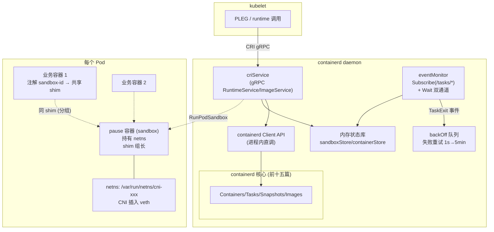
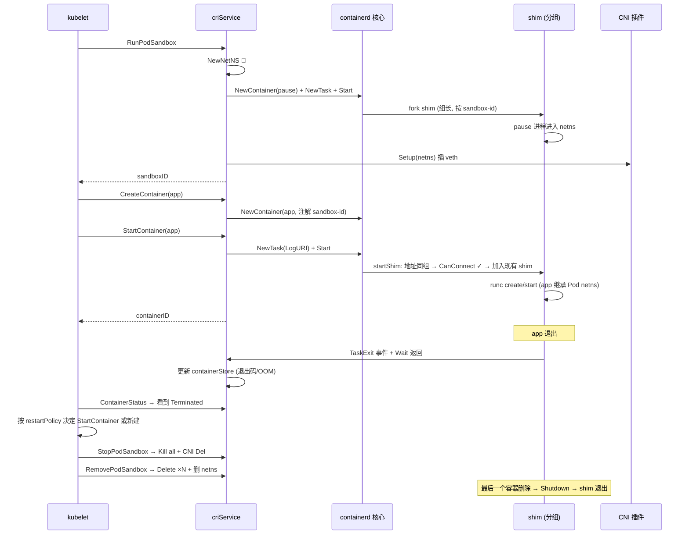

# 第十六篇：CRI 插件概览

> containerd v1.5.x (commit 5280530a0) 源码剖析系列 16/N
> 核心文件：`pkg/cri/server/sandbox_run.go`、`container_create.go`、`container_start.go`、`events.go`、`pkg/cri/plugin`

---

## 1. 概述

一句话：**CRI 插件是内嵌在 containerd daemon 里的 kubelet 适配器——它在 gRPC Server 上额外注册 `runtime.v1alpha2.RuntimeService/ImageService`，把 kubelet 的 Pod 语义翻译成 containerd 原语：一个 PodSandbox = 一个跑 pause 镜像的普通容器（它创建 network namespace，CNI 把网卡插进这个 netns）+ sandbox 元数据；Pod 内每个业务容器是独立的 containerd container/task，通过注解 `io.kubernetes.cri.sandbox-id` 与 sandbox 共享同一个 shim（第十一篇分组机制）；容器退出经事件订阅 + Wait 双通道感知，失败操作进 backOff 队列重试。**

核心认知：**Kubernetes 里没有"Pod 对象"存在于 containerd**——Pod 只是"一组共享 netns 和 shim 的容器"的约定，全部由注解维系。

在架构中的位置：第 2 层 Daemon Services 的一个特例——它不是薄薄的 gRPC 转发，而是有完整状态机的大插件（v1.5 起从独立进程 dockershim/containerd-cri 并入 daemon，Layer 4 GRPCPlugin 注册）。

```
kubelet ──CRI gRPC──→ criService
                         ├─ RunPodSandbox  → NewContainer(pause) + NewTask + netns + CNI
                         ├─ CreateContainer→ NewContainer(业务镜像 + snapshot)
                         ├─ StartContainer → NewTask + Start (加入 sandbox 的 shim 组)
                         ├─ events 订阅    → TaskExit → 状态机 → kubelet 可见
                         └─ 直接用 containerd Client API（同进程，不走 gRPC）
```

---

## 2. 架构图



---

## 3. CRI → containerd 映射总表

| CRI 调用 | containerd 操作 | 关键点 |
|---|---|---|
| `RunPodSandbox` | NewContainer(pause 镜像) + NewTask(NullIO) + Start | 建 netns；CNI Add；pause 容器的 netns 即 Pod 网络 |
| `StopPodSandbox` | Kill sandbox task + CNI Del | 先停网络再停容器 |
| `RemovePodSandbox` | Delete task + Delete container + 删 netns | 级联清理业务容器 |
| `PullImage` | client.Pull（第五篇） | namespace=k8s.io |
| `CreateContainer` | NewContainer(WithNewSnapshot + spec) | 只建元数据+快照，不起进程 |
| `StartContainer` | NewTask(LogURI 日志) + Start | taskOpts 带 sandbox-id 注解 → 加入 sandbox 的 shim |
| `StopContainer` | Kill(SIGTERM→超时→SIGKILL) | grace period 在此实现 |
| `RemoveContainer` | Delete task + container + snapshot | — |
| `ContainerStatus` | 查 containerStore/task 状态 | 退出码/OOM 来自事件 |
| `ExecSync`/`Exec` | task.Exec + Wait / attach | 走 shim 的 Exec RPC |
| `ListImages`/`RemoveImage` | ImageService 查询/删除 | 镜像 GC 与 kubelet 阈值配合 |

---

## 4. 源码逐步剖析

### 4.1 RunPodSandbox：Pod 的实体化（sandbox_run.go:59）

```go
func (c *criService) RunPodSandbox(ctx, r *runtime.RunPodSandboxRequest) (resp, retErr error) {
	config := r.GetConfig()
	id := util.GenerateID()                       // wy: 随机 sandbox ID
	name := makeSandboxName(metadata)             // wy: k8s_<name>_<ns>_... 格式
	c.sandboxNameIndex.Reserve(name, id)          // wy: 防并发同名
	defer func() { 出错则释放名字 }()

	// Step 1: 🚀 创建 network namespace（Pod 网络的根）
	// 非 hostNetwork 时: unshare(CLONE_NEWNET) 建 netns, 挂到 /var/run/netns/cni-xxx
	if !hostNetwork {
		sandbox.NetNS, err = netns.NewNetNS(netnsMountDir)
		sandbox.NetNSPath = sandbox.NetNS.GetPath()
	}

	// Step 2: 拉取/解析 pause 镜像（sandbox_image 配置, 默认 registry.k8s.io/pause:x.x）
	image, err := c.ensureImageExists(...)

	// Step 3: 生成 pause 容器的 OCI spec
	//   - 挂载 /proc/sys 等、设置 sysctl
	//   - 🚀 加入刚建的 netns（linux.namespaces 里 path=NetNSPath）
	spec, err := c.sandboxContainerSpec(id, config, &image..., sandbox.NetNSPath, ...)
	specOpts, err := c.sandboxContainerSpecOpts(config, ...)

	// Step 4: 🚀 就是第三篇的 NewContainer —— pause 是个普通容器
	opts := []containerd.NewContainerOpts{
		containerd.WithSnapshotter(...),
		containerd.WithSpec(spec, specOpts...),
		// WithNewSnapshot 等
	}
	container, err := c.client.NewContainer(ctx, id, opts...)

	// Step 5: NewTask + Start —— NullIO（pause 无输出）
	task, err := container.NewTask(ctx, containerdio.NullIO, taskOpts...)
	if err := task.Start(ctx); err != nil { ... }

	sandbox.Container = container

	// Step 6: 🚀 CNI 把网卡插入 sandbox 的 netns
	if !hostNetwork {
		c.netPlugin.Setup(id, NetNSPath, cni.WithArgs(...))
	}

	// Step 7: 状态入库 + 启动退出监控
	c.sandboxStore.Add(sandbox)
	em.startSandboxExitMonitor(ctx, id, pid, task.Wait())
}
```

**pause 容器的全部意义**：它是 netns 的持有者（进程活着 netns 就在），同时是 shim 分组的组长。

### 4.2 CreateContainer + StartContainer：业务容器入组

`container_create.go:193-245`：

```go
// CreateContainer: 纯元数据（第三篇 NewContainer 路径）
opts := []containerd.NewContainerOpts{
	customopts.WithNewSnapshot(id, containerdImage, snapshotterOpt),  // 可写层
	containerd.WithSpec(spec, specOpts...),
	// wy: 🚀 关键注解 —— Pod 共享 shim 的纽带
	// spec.Annotations["io.kubernetes.cri.sandbox-id"] = sandboxID
}
cntr, err = c.client.NewContainer(ctx, id, opts...)
c.containerStore.Add(...)
```

`container_start.go:113-149`：

```go
// StartContainer: 起进程
taskOpts := c.taskOpts(ctrInfo.Runtime.Name)
task, err := container.NewTask(ctx, ioCreation, taskOpts...)
// wy: ioCreation = LogURI → 容器日志直写 /run/.../<id>.log（第十三篇）
// wy: taskOpts 带 sandbox-id 注解:
//   → daemon TaskManager startShim 时读注解（第十一篇 groupLabels）
//   → SocketAddress 与 sandbox 相同 → CanConnect 成功 → 不 fork 新 shim，加入现有
if err := task.Start(ctx); err != nil { ... }

em.startContainerExitMonitor(ctx, id, pid, task.Wait())
```

**一个 Pod 的进程全景**：

```
containerd-shim-runc-v2  (1 个, sandbox-id 分组)
├── pause 进程            (持有 netns)
├── 业务容器 1 init 进程
└── 业务容器 2 init 进程
```

对比 v1 shim（io.containerd.runc.v1）每容器一个 shim——v2 + CRI 分组让每 Pod 只有 1 个 shim，千 Pod 节点省近千进程。

### 4.3 退出感知：事件 + Wait 双通道（events.go）

```go
func (em *eventMonitor) subscribe(subscriber events.Subscriber) {
	filters := []string{`topic=="/tasks/exit"` /* 等 */}
	em.ch, em.errCh = subscriber.Subscribe(em.ctx, filters...)
	// wy: 后台 goroutine 消费 → handleTaskExit → 更新状态 → 触发 kubelet 可见的变化
}

// 同时每个容器启动时挂 Wait 监控:
func (em *eventMonitor) startContainerExitMonitor(ctx, id, pid, exitCh) <-chan struct{} {
	go func() {
		exitRes := <-exitCh      // wy: task.Wait() 的 channel（第四篇 waitBlock）
		e := &eventtypes.TaskExit{...}
		if err := handle...; err != nil {
			em.backOff.enBackOff(id, e)   // wy: 🚀 处理失败 → backOff 队列重试
		}
	}()
}
```

**为什么双通道？** 事件可能丢（第十五篇 at-most-once），Wait 是可靠的阻塞 RPC——两条路任一到达即可处理，去重后幂等。backOff 队列（1s 起指数退避到 5min 上限）保证瞬态失败（如删容器时资源正忙）最终成功。

### 4.4 镜像 GC 协作

CRI 插件不自己 GC 镜像——kubelet 的 image GC（高/低水位阈值）调 `RemoveImage` CRI，CRI 转调 containerd ImageService 删 image 记录，真正的 blob/快照回收由 containerd 的 GC（第十四篇）异步完成。CRI 只负责"列出镜像+用量"（`ListImages` 带 size）供 kubelet 决策。

### 4.5 日志与流服务

| 能力 | 机制 |
|---|---|
| 容器日志 | StartContainer 用 LogURI → 日志二进制写 `/run/containerd/io.containerd.../<id>.log`（CRI 格式带 tag），kubelet 读它 |
| `kubectl logs` | kubelet 直读日志文件 |
| `kubectl exec -it` | kubelet → CRI `Exec` 拿流服务 URL → 浏览器 SPDY/WebSocket 直连 containerd 流服务器 → shim Exec |
| `kubectl attach` | 同上，Attach 到 init 进程 stdio |

---

## 5. Pod 完整生命周期时序



---

## 6. 关键数据路径

```
/etc/containerd/config.toml:
[plugins."io.containerd.grpc.v1.cri"]
  sandbox_image = "registry.k8s.io/pause:3.6"
  [plugins."io.containerd.grpc.v1.cri".cni]
    bin_dir / conf_dir
  [plugins."io.containerd.grpc.v1.cri".containerd.runtimes.runc]
    runtime_type = "io.containerd.runc.v2"
    [....options] SystemdCgroup = true    ← 🚀 必须与 kubelet 一致

namespace: k8s.io（所有 K8s 容器/镜像都在这个 namespace）

/var/run/netns/cni-<xxx>                     ← Pod netns 挂载点
/run/containerd/io.containerd.grpc.v1.cri/
├── Sandboxes/<sandbox-id>/                  ← sandbox 状态/日志
└── Containers/<container-id>/<id>.log       ← 容器日志（CRI 格式）

meta.db v1/k8s.io/...                        ← 容器/镜像记录（带 CRI 标签）
容器注解: io.kubernetes.cri.sandbox-id / .container-name / .sandbox-uid ...
```

---

## 7. 并发与状态

| 单元 | 说明 |
|---|---|
| sandboxStore/containerStore | 内存状态 + meta.db 持久化；daemon 重启从 containerd 记录重建 |
| nameIndex | 防并发创建同名 sandbox/container（Reserve/Release） |
| eventMonitor | 事件消费 goroutine + 每容器 Wait goroutine |
| backOff | 每 ID 一个退避队列，1s→5min 指数，1s 检查过期 |
| CNI 调用 | 串行化（每 sandbox 一次 Setup/Del） |

---

## 8. 错误路径

| 场景 | 行为 |
|---|---|
| RunPodSandbox 中途失败 | defer 级联回滚：杀 task、删 container、删 netns、释放名字 |
| CNI Setup 失败 | sandbox 保留但网络未就绪；kubelet 重试整个 RunPodSandbox |
| 业务容器启动失败 | 状态记为 CreateError/RunError，kubelet 按 backoff 重试 |
| TaskExit 处理失败 | enBackOff 重试（1s 起）——绝不丢退出状态 |
| pause 容器死（Pod 网络塌了） | sandboxExitMonitor 触发，整个 sandbox 标记 NotReady，kubelet 重建 Pod |
| daemon 重启 | 从 meta.db + 注解重建 sandbox/containerStore，重连 shim（第十一篇），CNI 状态靠 netns 还在即有效 |
| shim 死 | daemon 侧 cleanupAfterDeadShim 杀容器进程 → TaskExit 事件 → CRI 标记退出 → kubelet 重建 |

---

## 9. 设计要点与踩坑

### 设计精髓

1. **Pod = 约定而非对象**：netns 持有 + shim 分组注解两个约定撑起整个 Pod 语义，containerd 核心零 K8s 知识。
2. **pause 一物三用**：netns 锚点、shim 组长、Pod 生命周期指示器（它死 = Pod 死）。
3. **CRI 内嵌同进程**：直调 containerd API 无 gRPC 开销，状态一致性天然（同一 meta.db 事务）——这是 dockershim 删除后 containerd 直连 kubelet 的基础。
4. **双通道退出感知 + backOff**：事件丢失不影响正确性（Wait 兜底），瞬态失败不影响最终一致（退避重试）。
5. **日志外置到文件**：containerd 不碰日志内容，kubelet 直读文件——日志轮转由 kubelet 管，职责清晰。

### 踩坑 / 调试

| 现象 | 原因 | 排查 |
|---|---|---|
| Pod 卡 ContainerCreating | CNI 失败/netns 问题 | `crictl ps -a`；journalctl -u containerd 查 CNI 错误；`/var/run/netns` 残留 |
| 容器 OOM 但 K8s 显示 Error 而非 OOMKilled | 事件丢失且退出码被覆盖（罕见） | 查 dmesg OOM 记录；containerd 日志 TaskOOM |
| cgroup 冲突 daemon 起不来 | SystemdCgroup 与 kubelet 不一致 | 两边统一 systemd 驱动 |
| `crictl ps` 空但 `ctr -n k8s.io c ls` 有 | CRI 状态重建失败 | 重启 containerd 触发重建；看 CRI 初始化日志 |
| 一个 Pod 多个 shim | 注解没带上（自定义 runtime/老配置） | 检查容器 annotations `io.kubernetes.cri.sandbox-id` |
| 想看 CRI 与 containerd 的对照 | — | `crictl pods` ↔ `ctr -n k8s.io c ls`；`crictl inspect <id>` 看完整状态 |

调试命令速查：

```bash
crictl pods / ps -a / images
crictl inspect <container-id>        # 完整状态 JSON
crictl logs <container-id>           # 读 CRI 日志文件
ctr -n k8s.io tasks ls               # 底层 task 视角
journalctl -u containerd -f          # daemon + CRI 日志
```

---

## 10. 系列正文完，下一篇

**附录：调试手册与故障排查树** —— 全系列排查手段汇总：ctr/crictl 命令对照表、debug 日志开启、strace/dlv 跟踪 shim 与 runc、常见故障决策树（daemon 起不来/容器卡创建/Pull 失败/泄漏清理）、与 Docker 及 containerd v2.0 的架构对比。
