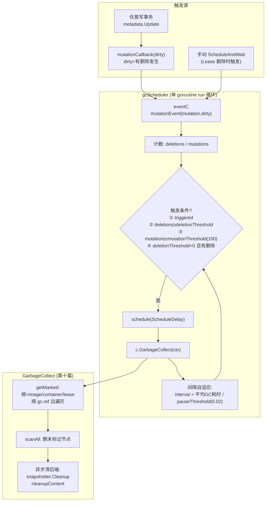
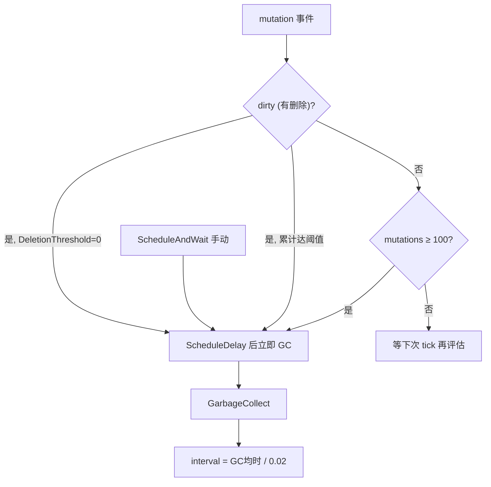
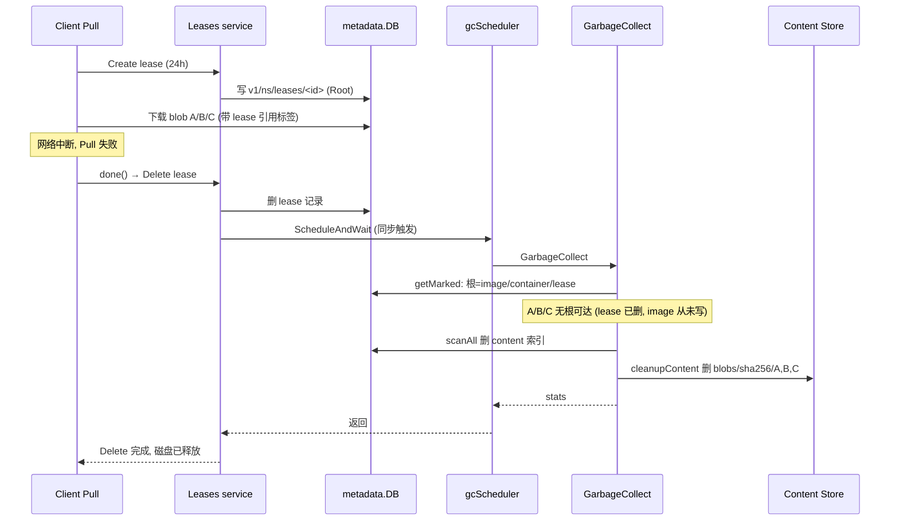

# 第十四篇：GC 与 Lease

> containerd v1.5.x (commit 5280530a0) 源码剖析系列 14/N
> 核心文件：`gc/scheduler/scheduler.go`、`metadata/db.go`（GarbageCollect）、`gc/gc.go`、`leases/`、`lease.go`

---

## 1. 概述

一句话：**GC 是"metadata 变更驱动的异步标记-清除"——每次 bolt 写事务后 mutationCallback 把 `{mutation, dirty(有删除)}` 事件投给调度器，调度器按"有删除必收（ScheduleDelay 后）、累积 100 次变更收、手动触发立即收"三条规则择机调用第十篇的 `GarbageCollect`（标记可达 → 扫全库删不可达 → 异步清后端文件），并用 pauseThreshold 动态调整收集间隔保证 GC 占用不超过 2% 时间；Lease 是"临时根注入"——Pull/容器创建期间先建一条带过期时间的 lease 记录并塞进 context，期间新建的 content/snapshot 自动挂上该 lease 的引用，即使 image 记录还没写、容器还没建完，GC 的根集合也包含 lease → 资源不会被误删，操作完成后释放 lease，资源转由真正的根（image/container）接管。**

在架构中的位置：GCPlugin（ID=scheduler，Layer 2）依赖 MetadataPlugin；Lease 存在 meta.db 的 `v1/<ns>/leases/` bucket，是第五篇 Pull、第三篇 NewContainer 里 `WithLease` 的实体。

---

## 2. 架构图



---

## 3. 核心数据结构

| 结构体 | 所在文件 | 关键字段 | 作用 |
|---|---|---|---|
| `config` | `gc/scheduler/scheduler.go` | `PauseThreshold`、`DeletionThreshold`、`MutationThreshold`、`ScheduleDelay`、`StartupDelay` | 调度参数（TOML 可配） |
| `mutationEvent` | scheduler.go | `ts`、`mutation`、`dirty` | 一次元数据变更事件 |
| `gcScheduler` | scheduler.go | `c collector`、`eventC`、`waiters`、各阈值 | 调度器主体 |
| `collector` | scheduler.go | `GarbageCollect`、`RegisterMutationCallback` | metadata.DB 实现的接口 |
| `gc.Node` | `gc/gc.go` | `Type`、`Namespace`、`Key`、`Root` | GC 图节点 |
| `leases.Lease` | `leases/leases.go` | `ID`、`CreatedAt`、`Labels` | 租约记录 |

### 默认配置（scheduler.go:106）

| 参数 | 默认 | 含义 |
|---|---|---|
| `PauseThreshold` | 0.02 | GC 占用时间上限比例（2%），据此反推最小间隔 |
| `DeletionThreshold` | 0 | 累计删除 N 次立即收；**0 = 有删除就收** |
| `MutationThreshold` | 100 | 累计 100 次变更（无删除）也收一次 |
| `ScheduleDelay` | 0 | 触发后延迟多久执行（防抖） |
| `StartupDelay` | 100ms | daemon 启动后首次 GC 延迟 |

---

## 4. 源码逐步剖析

### 4.1 插件注册与回调接线（scheduler.go:98）

```go
func init() {
	plugin.Register(&plugin.Registration{
		Type: plugin.GCPlugin,
		ID:   "scheduler",
		Requires: []plugin.Type{plugin.MetadataPlugin},  // wy: 依赖 metadata
		Config: &config{
			PauseThreshold: 0.02, MutationThreshold: 100,
			ScheduleDelay: 0, StartupDelay: duration(100 * time.Millisecond),
		},
		InitFn: func(ic *plugin.InitContext) (interface{}, error) {
			md, _ := ic.Get(plugin.MetadataPlugin)
			mdCollector := md.(collector)          // wy: metadata.DB 实现 collector 接口
			m := newScheduler(mdCollector, ic.Config.(*config))
			go m.run(ic.Context)                   // wy: 🚀 调度器常驻 goroutine
			return m, nil
		},
	})
}

func newScheduler(c collector, cfg *config) *gcScheduler {
	s := &gcScheduler{...}
	c.RegisterMutationCallback(s.mutationCallback)  // wy: 🚀 接线: 每次写事务后收到通知
	return s
}
```

回调源头（第十篇的 metadata Update）：

```go
// metadata/db.go Update() 尾部
for _, fn := range m.mutationCallbacks {
	fn(dirty)   // dirty = 本次事务是否发生删除
}

// scheduler.go
func (s *gcScheduler) mutationCallback(dirty bool) {
	e := mutationEvent{ts: time.Now(), mutation: true, dirty: dirty}
	go func() { s.eventC <- e }()   // wy: 异步投递，不阻塞写事务
}
```

### 4.2 run 循环：触发判定（scheduler.go:243）

```go
func (s *gcScheduler) run(ctx context.Context) {
	var (
		schedC <-chan time.Time
		lastCollection, nextCollection *time.Time
		interval = time.Second
		triggered bool
		deletions, mutations int
	)
	if s.startupDelay > 0 {
		schedC, nextCollection = schedule(s.startupDelay)  // wy: 启动 100ms 后首次
	}
	for {
		select {
		case <-schedC:
			// wy: 定时到了——但没事做就跳过: 无触发 && 无删除 && 变更未达阈值
			if !triggered && lastCollection != nil && deletions == 0 &&
				(s.mutationThreshold == 0 || mutations < s.mutationThreshold) {
				schedC, nextCollection = schedule(interval)
				continue
			}
		case e := <-s.eventC:
			if lastCollection != nil && lastCollection.After(e.ts) { continue } // 旧事件
			if e.dirty    { deletions++ }
			if e.mutation { mutations++ } else { triggered = true }  // 手动触发

			// wy: 🚀 三条立即收集规则:
			if triggered ||                                          // ① 手动
				(s.deletionThreshold > 0 && deletions >= s.deletionThreshold) || // ② 删除够多
				(nextCollection == nil && ((s.deletionThreshold == 0 && deletions > 0) ||  // ③ 有删除(阈值0)
					(s.mutationThreshold > 0 && mutations >= s.mutationThreshold))) {      //    或变更达100
				if nextCollection == nil || nextCollection.After(time.Now().Add(s.scheduleDelay)) {
					schedC, nextCollection = schedule(s.scheduleDelay)  // wy: 安排执行（默认立即）
				}
			}
			continue
		case <-ctx.Done():
			return
		}

		// wy: 执行 GC
		stats, err := s.c.GarbageCollect(ctx)
		if err != nil {
			// 失败: 原间隔 +1s 后重试
			schedC, nextCollection = schedule(nextCollection.Sub(*lastCollection) + time.Second)
			...
			continue
		}

		// wy: 🚀 间隔自适应: interval = 平均 GC 耗时 / pauseThreshold
		// GC 花 50ms → interval = 50ms/0.02 = 2.5s（保证占用率 ≤ 2%）
		gcTime += stats.Elapsed(); collections++
		triggered, deletions, mutations = false, 0, 0
		if s.pauseThreshold > 0.0 {
			interval = (gcTime / collections) / s.pauseThreshold
		}
	}
}
```

**调度语义总结**：



### 4.3 GarbageCollect 回顾（第十篇，此处补 GC 图视角）

标记阶段的根与边：

| 节点类型 | 来源 bucket | Root? | 引用边 |
|---|---|---|---|
| image | `v1/<ns>/image/<name>` | ✅ | target.digest → content |
| container | `v1/<ns>/containers/<id>` | ✅ | snapshotKey → snapshot |
| lease | `v1/<ns>/leases/<id>` | ✅ | 资源列表 → content/snapshot |
| content | `v1/<ns>/content/blobs/<digest>` | ❌ | labels `gc.ref.content.*` → content |
| snapshot | `v1/<ns>/snapshots/<ss>/<key>` | ❌ | labels `gc.ref.snapshot.*` + parent → snapshot |
| ingest | content ingest | ❌ | — |

清除阶段 `scanAll` 遍历全库，节点不在 marked 集合 → `remove`（删 bolt 记录）+ 标脏后端（dirtySS/dirtyCS）→ 事务后并行 `cleanupSnapshotter`/`cleanupContent` 删实际文件。

### 4.4 Lease：临时根的生命周期（lease.go:27）

```go
func (c *Client) WithLease(ctx context.Context, opts ...leases.Opt) (context.Context, func(context.Context) error, error) {
	_, ok := leases.FromContext(ctx)
	if ok { return ctx, nop, nil }   // wy: 已有 lease 则复用（嵌套操作不重复建）

	ls := c.LeasesService()
	if len(opts) == 0 {
		opts = []leases.Opt{
			leases.WithRandomID(),
			leases.WithExpiration(24 * time.Hour),   // wy: 🚀 默认 24h 过期（防崩溃后永久泄漏）
		}
	}
	l, err := ls.Create(ctx, opts...)   // wy: gRPC → BoltDB 写 leases bucket
	ctx = leases.WithLease(ctx, l.ID)   // wy: lease ID 塞进 context
	return ctx, func(ctx context.Context) error {
		return ls.Delete(ctx, l)        // wy: done() 释放
	}, nil
}
```

**使用点**（前几篇都见过）：

| 调用方 | 保护对象 | 保护窗口 |
|---|---|---|
| `Client.Pull`（第五篇） | 下载中的所有 blob | Resolve → createNewImage 全程 |
| `Client.NewContainer`（第三篇） | WithNewSnapshot 建的快照 | 选项应用到记录写入之间 |
| CRI 插件拉镜像/建沙箱 | 同上 | 同上 |

**为什么需要 lease？** 考虑 Pull 的时间线：

```
t0: 下载 manifest blob      ← 此刻没有任何 image 记录指向它
t1: 下载 layer blobs        ← GC 若在此刻跑，这些 blob 无根可达 → 被删！
t2: Unpack 建快照
t3: 写 image 记录           ← 真正的根此刻才出现
```

t0~t3 之间的空窗靠 lease 填：lease 是根，期间创建的资源自动带上 `containerd.io/gc.ref...` 指向 lease 的标签（metadata 包装层从 ctx 取 lease ID 打标）。释放 lease 后若 image 记录已写好，引用无缝交接；若 Pull 失败，资源失去所有根，下一轮 GC 回收。

### 4.5 Lease 删除触发 GC

`leases service` 的 Delete 实现里会调 `gcScheduler.ScheduleAndWait`——删除 lease 可能使大批资源失去最后引用，立即收集可快速释放磁盘。这是 `ScheduleAndWait`（同步等 GC 完成）与自动触发（异步）的区别使用。

---

## 5. 完整时序图（Pull 失败 + GC 回收）



---

## 6. 关键数据路径

```
meta.db:
├── v1/<ns>/leases/<id>/
│   ├── createdat
│   ├── labels (含过期时间 containerd.io/gc.expire)
│   ├── snapshots/<ss>/<key>     ← 租约保护的快照引用
│   └── content/<digest>         ← 租约保护的 blob 引用
├── v1/<ns>/content/blobs/<digest>/labels
│   └── containerd.io/gc.ref.lease.<id>  ← 资源 → lease 的反向边
└── ...

config.toml (gc 调优):
[plugins."io.containerd.gc.v1.scheduler"]
  pause_threshold = 0.02
  deletion_threshold = 0
  mutation_threshold = 100
  schedule_delay = "0s"
  startup_delay = "100ms"
```

---

## 7. 并发模型

| 单元 | 说明 |
|---|---|
| 调度器 run goroutine | 唯一，串行决策 + 串行 GC（GarbageCollect 内部拿 metadata wlock） |
| mutationCallback | 每次写事务触发，异步投递 eventC（不阻塞业务） |
| GarbageCollect | 独占 metadata 写锁——期间所有写事务短暂阻塞 |
| 后端清理 | GC 事务提交后的并行 goroutine |
| GC 期间的事件 | 在 eventC 排队，GC 完成后处理（lastCollection.After(e.ts) 过滤旧事件） |

**GC 停顿控制**：pauseThreshold=0.02 保证长期看 GC 占用 ≤2% 墙钟时间；单次停顿 = 标记+清除事务时长（与 meta.db 规模正相关），不可拆分——超大库可调大 schedule_delay 合并批次。

---

## 8. 错误路径

| 场景 | 行为 |
|---|---|
| GC 执行失败 | 原间隔 +1s 重试；错误日志 "garbage collection failed" |
| daemon 崩溃留下未释放 lease | 24h 过期（`gc.expire` 标签），过期后 GC 视其为无根 |
| Pull 成功但忘记释放 lease | WithLease 的 defer done() 保证释放；极端情况靠过期兜底 |
| GC 删了"正在用"的资源 | 不可能——进行中的操作持有 lease（临时根）或已完成（真根接管）；读操作本身不加保护（读到的 digest 若被删会 NotFound，由调用方重试） |
| 删除大量镜像后磁盘迟迟不降 | DeletionThreshold=0 应立即触发；检查是否有 lease 未释放（`ctr leases ls`） |
| GC 太频繁影响性能 | 调大 mutation_threshold / schedule_delay；但删除场景仍会触发 |

---

## 9. 设计要点与踩坑

### 设计精髓

1. **变更驱动 + 阈值防抖**：不定时全扫（浪费），不每次变更都扫（太频），"有删除必扫 + 变更累积扫 + 自适应间隔"三管齐下。
2. **pauseThreshold 自适应间隔**：interval = GC耗时/2%——库越大 GC 越慢、间隔自动拉长，占用率恒定，无需人工调参。
3. **lease = 可编程的临时根**：把"操作原子性窗口"显式建模为 GC 图的根——任何跨多个写事务的操作（Pull、NewContainer）都能无缝接入 GC 安全，无需 GC 懂业务。
4. **24h 过期兜底**：lease 泄漏（客户端崩溃）不会永久占磁盘，过期即失效——可用性优先于严格性。
5. **删除 lease 同步 GC**：释放租约往往意味着大批资源可回收，ScheduleAndWait 让磁盘空间及时可见。

### 踩坑 / 调试

| 现象 | 原因 | 排查 |
|---|---|---|
| `ctr leases ls` 大量残留 | 客户端崩溃未释放 | 等 24h 过期或手动 `ctr leases rm <id>`（会触发 GC） |
| 删镜像后空间不释放 | lease 仍引用 | 同上；确认无任务在用该镜像 |
| GC 日志刷得频繁 | mutation_threshold 太小或写入压力大 | 看 debug 日志 "garbage collected d=..." 的耗时与频率 |
| 写请求周期性延迟尖刺 | GC 拿写锁的停顿 | 大库属正常；调大 pause_threshold（牺牲空间换延迟）或压缩 meta.db |
| 怀疑 GC 误删 | — | 几乎不可能（有 lease 保护）；先查操作是否正确 WithLease |
| 想看 GC 引用图 | — | `ctr content ls` 看 labels 列的 gc.ref；或 bbolt 导出 leases/content bucket |

---

## 10. 下一篇预告

**第十五篇：Events 事件系统** —— `exchange.Exchange` 的发布-订阅实现（Enqueue 扇出、订阅过滤）、shim → daemon 的事件回传路径（publisher → TTRPC `/containerd.events.v1.Events/Forward`）、namespace/topic 过滤、事件丢失语义（at-most-once + 重连重放缺位），以及 `ctr events` 与 CRI 如何消费。
