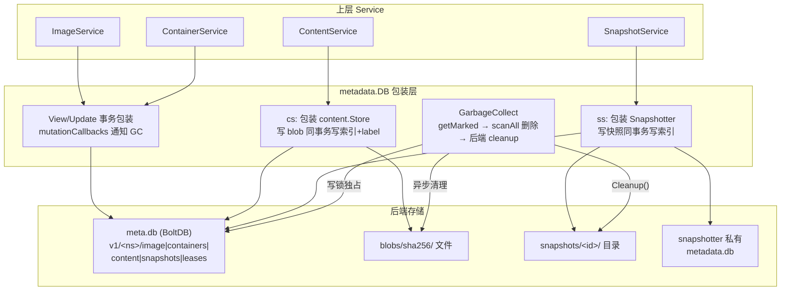
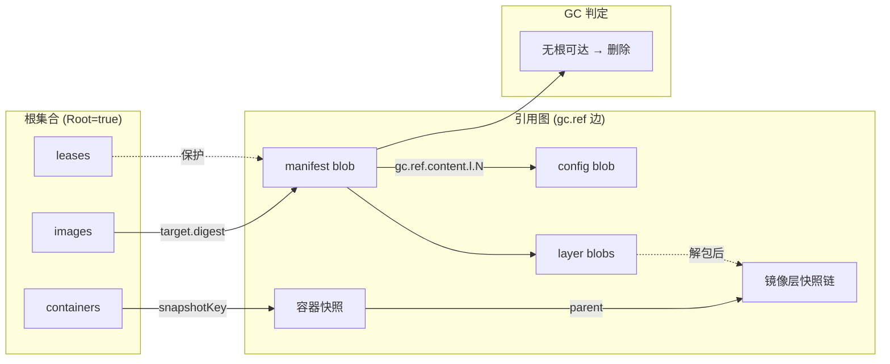

# 第十篇：Metadata 与 BoltDB 数据中枢

> containerd v1.5.x (commit 5280530a0) 源码剖析系列 10/N
> 核心文件：`metadata/db.go`、`metadata/buckets.go`、`metadata/content.go`、`metadata/snapshot.go`、`metadata/containers.go`

---

## 1. 概述

一句话：**`metadata.DB` 把 BoltDB + Content Store + 多个 Snapshotter 粘合成一个带事务的数据中枢——所有资源（image/container/content/snapshot/lease）的索引和标签存在 meta.db 的 `v1/<namespace>/<object>/<key>` 嵌套 bucket 里，实际数据仍留在各自后端（blobs 文件、快照目录）；对 content/snapshot 的包装层让"写数据"和"写索引"在同一 bolt 事务里原子完成，删除则走标记-清除 GC：getMarked 扫全库建可达集，scanAll 删未标记节点，再异步清理后端孤儿文件。**

在架构中的位置：第一篇 Layer 1 的 MetadataPlugin（ID=bolt），依赖 ContentPlugin + SnapshotPlugin；上层所有 Service（tasks/images/containers...）经它读写，GC 调度器（第十四篇）经它回收。

---

## 2. 架构图



---

## 3. 核心数据结构

| 结构体 | 所在文件 | 关键字段 | 作用 |
|---|---|---|---|
| `DB` | `metadata/db.go` | `db *bolt.DB`、`cs`、`ss`、`dirty`、`dirtySS`、`dirtyCS`、`wlock` | 数据中枢主体 |
| `contentStore`（包装） | `metadata/content.go` | `db *DB`、`provider`、`ingestManager` | 给 Content Store 加索引/标签/namespace |
| `snapshotter`（包装） | `metadata/snapshot.go` | `db`、`name`、`Snapshotter` | 给快照器加索引/GC 标签 |
| `gc.Node` | `gc/gc.go` | `Type`、`Namespace`、`Key`、`Root` | GC 图节点（资源标识） |
| bucket 布局 | `metadata/buckets.go` | `v1/<ns>/<object>/<key>/<field>` | 全部元数据的物理结构 |

---

## 4. BoltDB 物理布局（buckets.go）

通用规则：`<version>/<namespace>/<object>/<key> → <field>`

```
v1/
├── <namespace>/
│   ├── labels/<key>                    ← namespace 标签
│   ├── image/<name>/
│   │   ├── createdat / updatedat       ← 二进制时间
│   │   ├── target/{digest,mediatype,size}  ← 指向 manifest 的 Descriptor
│   │   └── labels/<key>
│   ├── containers/<id>/
│   │   ├── spec                        ← Proto 序列化的 OCI spec
│   │   ├── image / snapshotter / snapshotKey
│   │   ├── runtime/{name,options}
│   │   └── labels/<key>
│   ├── content/
│   │   ├── blobs/<digest>/{size,labels}    ← content 索引（blob 本体在文件系统）
│   │   │   └── labels: gc.ref.content.l.N → 子节点 digest（GC 引用边!）
│   │   └── ingest/<ref>/...                ← 进行中写入状态
│   ├── snapshots/<snapshotter>/<key>/
│   │   ├── {kind,parent,name,createdat}
│   │   └── labels: gc.ref.snapshot.<key> → 父快照引用
│   └── leases/<id>/
│       ├── {createdat, labels}
│       └── snapshots|content/...           ← 租约保护的资源列表
└── schemaVersion                         ← 迁移版本号
```

**核心认知**：blob 和快照数据不在 BoltDB 里——库里只有索引和标签。`gc.ref.*` 标签是 GC 引用图的边（第五篇打的 `containerd.io/gc.ref.content.l.0` 就是这里用的）。

---

## 5. 源码逐步剖析

### 5.1 NewDB：包装三个后端（db.go:101）

```go
func NewDB(db *bolt.DB, cs content.Store, ss map[string]snapshots.Snapshotter, opts ...DBOpt) *DB {
	m := &DB{
		db:      db,
		ss:      make(map[string]*snapshotter, len(ss)),
		dirtySS: map[string]struct{}{},   // wy: 记录哪些 snapshotter 有删除待清理
		dbopts:  dbOptions{shared: true}, // wy: content 跨 namespace 共享策略
	}
	// wy: 🚀 关键: 用包装器替换裸后端
	m.cs = newContentStore(m, m.dbopts.shared, cs)      // content 包装
	for name, sn := range ss {
		m.ss[name] = newSnapshotter(m, name, sn)         // 每个 snapshotter 包装
	}
	return m
}
```

上层拿到的 `db.ContentStore()` / `db.Snapshotter(name)` 全是包装版——任何写操作都自动带上索引维护。

### 5.2 事务包装与变更通知（db.go:237-260）

```go
func (m *DB) View(fn func(*bolt.Tx) error) error {
	return m.db.View(fn)   // wy: 读事务直通
}

func (m *DB) Update(fn func(*bolt.Tx) error) error {
	m.wlock.RLock()        // wy: 与 GarbageCollect 的写锁互斥（GC 期间禁写）
	defer m.wlock.RUnlock()
	err := m.db.Update(fn)
	if err == nil {
		dirty := atomic.LoadUint32(&m.dirty) > 0
		for _, fn := range m.mutationCallbacks {
			fn(dirty)      // wy: 🚀 通知 GC 调度器: 有变更发生，酌情安排回收
		}
	}
	return err
}
```

**mutationCallbacks 是 GC 的触发器**：GC 调度器（第十四篇）注册回调，每次写事务后收到通知，按防抖/节流策略决定是否跑一轮 GC。

### 5.3 包装层示例：content 写入的事务联动（metadata/content.go 思路）

包装版 Ingester 的 Commit 做两件事，且在一个 bolt 事务内：

```
Commit(blob):
  1. 底层 local store Commit → blobs/sha256/<hex> 落盘
  2. 同事务写 meta.db: v1/<ns>/content/blobs/<digest> = {size, labels}
  3. 解析 labels 中的 gc.ref.* → 记录引用关系到 GC 图
```

写数据成功但写索引失败 → 事务回滚，索引无记录；残留的 blob 文件由 GC 的 `cleanupContent`（扫描磁盘 vs 索引）异步清掉——**索引是权威，文件是仆从**。

### 5.4 Init 与迁移（db.go:126）

```go
func (m *DB) Init(ctx context.Context) error {
	// wy: 从最新 migration 倒序查找当前 schema 版本
	// 找到后正序执行未应用的 migration（改 bucket 结构）
	// 无迁移需要时直接 rollback（省掉昂贵的 commit）——errSkip 技巧
}
```

schema 版本存在 `schemaVersion` 键，layout 变更必须配 migration + 版本号递增——这是 meta.db 能跨 containerd 版本升级的保证。

### 5.5 GarbageCollect：标记-清除（db.go:280）

```go
func (m *DB) GarbageCollect(ctx context.Context) (gc.Stats, error) {
	m.wlock.Lock()          // wy: 🚀 独占写锁——GC 期间所有 Update 阻塞
	t1 := time.Now()

	// Phase 1: 标记——从根（image/container/lease）出发，
	// 顺着 gc.ref 标签遍历引用图，收集全部可达节点
	marked, err := m.getMarked(ctx)

	// Phase 2: 清除——扫全库，不在 marked 中的节点删除
	m.db.Update(func(tx *bolt.Tx) error {
		rm := func(ctx context.Context, n gc.Node) error {
			if _, ok := marked[n]; ok { return nil }   // 可达，跳过

			// wy: 记录脏后端，事务后异步清理实际数据
			if n.Type == ResourceSnapshot {
				m.dirtySS[snName] = struct{}{}
			} else if n.Type == ResourceContent || n.Type == ResourceIngest {
				m.dirtyCS = true
			}
			return remove(ctx, tx, n)   // wy: 删 bolt 索引
		}
		return scanAll(ctx, tx, rm)
	})

	m.dirty = 0

	// Phase 3: 🚀 后端清理并行执行
	//   dirtySS: 各 snapshotter 调 Cleanup() 删孤儿目录
	//   dirtyCS: cleanupContent() 扫 ingest/ 与 blobs/ 删无索引文件
	wg.Wait()
	return stats, err
}
```



**lease 的作用在此显现**：Pull 期间新 blob 还没有 image 根指向（image 记录最后才写），但 lease 节点 Root=true 且引用它们 → 不被误删（第十四篇详述）。

---

## 6. namespace 隔离

所有数据都在 `v1/<namespace>/` 下——`default`、`k8s.io`（Kubernetes）、`moby`（Docker）互不可见：

```bash
ctr -n default image ls     # 看不到 k8s 拉的镜像
ctr -n k8s.io image ls
```

隔离靠 gRPC 拦截器把 namespace 塞进 context（第一篇 Client 层），metadata 各函数从 ctx 取 namespace 决定 bucket 路径。content 默认 `shared` 策略：blob 索引按 namespace 分开但底层 blob 文件共享（两 namespace 拉同镜像只存一份数据）；`isolated` 策略则完全分开。

---

## 7. 关键数据路径

```
/var/lib/containerd/io.containerd.metadata.v1.bolt/
└── meta.db                ← 🚀 整个 daemon 唯一全局数据库
    ├── v1/default/...     ← default namespace
    ├── v1/k8s.io/...      ← kubernetes namespace
    └── v1/moby/...        ← docker namespace

写路径: Service → metadata 包装 → [底层数据 + bolt 索引] 同事务
删路径: GC → 删索引 → 异步清后端文件
```

BoltDB 本身的约束（第一篇已提）：单写者（所有写串行）、多读者（MVCC）、flock 独占——这也是为什么 GC 拿写锁时整个 daemon 写路径短暂阻塞。

---

## 8. 并发模型

| 操作 | 锁 |
|---|---|
| 读事务 View | bolt 读事务，无限并发 |
| 写事务 Update | bolt 单写者 + `wlock.RLock`（多个 Update 之间靠 bolt 串行） |
| GarbageCollect | `wlock.Lock` 独占——与所有 Update 互斥 |
| 后端清理 | GC 事务提交后的并行 goroutine（不持 bolt 写锁） |
| dirty 标记 | atomic（Update 路径无锁检测） |

**GC 阻塞窗口** = 标记扫描 + 清除事务的时间，meta.db 越大越长。生产上由 GC 调度器控制频率（第十四篇：默认 mutation 后 100ms 合并、最长间隔限制）。

---

## 9. 错误路径与一致性

| 场景 | 一致性保证 |
|---|---|
| 写数据成功、写索引失败 | 事务回滚 → 索引无记录；孤儿文件由 cleanupContent 异步回收 |
| 写索引成功、数据损坏 | 读取时 digest 校验失败报错；blob 删除后 GC 清索引 |
| GC 中途崩溃 | bolt 事务原子——索引删除要么全完成要么全没有；后端清理是幂等扫描，下次补做 |
| daemon kill -9 | bolt 自身崩溃恢复（mmap + CoW B+Tree）；ingest/ 残留按超时清 |
| meta.db 与后端漂移 | GC 的 cleanup 阶段以索引为准修齐后端——**长期自洽，短期可有孤儿** |

**设计不变量**：索引 ⊇ 实际数据（允许多索引少数据吗？不——允许多数据少索引：孤儿文件可被清；但索引指向的数据必须存在，否则读取失败）。

---

## 10. 设计要点与踩坑

### 设计精髓

1. **索引与数据分离 + 事务绑定**：BoltDB 只存小索引（查询/事务/GC 快），大数据留在文件系统（顺序 IO 快），包装层把两者粘成原子操作。
2. **标签即引用图**：GC 不需要懂镜像/容器的领域格式，`gc.ref.*` 标签让引用关系统一成图的边——新增资源类型只要打标签就自动接入 GC。
3. **根集合 = image + container + lease**：三种"用户可见/主动持有"的资源做根，其余全是派生数据可回收——lease 是临时根的注入机制。
4. **mutationCallback 驱动 GC**：不是定时扫，而是"有删除才可能产生垃圾"——读多写少时 GC 几乎不跑。
5. **wlock 分层**：GC 独占锁与写事务读锁的 RWMutex 设计，让 GC 不必关闭 daemon 就能全量整理。

### 踩坑 / 调试

| 现象 | 原因 | 排查 |
|---|---|---|
| 删镜像后磁盘不降 | GC 未触发或层被其他根引用 | `ctr leases ls`；等 GC 或查第十四篇调度策略 |
| meta.db 体积膨胀 | bolt 页碎片（删除不缩文件） | 正常；`bbolt compact` 可压缩（需停 daemon） |
| 某 namespace 看不到资源 | ctr 默认 namespace 是 default | `-n k8s.io` / `-n moby` |
| "database is locked" | 另一进程打开 meta.db（如手动 bbolt 工具） | 停 daemon 或只读打开 |
| 想看库内结构 | — | 停 daemon 后 `bbolt keys meta.db v1`；或 `ctr --debug` 日志 |
| 索引与文件不一致怀疑 | — | 跑一次 GC（删任意资源触发）看 cleanup 日志 |

---

## 11. 下一篇预告

**第十一篇：Shim 生命周期与两次调用协议** —— `runtime/v2/shim/shim.go` 的 `run()` 三种 action（start/delete/server）、TTRPC Serve 注册、subreaper 设置、日志管道，以及 daemon 重启后 `loadExistingTasks` 如何扫描 state 目录 + address 文件重连所有 shim。
