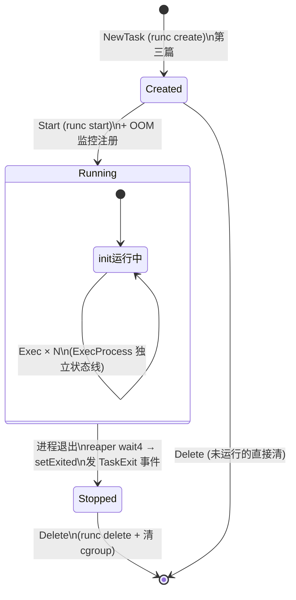
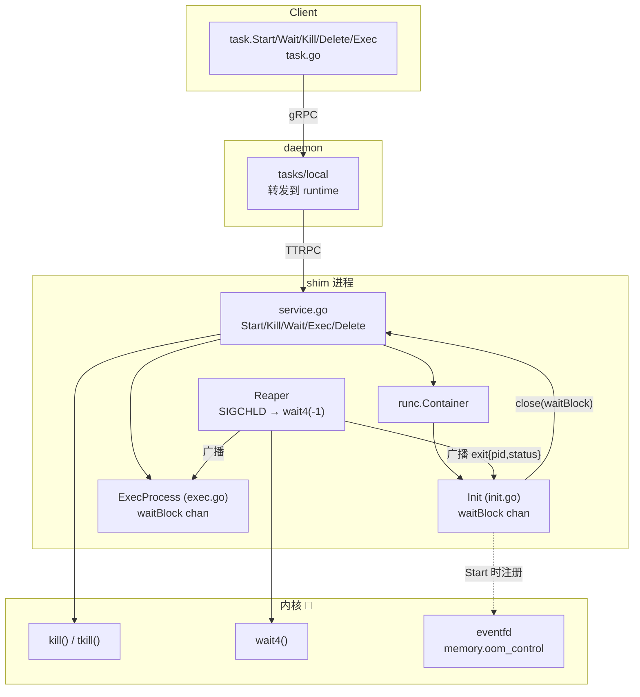
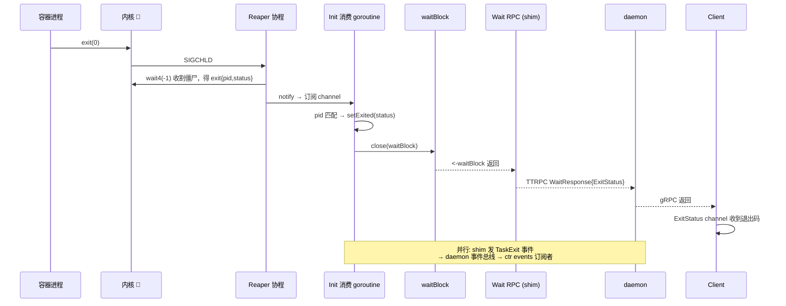

# 第四篇：Exec / Start / Wait / Kill / Delete 任务生命周期管理

> containerd v1.5.x (commit 5280530a0) 源码剖析系列 4/N
> 核心文件：`task.go`、`runtime/v2/runc/v2/service.go`、`pkg/process/init.go`、`pkg/process/exec.go`、`sys/reaper/reaper_unix.go`

---

## 1. 概述

一句话：**Task 是一个三态状态机（Created → Running → Stopped）——`Start` 经 TTRPC 触发 `runc start` 放行 init 进程并注册 OOM 监控；进程退出后 shim 的 Reaper 靠 SIGCHLD + `wait4(-1)` 收割所有僵尸进程，关闭 `waitBlock` 唤醒阻塞的 `Wait` 调用；`Kill` 经 `runc kill` 把信号投递给容器 cgroup 内进程；`Exec` 在活容器的 namespaces 里 fork 第二条进程线，与 init 进程共用 shim 但各有独立的等待通道。**

在架构中的位置：本篇是第三篇创建的容器"活过来 → 死掉 → 收尸"的全过程，主要战场在 **Shim 层**。

---

## 2. 状态机与架构图





---

## 3. 核心数据结构

| 结构体 | 所在文件 | 关键字段 | 作用 |
|---|---|---|---|
| `process.Init` | `pkg/process/init.go` | `pid`、`status`、`exited`、`waitBlock chan`、`console`、`initState` | 容器 init 进程管理者；状态模式（initState）守护非法操作 |
| `process.Exec` / `ExecProcess` | `pkg/process/exec.go` | `id`(ExecID)、`waitBlock`、`spec`(process.json) | exec 出的第二条进程线 |
| `reaper.Monitor` | `sys/reaper/reaper_unix.go` | `subscribers map[chan]` | shim 内僵尸进程收割器，发布/订阅 exit 事件 |
| `runc.Exit` | runc/libcontainer | `Pid`、`Status`、`Timestamp` | 一次进程退出的描述 |
| `eventstypes.TaskExit` | api/events | `ContainerID`、`ID`、`Pid`、`ExitStatus`、`ExitedAt` | shim → daemon 的退出事件 |

---

## 4. 源码逐步剖析

### 4.1 Start：放行 init 进程

Client 侧极简（`task.go:233`）：

```go
func (t *task) Start(ctx context.Context) error {
	r, err := t.client.TaskService().Start(ctx, &tasks.StartRequest{
		ContainerID: t.id,   // wy: ExecID 为空 = 启动 init 进程
	})
	t.pid = r.Pid
	return ...
}
```

shim 侧才是关键（`runtime/v2/runc/v2/service.go:405`）：

```go
func (s *service) Start(ctx context.Context, r *taskAPI.StartRequest) (*taskAPI.StartResponse, error) {
	container, err := s.getContainer(r.ID)

	// wy: 持锁保证 Start 事件先于 Exit 事件发出
	// （否则容器秒退时，daemon 可能先收到 TaskExit 再收到 TaskStart，顺序错乱）
	s.eventSendMu.Lock()

	// wy: 🚀 ExecID=="" → runc start <id>:
	//   runc 向容器 init 进程预置的同步管道写一个字节，
	//   init 进程解除阻塞，execve(config.json 中的 args)
	p, err := container.Start(ctx, r)

	switch r.ExecID {
	case "":
		// wy: 🚀 init 进程启动后，立即注册 OOM 监控
		switch cg := container.Cgroup().(type) {
		case cgroups.Cgroup:
			// cgroups v1: eventfd 监听 memory.oom_control
			s.ep.Add(container.ID, cg)
		case *cgroupsv2.Manager:
			// cgroups v2: 轮询 memory.events 的 oom 计数
			...
		}
		s.send(&eventstypes.TaskStart{ContainerID: container.ID, Pid: uint32(p.Pid())})
	default:
		s.send(&eventstypes.TaskExecStarted{...})
	}
	s.eventSendMu.Unlock()
}
```

### 4.2 Wait：一个 channel 阻塞到进程死亡

Client 侧（`task.go:299`）：

```go
func (t *task) Wait(ctx context.Context) (<-chan ExitStatus, error) {
	c := make(chan ExitStatus, 1)
	go func() {   // wy: Wait 是"阻塞式 gRPC"——调用一直挂到进程退出才返回
		defer close(c)
		r, err := t.client.TaskService().Wait(ctx, &tasks.WaitRequest{ContainerID: t.id})
		c <- ExitStatus{code: r.ExitStatus, exitedAt: r.ExitedAt}
	}()
	return c, nil   // wy: 立即返回 channel，调用方 <-c 阻塞等退出码
}
```

daemon 只是把 Wait 透传给 shim（TTRPC）。shim 侧（`service.go:688`）：

```go
func (s *service) Wait(ctx context.Context, r *taskAPI.WaitRequest) (*taskAPI.WaitResponse, error) {
	container, err := s.getContainer(r.ID)
	p, err := container.Process(r.ExecID)   // wy: ExecID="" 取 init，否则取 exec 进程
	p.Wait()                                // wy: 🚀 阻塞在 <-waitBlock，直到进程死亡
	return &taskAPI.WaitResponse{
		ExitStatus: uint32(p.ExitStatus()),
		ExitedAt:   p.ExitedAt(),
	}
}
```

`Init.Wait`（`pkg/process/init.go:214`）只有一行：

```go
func (p *Init) Wait() {
	<-p.waitBlock   // wy: 🚀 无锁阻塞——谁来关它？见 4.3 Reaper
}
```

**要点**：一个 Wait RPC 在 shim 里占一个挂起的 goroutine 直到进程退出。多个调用方 Wait 同一容器 → 多个 goroutine 阻塞在同一个 `waitBlock`，`close()` 一次全部唤醒——这就是用 close channel 做广播的经典模式。

### 4.3 Reaper：SIGCHLD → wait4 收割机（sys/reaper/reaper_unix.go）

shim 是容器内所有进程的祖先（subreaper，`PR_SET_CHILD_SUBREAPER`），任何子孙进程死亡都会变成 shim 的僵尸子进程，必须由 shim wait。

```go
// Reap should be called when the process receives SIGCHLD.
// wy: 🚀 SIGCHLD 信号处理协程里调用
func Reap() error {
	now := time.Now()
	exits, err := reap(false)          // wy: 一次收掉所有已死进程
	for _, e := range exits {
		done := Default.notify(runc.Exit{   // wy: 广播给所有订阅者
			Pid: e.Pid, Status: e.Status, Timestamp: now,
		})
		select {
		case <-done:
		case <-time.After(1 * time.Second):  // wy: 订阅者处理超时保护
		}
	}
	return err
}

func reap(flag int) (exits []exit, err error) {
	var ws unix.WaitStatus
	for {
		// wy: 🚀 wait4(-1): 等待任意子进程，-1 表示不限定 pid
		// 循环调用直到没有可收的僵尸（ECHILD/无更多）
		pid, err := unix.Wait4(-1, &ws, flag, &rus)
		if pid <= 0 { return exits, nil }
		exits = append(exits, exit{Pid: pid, Status: exitStatus(ws)})
	}
}

// wy: 信号杀死 vs 正常退出: 被信号杀死的退出码 = 128 + 信号值（shell 惯例）
func exitStatus(status unix.WaitStatus) int {
	if status.Signaled() {
		return exitSignalOffset + int(status.Signal())  // 128+sig
	}
	return status.ExitStatus()
}
```

**Init 如何消费 exit 事件**（InitProcess 创建时订阅 reaper）：每个 `Init` 持有订阅 channel，后台 goroutine 循环读，匹配到自己的 pid 就调 `setExited`：

```go
func (p *Init) setExited(status int) {
	p.exited = time.Now()
	p.status = status
	p.Platform.ShutdownConsole(context.Background(), p.console)
	close(p.waitBlock)   // wy: 🚀 唤醒所有 <-waitBlock 的 Wait 调用
}
```

完整死亡链路：



### 4.4 Kill：信号投递

Client（`task.go:252`）：

```go
func (t *task) Kill(ctx context.Context, s syscall.Signal, opts ...KillOpts) error {
	_, err := t.client.TaskService().Kill(ctx, &tasks.KillRequest{
		Signal:      uint32(s),   // wy: 15=SIGTERM, 9=SIGKILL
		ContainerID: t.id,
		ExecID:      i.ExecID,    // wy: "" = init 进程
		All:         i.All,       // wy: true = cgroup 内所有进程
	})
}
```

shim（`service.go:605`）→ `container.Kill` → `pkg/process/init.go:350` `Init.Kill` → `runc kill <id> <sig> [--all]`：

```
runc kill 底层 🚀:
  All=false → kill(initPid, sig)
  All=true  → 遍历 cgroup.procs 读出全部 PID → 逐个 kill()
              （不能只杀 init，否则孤儿进程会被 shim 收养继续跑）
```

**要点**：`ctr tasks kill` 默认只发 SIGTERM 给 init 进程；应用不响应就需要 `--all` + 后续 SIGKILL。Kubernetes 的 `terminationGracePeriodSeconds` 就是靠这中间的等待实现的。

### 4.5 Exec：第二条进程线

shim（`service.go:498`）：

```go
func (s *service) Exec(ctx context.Context, r *taskAPI.ExecProcessRequest) (*ptypes.Empty, error) {
	container, err := s.getContainer(r.ID)
	ok, cancel := container.ReserveProcess(r.ExecID)   // wy: 占坑防重复 ExecID
	process, err := container.Exec(ctx, r)
	// wy: 内部: 写 process.json → exec "runc exec -d --pid-file ... --process process.json <id>"
	//   runc: 通过 init 进程的命名空间 fd (setns) 进入容器的 mnt/pid/net... 后 fork
	s.send(&eventstypes.TaskExecAdded{ContainerID: container.ID, ExecID: process.ID()})
}
```

| 维度 | Init 进程 | Exec 进程 |
|---|---|---|
| 创建时机 | `runc create`（第三篇） | 容器 Running 后任意时刻 |
| 数量 | 每容器 1 个 | 每容器 N 个（ExecID 区分） |
| 生命周期 | 与容器绑定，退出=容器死 | 独立退出，不影响容器 |
| 等待通道 | `Init.waitBlock` | `ExecProcess.waitBlock`（同样的 close 广播） |
| cgroup | 在容器 cgroup 内 | 同容器 cgroup |
| Wait 调用 | `Wait{ExecID: ""}` | `Wait{ExecID: "xxx"}` |
| 退出事件 | `TaskExit` | `TaskExit`（带 ExecID） |

两者在 reaper 眼里没有区别——都是 wait4 收割的 pid，各自匹配各自的订阅 goroutine。

### 4.6 Delete：收尾

`task.Delete`（`task.go:324`）前置检查状态：Running 拒绝删除（需先 Kill）。shim 内 `Init.Delete` → `runc delete <id>`：

```
runc delete 🚀:
  1. 确认容器进程已死
  2. 删除 cgroup 目录 (rmdir /sys/fs/cgroup/.../<id>)
  3. 清理 runc state (/run/runc/<id>)
随后 shim:
  4. umount bundle/rootfs
  5. 删 bundle 目录
  6. 容器列表移除；列表空则 shim 自行退出（runc.v2: 最后一个容器删除后 Shutdown）
```

---

## 5. 关键数据路径

```
/run/containerd/io.containerd.runtime.v2.task/<ns>/<id>/
├── init.pid           ← init 进程 PID 文件（runc create 写入）
├── <exec-id>.pid      ← 每个 exec 进程的 pid 文件
└── log                ← shim 日志

/run/runc/<id>/        ← runc 自身状态（state.json），runc delete 时清除
/sys/fs/cgroup/.../<id>/
├── cgroup.procs       ← Kill --all 遍历读取 🚀
├── memory.oom_control ← v1 OOM eventfd 监听 🚀
└── memory.events      ← v2 OOM 计数轮询
```

事件流（异步，不经过 Wait 路径）：

```
shim s.send(TaskExit) → 事件队列 → forward goroutine
  → daemon TTRPC (/run/containerd/containerd.sock.ttrpc)
  → exchange 事件总线 → 所有订阅者（ctr events、CRI 插件、monitor）
```

---

## 6. 并发模型

| goroutine | 位置 | 职责 |
|---|---|---|
| Reaper 信号协程 | shim 启动时 | 收 SIGCHLD → `Reap()` → wait4 → 广播 |
| Init 消费协程 | 每个 Init 创建时 | 订阅 reaper channel，匹配 pid → setExited |
| Wait RPC goroutine | 每次 Wait 调用 | 阻塞 `<-waitBlock`，TTRPC handler goroutine |
| 事件 forward 协程 | shim 启动时 | 事件队列 → daemon |
| OOM 监控协程 | Start 注册时 | eventfd/轮询 → 发 TaskOOM 事件 |

同步点：`s.mu`（容器级）、`s.eventSendMu`（保证 Start 事件先于 Exit）、`p.mu`（Init 字段）、`waitBlock`（无锁广播）。

---

## 7. 错误路径与边界行为

| 场景 | 行为 |
|---|---|
| 对 Created 态 Kill | 允许（runc kill 对 created 容器生效，直接进 Stopped） |
| 对 Stopped 态再 Kill | 返回错误（进程不存在） |
| Wait 调用时进程已死 | `waitBlock` 已 close，`<-waitBlock` 立即返回——**幂等** |
| Kill 后进程不退出 | 无内置超时，调用方自己补 SIGKILL（CRI 的 grace period 逻辑） |
| 容器进程被 OOM kill | Reaper 照常收到退出（exitStatus=137=128+9）；OOM 监控并行发 TaskOOM 事件 |
| shim 崩溃 | daemon onClose 回调 → `cleanupAfterDeadShim`：直接按记录的 pid 杀进程、发合成退出事件 |
| Wait RPC 期间 Client 断连 | ctx 取消，RPC goroutine 返回错误；但 `waitBlock` 不受影响，重连再 Wait 即可 |
| Exec 进程僵尸未被认领 | 不可能——subreaper 保证全部归 shim，wait4(-1) 通收 |

---

## 8. 设计要点与踩坑

### 设计精髓

1. **subreaper + wait4(-1) 通收**：shim 设 `PR_SET_CHILD_SUBREAPER`，容器内任何层级 fork 的进程死后都归 shim 收，一个循环收全部，不怕遗漏。
2. **close(channel) 广播**：`waitBlock` 一次 close 唤醒无限多个 Wait 调用方，零锁、无惊群问题（都读零值）。
3. **Wait 是挂起 RPC 而非轮询**：退出码零延迟送达，代价是 shim 内每个 Wait 挂一个 goroutine（goroutine 廉价，可接受）。
4. **eventSendMu 排序**：秒退容器的 Start/Exit 事件不会颠倒，订阅方状态机不会错乱。
5. **退出码 128+sig 惯例**：与 shell `$?` 语义一致，`137` 一看就知道是 SIGKILL。

### 踩坑 / 调试

| 现象 | 原因 | 排查 |
|---|---|---|
| Kill 后容器还在 | 只杀了 init，子孙进程被 shim 收养继续跑 | 用 `Kill --all`；检查 `ctr tasks ps <id>` |
| Wait 一直不返回 | shim 失联（进程死了但 daemon 没察觉） | `ps aux \| grep shim`，看 daemon 日志 "shim disconnected" |
| 退出码总是 137 | 被 SIGKILL——OOM 或 K8s 超时 | 查 `dmesg` OOM 记录、`ctr events` 里的 TaskOOM |
| Exec 卡住 | 容器其实没 Running（Created 态不能 exec） | 先 `task.Start()` |
| 想手动验证 reaper | `ctr run` 起容器，进容器 `fork 一堆进程后 kill -9`，看 shim 日志 | `ctr --debug` |

---

## 9. 下一篇预告

**第五篇：镜像拉取 Pull 与 Dispatch 分发** —— `Client.Pull` 的 Resolve（HTTP 认证 + manifest 协商）→ `images.Dispatch` 递归 handler 链（manifest list → manifest → config + layers 并行）→ 边下载边 Unpack 的流水线设计。
