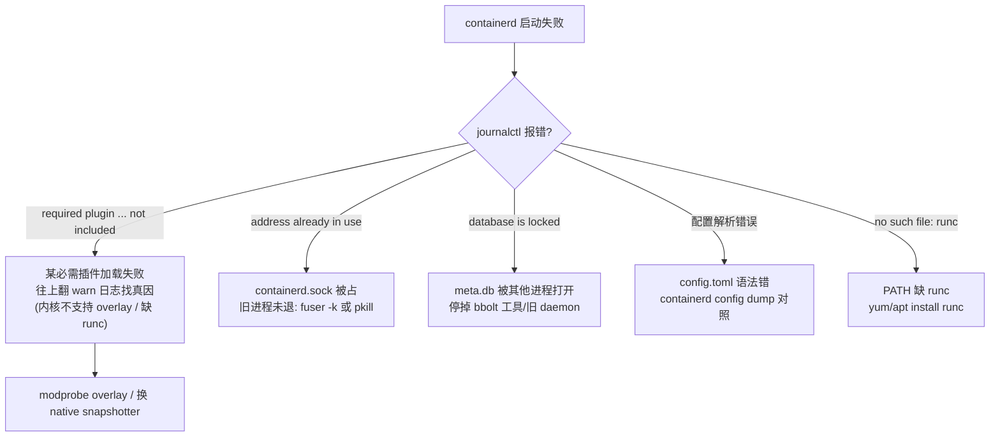
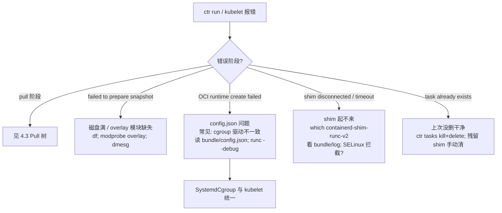
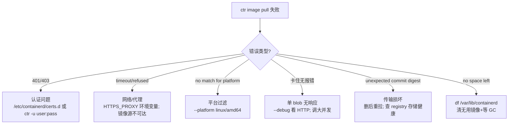

# 附录：调试手册与故障排查树

> containerd v1.5.x (commit 5280530a0) 源码剖析系列 附录
> 汇总全 16 篇的排查手段，另含与 Docker / containerd v2.0 的架构对比

---

## 1. 命令速查对照表

### ctr（containerd 原生 CLI，调试用）

| 命令 | 作用 | 对应篇 |
|---|---|---|
| `ctr version` | 版本 + 各插件版本 | 一 |
| `ctr plugins ls` | 所有插件及 Requires 依赖 | 一/二 |
| `ctr -n <ns> images ls / pull / rm` | 镜像管理（默认 ns=default，K8s 用 k8s.io） | 五 |
| `ctr -n <ns> content ls / active / delete` | CAS blob 与进行中下载 | 七 |
| `ctr -n <ns> snapshots ls / tree / rm` | 快照链（tree 显示父子关系） | 六/八 |
| `ctr -n <ns> containers ls / info` | 容器元数据记录 | 三 |
| `ctr -n <ns> tasks ls / ps <id>` | 活进程（ps 列容器内全部 PID） | 四 |
| `ctr -n <ns> run -d <image> <id> <cmd>` | 一条龙建容器+task | 三 |
| `ctr -n <ns> tasks kill --all <id>` | 杀容器内所有进程 | 四 |
| `ctr -n <ns> tasks exec --exec-id x -t <id> sh` | 进容器 | 四 |
| `ctr -n <ns> events` | 订阅事件流（支持 filter） | 十五 |
| `ctr -n <ns> leases ls / rm` | 查/清 GC 租约 | 十四 |
| `ctr -n <ns> metrics ps` | cgroup 指标 | 十二 |
| `ctr pprof <profile>` | daemon pprof（需 debug 地址） | 一 |

### crictl（CRI 视角，K8s 节点用）

| 命令 | 作用 |
|---|---|
| `crictl pods / ps -a / images` | Pod/容器/镜像列表 |
| `crictl inspect <id>` / `inspectp <pod-id>` | 完整状态 JSON |
| `crictl logs <id>` | 容器日志 |
| `crictl exec -it <id> sh` | 进容器 |
| `crictl stats / statsp` | 资源用量 |
| `crictl info` | CRI 插件配置与状态 |

### 两侧视角对照

```
crictl pods            ↔  ctr -n k8s.io c ls（名字带 k8s_POD_ 的是 sandbox）
crictl ps              ↔  ctr -n k8s.io tasks ls
crictl images          ↔  ctr -n k8s.io images ls
crictl inspect <id>    ↔  ctr -n k8s.io c info + tasks ls 组合
```

---

## 2. 日志与可观测

### 开启 debug 日志

```toml
# /etc/containerd/config.toml
[debug]
  level = "debug"          # trace/debug/info/warn/error
  address = "/run/containerd/debug.sock"   # pprof 端点
```

或命令行：`containerd --log-level debug`

### 日志位置

| 来源 | 位置 |
|---|---|
| daemon | journald（`journalctl -u containerd -f`）或 stdout |
| shim | bundle 内 `log` FIFO；daemon 日志中以 `runtime=` 字段带出 |
| runc | shim 日志内嵌（runc 输出被 shim 捕获） |
| shim 栈 dump | `kill -USR1 <shim-pid>` → shim 日志 |
| daemon 栈 dump | `kill -USR1 <containerd-pid>` → daemon 日志 + /tmp/containerd.<pid>.stacks.log |

### 指标

```toml
[metrics]
  address = "127.0.0.1:1338"     # Prometheus /v1/metrics
```

关键指标：`engine_daemon_container_states_containers`、grpc 各方法延迟、GC 耗时。

---

## 3. 动态跟踪手段

### strace 跟踪 runc 系统调用（第三篇链路验证）

```bash
# 跟踪 shim 起的 runc create，看 clone/mount 序列
strace -f -e trace=clone,mount,umount2,wait4 -p <shim-pid>
```

### dlv 调试 daemon / shim

```bash
# daemon
dlv attach <containerd-pid> -- -l 127.0.0.1:2345
# shim（独立进程，可单独 attach）
dlv attach <shim-pid>
# 或重编译带 -gcflags="all=-N -l" 后替换二进制
```

### 手动拆解一次 NewTask（第三篇验证）

```bash
ctr image pull docker.io/library/alpine:latest
ctr run -d alpine:latest t1 sleep 100

B=/run/containerd/io.containerd.runtime.v2.task/default/t1
ls $B                    # config.json / rootfs / address
cat $B/address           # shim TTRPC socket 地址
cat $B/config.json | jq .process.args
ps -ef | grep shim       # shim 进程（非 containerd 子进程）
cat /proc/$(cat $B/../../*/t1/shim.pid 2>/dev/null || pgrep -f "shim.*t1")/status | grep NSpid
runc state t1            # 需知道 runc root
```

### bbolt 查元数据（第十篇）

```bash
systemctl stop containerd           # 必须先停（flock 独占）
bbolt keys /var/lib/containerd/io.containerd.metadata.v1.bolt/meta.db v1
# 或写小 Go 程序只读遍历
```

---

## 4. 故障排查决策树

### 4.1 daemon 起不来



### 4.2 容器卡在创建/启动



### 4.3 Pull 失败



### 4.4 资源泄漏

| 泄漏物 | 定位 | 清理 |
|---|---|---|
| shim 进程无主 | `ps aux \| grep shim` 对照 `ctr tasks ls` | daemon 重启触发 delete 清理；或手动 kill 后看 daemon 清理 |
| 孤儿快照 | `ctr snapshots ls \| grep extract-` | 触发 GC（删任意资源）；daemon 重启 Cleanup |
| lease 残留 | `ctr leases ls` | `ctr leases rm <id>`（自动触发 GC） |
| 挂载点残留 | `mount \| grep containerd` | daemon 重启自动 CleanupTempMounts（第一篇） |
| netns 残留（K8s） | `ls /var/run/netns` | `ip netns delete cni-xxx` |
| 磁盘不释放 | 上述全查 + GC 是否跑（debug 日志 "garbage collected"） | meta.db 碎片用 bbolt compact（停机） |

---

## 5. 配置速查（config.toml 关键项）

```toml
version = 2
root  = "/var/lib/containerd"      # 持久化（七/八/十篇）
state = "/run/containerd"          # 运行时（第一篇）

[grpc]
  address = "/run/containerd/containerd.sock"

[plugins."io.containerd.grpc.v1.cri"]
  sandbox_image = "registry.k8s.io/pause:3.6"
  [plugins."io.containerd.grpc.v1.cri".containerd]
    snapshotter = "overlayfs"
    default_runtime_name = "runc"
    [plugins."io.containerd.grpc.v1.cri".containerd.runtimes.runc]
      runtime_type = "io.containerd.runc.v2"   # → containerd-shim-runc-v2（二/十一篇）
      [plugins."io.containerd.grpc.v1.cri".containerd.runtimes.runc.options]
        SystemdCgroup = true                   # 🚀 与 kubelet 必须一致（十二篇）

[plugins."io.containerd.gc.v1.scheduler"]      # 十四篇
  mutation_threshold = 100
  schedule_delay = "0s"

disabled_plugins = []
required_plugins = []
```

生成默认配置：`containerd config default > /etc/containerd/config.toml`

---

## 6. 与 Docker 的架构对比

```mermaid
graph TB
    subgraph "传统 Docker"
        D1[docker CLI] -->|REST| D2[dockerd<br/>镜像/容器/网络/存储/运行时全在一起]
        D2 --> D3[containerd<br/>(内嵌)]
        D3 --> D4[containerd-shim]
        D4 --> D5[runc]
    end
    subgraph "Kubernetes + containerd 直连"
        K1[kubelet] -->|CRI gRPC| K2[containerd<br/>(含 CRI 插件)]
        K2 --> K3[shim v2]
        K3 --> K4[runc]
    end
```

| 维度 | Docker | containerd 直连 K8s |
|---|---|---|
| 调用链 | kubelet→dockershim→dockerd→containerd→shim→runc | kubelet→containerd(CRI)→shim→runc |
| 组件数 | 多一层 dockerd + dockershim | 少两层（1.24 起 dockershim 移除） |
| 镜像构建 | dockerd 内置 | 交给 buildkit/kaniko |
| 存储/网络 | dockerd 自带 graphdriver/libnetwork | containerd snapshotter + CNI |
| 升级影响 | dockerd 重启经 live-restore 保容器 | daemon 重启天然不影响（shim 独立，第十一篇） |
| 共同点 | 底层都是 containerd + runc + shim + OCI | 同 |

**containerd 从 Docker 捐给 CNCF 后成为独立标准**：Docker 自己也是 containerd 的用户。

---

## 7. containerd v1.5 → v2.0 主要变化（延伸）

| 变化 | v1.5（本系列） | v2.x |
|---|---|---|
| 包路径 | `github.com/containerd/containerd` | `github.com/containerd/containerd/v2` |
| CRI | 插件 `io.containerd.grpc.v1.cri`，v1alpha2 | 内置核心，v1 稳定；sandbox API 独立（`Sandbox` 插件） |
| 插件注册 | 本系列第二篇机制基本延续 | 引入 `plugin.Register` 泛型化 InitFn |
| shim | runc.v2 主流 | 同，shim 协议稳定 |
| 核心数据路径 | meta.db + CAS + snapshotter 三件套 | 不变（架构稳定是 containerd 的优点） |
| NRI | 无 | Node Resource Interface（容器资源插件框架） |

**读本系列的价值**：v1.5 的 5 层架构、两次调用协议、CAS+元数据分离、GC/Lease 模型在 v2 中**全部延续**，变的主要是 API 表面和 CRI 集成方式。

---

## 8. 系列全目录回顾

| # | 文档 | 核心源码 |
|---|---|---|
| 一 | Daemon 启动与 Plugin 初始化 | command/main.go, server.go |
| 二 | Plugin 机制与拓扑排序 | plugin/plugin.go, context.go |
| 三 | 容器创建全链路 | client.go, container.go, tasks/local.go, manager.go |
| 四 | 任务生命周期管理 | task.go, runc/v2/service.go, process/init.go |
| 五 | 镜像拉取 Pull 与 Dispatch | pull.go, images/handlers.go |
| 六 | Unpack 解包与 chainID | unpacker.go, rootfs/apply.go |
| 七 | Content Store / CAS | content/local/store.go, writer.go |
| 八 | Snapshotter 与 overlayfs | snapshots/overlay/overlay.go |
| 九 | Diff 与层应用 | diff/apply/, archive/tar.go |
| 十 | Metadata 与 BoltDB | metadata/db.go, buckets.go |
| 十一 | Shim 生命周期 | shim/shim.go, runc/v2 StartShim |
| 十二 | Reaper / OOM / Cgroups | sys/reaper, pkg/oom |
| 十三 | CIO 与 IO 管道 | cio/, pkg/process/io.go |
| 十四 | GC 与 Lease | gc/scheduler, leases |
| 十五 | Events 事件系统 | events/exchange, shim/publisher.go |
| 十六 | CRI 插件概览 | pkg/cri/server/ |
| 附录 | 调试手册（本篇） | — |

**阅读建议**：按序读建立全貌；排查问题时按"故障在哪个阶段"跳读对应篇 + 本附录决策树；改源码前精读对应篇的源码剖析节。
